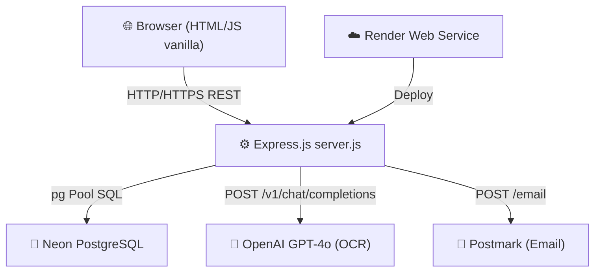
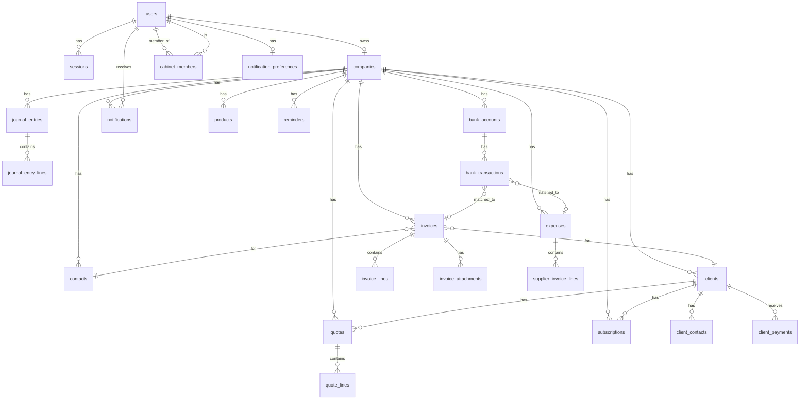
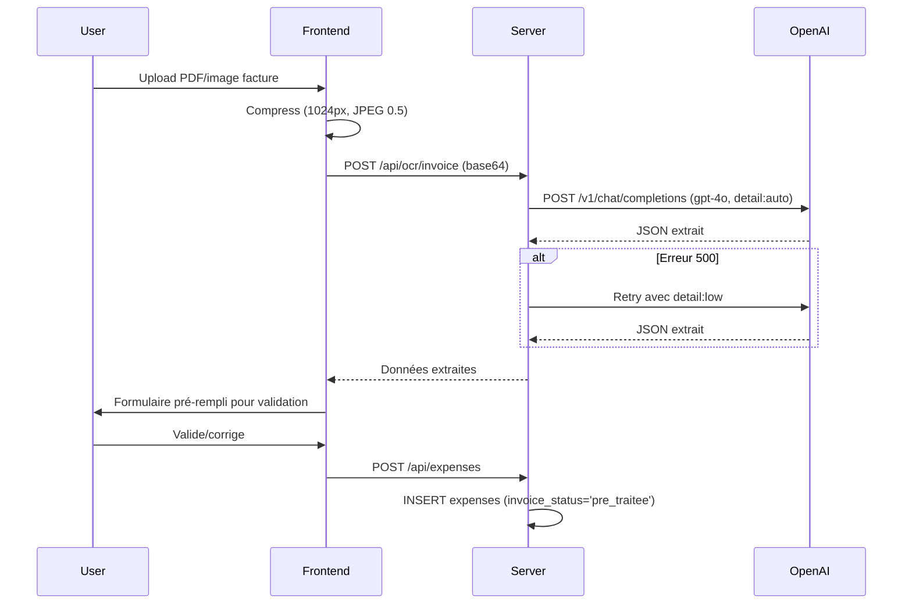
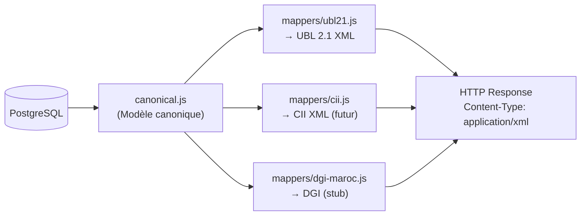
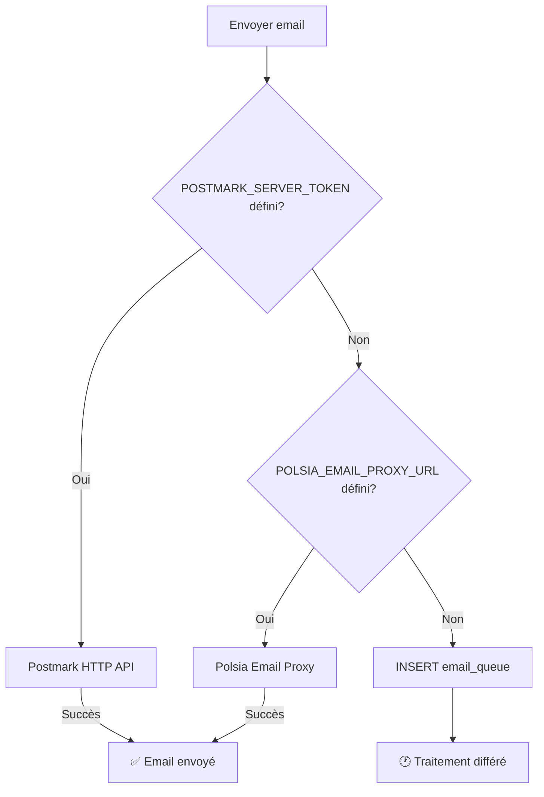
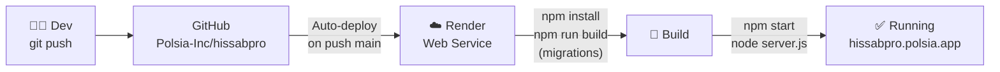
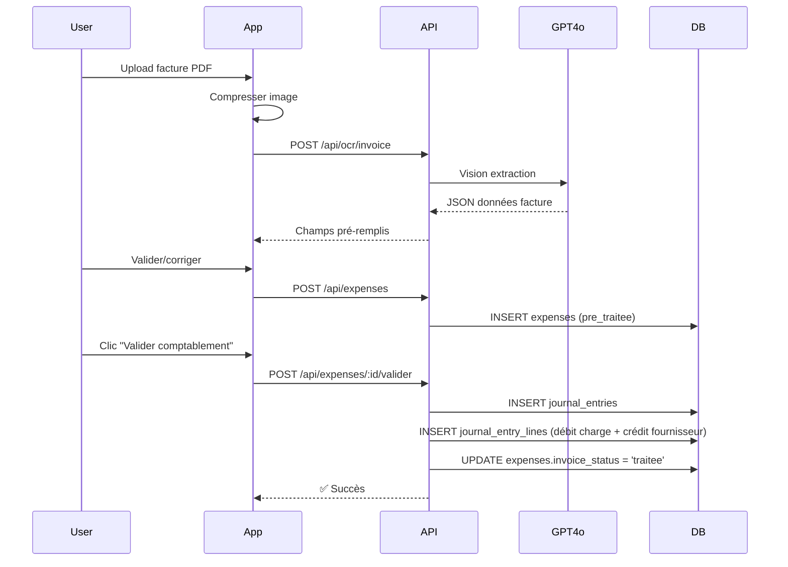
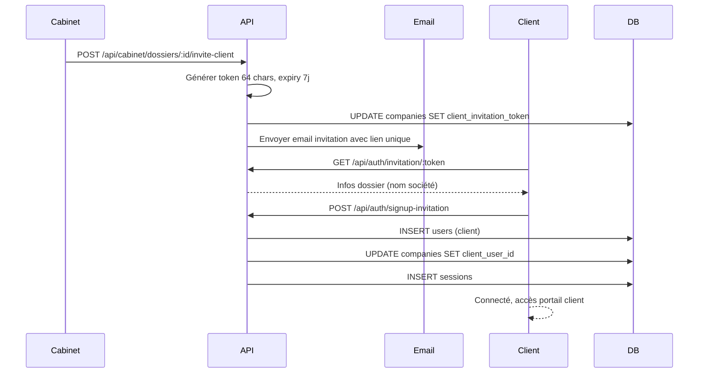

# HissabPro — Spécification Technique Exhaustive

> **Document de référence** pour onboarder un développeur, auditer le code, ou préparer une levée de fonds.
> Mis à jour le : 2026-04-21 — 23 modules, 31 migrations, 10 478 lignes

---

## Table des Matières

1. [Stack Technique](#1-stack-technique)
2. [Schéma de Base de Données](#2-schéma-de-base-de-données)
3. [API Endpoints](#3-api-endpoints)
4. [Structure du Code](#4-structure-du-code)
5. [Design System & Frontend](#5-design-system--frontend)
6. [Intégrations](#6-intégrations)
7. [Authentification & Sécurité](#7-authentification--sécurité)
8. [Déploiement & Infrastructure](#8-déploiement--infrastructure)
9. [Performance & Scalabilité](#9-performance--scalabilité)
10. [Tests](#10-tests)

---

## 1. Stack Technique

### Vue d'ensemble

| Couche | Technologie | Version |
|--------|-------------|---------|
| **Runtime** | Node.js | 18+ (`.nvmrc`) |
| **Framework backend** | Express.js | ^4.18.2 |
| **Frontend** | Vanilla JS + HTML/CSS | — |
| **Base de données** | Neon PostgreSQL | v15 |
| **Hébergement** | Render (Web Service) | — |
| **PDF** | pdf-lib | ^1.17.1 |
| **AI / OCR** | OpenAI SDK | ^4.77.0 |
| **Client DB** | node-postgres (pg) | ^8.11.3 |

### Frontend

- **Technologie** : HTML pur + JavaScript vanilla (pas de framework SPA)
- **Fichiers principaux** :
  - `public/index.html` — Landing page
  - `public/login.html` — Authentification
  - `public/app.html` — Shell SPA (inline JS)
  - `public/invite.html` — Invitation client
  - `public/member-invite.html` — Invitation membre cabinet
  - `public/onboarding.html` — Wizard d'onboarding 5 étapes
  - `public/logiciel-comptabilite-maroc.html` — Page SEO / marketing
- **Bundling** : Aucun — JavaScript inline dans les fichiers HTML
- **CSS** : `public/design-tokens.css` + `public/forms-modals.css`

### Backend

- **Runtime** : Node.js, module CommonJS
- **Point d'entrée** : `server.js` (fichier monolithique ~10 478 lignes)
- **Structure des routes** : Toutes dans `server.js` — pas de routeurs séparés
- **Pattern** : Route handler → requête SQL directe dans le même fichier

### Base de Données

- **SGBD** : PostgreSQL (Neon, région auto)
- **Connexion** : `pg.Pool` via `DATABASE_URL`
- **SSL** : Configuré avec `rejectUnauthorized: false` (warning non-fatal)
- **Migrations** : Système maison (`migrate.js` + dossier `migrations/`)

### Intégrations tierces

| Service | Usage | Variable d'env |
|---------|-------|----------------|
| **OpenAI GPT-4o** | OCR factures (vision) | `OPENAI_API_KEY` |
| **Neon PostgreSQL** | Base de données principale | `DATABASE_URL` |
| **Postmark** | Envoi d'emails | `POSTMARK_SERVER_TOKEN` |
| **Polsia Email Proxy** | Fallback email | `POLSIA_EMAIL_PROXY_URL` |
| **pdf-lib** | Génération et split de PDF | — |

### Diagramme d'architecture



---

## 2. Schéma de Base de Données

### Stratégie d'isolation multi-tenant

Toutes les données métier sont isolées par `company_id`. Un utilisateur de type `cabinet` peut switcher son contexte actif via `sessions.active_company_id`, permettant d'opérer sur n'importe quel dossier client.

### Tables Principales

#### `users`
```sql
id                    SERIAL PRIMARY KEY
email                 VARCHAR(255) NOT NULL UNIQUE
name                  VARCHAR(255)
password_hash         VARCHAR(255)           -- PBKDF2-SHA512: "salt:hash"
user_type             VARCHAR(20) DEFAULT 'standard'  -- 'standard' | 'cabinet'
cabinet_role          VARCHAR(20)            -- 'admin' | 'comptable' | 'assistant' | 'chef_mission' | 'collaborateur' | NULL
onboarding_completed  BOOLEAN DEFAULT false
stripe_subscription_id VARCHAR(255)
subscription_status   VARCHAR(50)
subscription_plan     VARCHAR(255)
subscription_expires_at TIMESTAMPTZ
subscription_updated_at TIMESTAMPTZ
created_at            TIMESTAMPTZ DEFAULT NOW()
updated_at            TIMESTAMPTZ DEFAULT NOW()
```

#### `sessions`
```sql
id                    SERIAL PRIMARY KEY
user_id               INTEGER NOT NULL REFERENCES users(id) ON DELETE CASCADE
token                 VARCHAR(128) NOT NULL UNIQUE
active_company_id     INTEGER                -- FK companies.id (cabinet mode)
expires_at            TIMESTAMPTZ NOT NULL
created_at            TIMESTAMPTZ DEFAULT NOW()
```

#### `companies`
```sql
id                    SERIAL PRIMARY KEY
name                  VARCHAR(255) NOT NULL
user_id               INTEGER REFERENCES users(id)
ice                   VARCHAR(15)            -- Identifiant Commun de l'Entreprise
idf                   VARCHAR(20)            -- Identifiant Fiscal
rc                    VARCHAR(50)            -- Registre du Commerce
cnss                  VARCHAR(20)
address               TEXT
city                  VARCHAR(100)
phone                 VARCHAR(20)
email                 VARCHAR(255)
logo_url              TEXT
fiscal_year_start     INTEGER DEFAULT 1
default_tva_rate      NUMERIC(5,2) DEFAULT 20.00
currency              VARCHAR(3) DEFAULT 'MAD'
rib                   VARCHAR(30)
bank_name             VARCHAR(100)
payment_conditions    TEXT
forme_juridique       VARCHAR(50)            -- SARL, SA, SAS, etc.
type_comptabilite     VARCHAR(20) DEFAULT 'Engagement'  -- 'Engagement' | 'Tresorerie'
statut                VARCHAR(20) DEFAULT 'actif'
collaborateur         VARCHAR(255)
chef_de_mission       VARCHAR(255)
collaborateur_id      INTEGER REFERENCES users(id) ON DELETE SET NULL
chef_de_mission_id    INTEGER REFERENCES users(id) ON DELETE SET NULL
pilote_pa             VARCHAR(255)
abonnement            VARCHAR(100) DEFAULT 'Collaboratif'
expert_comptable      VARCHAR(255)
-- Invitation client
client_invitation_token       VARCHAR(64) UNIQUE
client_invitation_expires_at  TIMESTAMP
client_invitation_status      VARCHAR(20) DEFAULT 'none'
client_user_id        INTEGER REFERENCES users(id) ON DELETE SET NULL
tva_regime            VARCHAR(20) DEFAULT 'Mensuel'  -- 'Mensuel' | 'Trimestriel'
created_at            TIMESTAMPTZ DEFAULT NOW()
updated_at            TIMESTAMPTZ DEFAULT NOW()
```

#### `pcm_accounts` (Plan Comptable Marocain)
```sql
id                    SERIAL PRIMARY KEY
code                  VARCHAR(10) NOT NULL UNIQUE
name                  VARCHAR(255) NOT NULL
class                 INTEGER NOT NULL
type                  VARCHAR(20) CHECK (type IN ('asset','liability','equity','revenue','expense'))
parent_code           VARCHAR(10)
is_active             BOOLEAN DEFAULT true
allow_direct_posting  BOOLEAN DEFAULT true
description           TEXT
created_at            TIMESTAMPTZ DEFAULT NOW()
```

#### `contacts` (Tiers: clients & fournisseurs legacy)
```sql
id                    SERIAL PRIMARY KEY
company_id            INTEGER REFERENCES companies(id)
user_id               INTEGER REFERENCES users(id)
type                  VARCHAR(20) CHECK (type IN ('client','fournisseur','both'))
name                  VARCHAR(255) NOT NULL
ice                   VARCHAR(15)
idf                   VARCHAR(20)
rc                    VARCHAR(50)
address               TEXT
city                  VARCHAR(100)
phone                 VARCHAR(20)
email                 VARCHAR(255)
account_code          VARCHAR(10)
balance               NUMERIC(15,2) DEFAULT 0
is_active             BOOLEAN DEFAULT true
created_at            TIMESTAMPTZ DEFAULT NOW()
updated_at            TIMESTAMPTZ DEFAULT NOW()
```

### Module Facturation

#### `invoices`
```sql
id                    SERIAL PRIMARY KEY
company_id            INTEGER REFERENCES companies(id)
contact_id            INTEGER REFERENCES contacts(id)
client_id             INTEGER REFERENCES clients(id)
user_id               INTEGER REFERENCES users(id)
invoice_number        VARCHAR(50) NOT NULL
type                  VARCHAR(20) CHECK (type IN ('sale','purchase'))
status                VARCHAR(20) CHECK (status IN ('draft','sent','paid','cancelled','overdue','validated','partiellement_payée'))
invoice_subtype       VARCHAR(20)            -- 'avoir' pour note de crédit
date                  DATE NOT NULL
due_date              DATE
subtotal              NUMERIC(15,2) DEFAULT 0
tva_amount            NUMERIC(15,2) DEFAULT 0
total                 NUMERIC(15,2) DEFAULT 0
tva_rate              NUMERIC(5,2) DEFAULT 20.00
notes                 TEXT
ice_client            VARCHAR(15)
payment_method        VARCHAR(50)
journal_entry_id      INTEGER REFERENCES journal_entries(id)
subscription_id       INTEGER REFERENCES subscriptions(id)
avoir_for_invoice_id  INTEGER REFERENCES invoices(id)  -- Invoice créditée par cet avoir
avoir_id              INTEGER REFERENCES invoices(id)  -- L'avoir créé pour cette facture
created_at            TIMESTAMPTZ DEFAULT NOW()
updated_at            TIMESTAMPTZ DEFAULT NOW()
```

#### `invoice_lines`
```sql
id                    SERIAL PRIMARY KEY
invoice_id            INTEGER NOT NULL REFERENCES invoices(id) ON DELETE CASCADE
description           VARCHAR(500) NOT NULL
quantity              NUMERIC(10,2) DEFAULT 1
unit_price            NUMERIC(15,2) NOT NULL
tva_rate              NUMERIC(5,2) DEFAULT 20.00
tva_amount            NUMERIC(15,2) DEFAULT 0
total                 NUMERIC(15,2) NOT NULL
account_code          VARCHAR(10)
sort_order            INTEGER DEFAULT 0
```

#### `invoice_attachments`
```sql
id                    SERIAL PRIMARY KEY
invoice_id            INTEGER NOT NULL REFERENCES invoices(id) ON DELETE CASCADE
filename              VARCHAR(255)
content_type          VARCHAR(100)
file_data             TEXT                   -- PDF/image en base64
created_at            TIMESTAMP DEFAULT NOW()
```

### Module Dépenses / OCR

#### `expenses` (Factures fournisseurs)
```sql
id                    SERIAL PRIMARY KEY
company_id            INTEGER REFERENCES companies(id)
contact_id            INTEGER REFERENCES contacts(id)
user_id               INTEGER REFERENCES users(id)
date                  DATE NOT NULL
description           VARCHAR(500) NOT NULL
amount                NUMERIC(15,2) NOT NULL
tva_rate              NUMERIC(5,2) DEFAULT 20.00
tva_amount            NUMERIC(15,2) DEFAULT 0
total                 NUMERIC(15,2) NOT NULL
tva_rate_label        VARCHAR(20)            -- 'multitaux' si plusieurs taux
account_code          VARCHAR(10) DEFAULT '6111'
payment_method        VARCHAR(50) DEFAULT 'virement'
status                VARCHAR(20) CHECK (status IN ('pending','approved','paid','cancelled'))
receipt_url           TEXT
journal_entry_id      INTEGER REFERENCES journal_entries(id)
category              VARCHAR(50)
-- Champs OCR
fournisseur_nom       VARCHAR(255)
numero_facture        VARCHAR(100)
supplier_ice          VARCHAR(20)
source                VARCHAR(50) DEFAULT 'saisie_manuelle'  -- 'saisie_manuelle' | 'ocr_imported'
invoice_status        VARCHAR(20) DEFAULT 'a_traiter'        -- 'a_traiter' | 'pre_traitee' | 'traitee'
-- Stockage PDF
document_data         TEXT                   -- PDF en base64
document_mime_type    VARCHAR(50)
is_split              BOOLEAN DEFAULT false
parent_document_id    INTEGER REFERENCES expenses(id) ON DELETE SET NULL
-- Dates
date_echeance         DATE
added_at              TIMESTAMPTZ DEFAULT NOW()
created_at            TIMESTAMPTZ DEFAULT NOW()
updated_at            TIMESTAMPTZ DEFAULT NOW()
```

#### `supplier_invoice_lines` (Ventilation multi-taux TVA)
```sql
id                    SERIAL PRIMARY KEY
invoice_id            INTEGER NOT NULL REFERENCES expenses(id) ON DELETE CASCADE
account_code          VARCHAR(20) DEFAULT '6111'
account_label         VARCHAR(255)
amount_ht             NUMERIC(12,2) DEFAULT 0
tva_rate              NUMERIC(5,2) DEFAULT 0
amount_tva            NUMERIC(12,2) DEFAULT 0
sort_order            INTEGER DEFAULT 0
created_at            TIMESTAMPTZ DEFAULT NOW()
```

### Module Comptabilité

#### `journal_entries`
```sql
id                    SERIAL PRIMARY KEY
company_id            INTEGER REFERENCES companies(id)
user_id               INTEGER REFERENCES users(id)
entry_number          VARCHAR(50)
date                  DATE NOT NULL
journal_type          VARCHAR(20) CHECK (journal_type IN ('AC','VE','BQ','CA','OD','AV','RAN'))
is_locked             BOOLEAN DEFAULT false
fiscal_year_id        INTEGER REFERENCES fiscal_years(id)
reference             VARCHAR(100)
description           TEXT
source_type           VARCHAR(20)            -- 'invoice' | 'expense' | 'payment'
source_id             INTEGER
is_balanced           BOOLEAN DEFAULT true
total_debit           NUMERIC(15,2) DEFAULT 0
total_credit          NUMERIC(15,2) DEFAULT 0
created_at            TIMESTAMPTZ DEFAULT NOW()
```

**Codes journaux** :
| Code | Libellé |
|------|---------|
| AC | Achats |
| VE | Ventes |
| BQ | Banque |
| CA | Caisse |
| OD | Opérations Diverses |
| AV | Avoirs (annulation facture) |
| RAN | Report à Nouveau (clôture exercice) |

#### `journal_entry_lines`
```sql
id                    SERIAL PRIMARY KEY
journal_entry_id      INTEGER NOT NULL REFERENCES journal_entries(id) ON DELETE CASCADE
account_code          VARCHAR(10) NOT NULL
account_name          VARCHAR(255)
debit                 NUMERIC(15,2) DEFAULT 0
credit                NUMERIC(15,2) DEFAULT 0
description           TEXT
lettrage_code         VARCHAR(10)            -- code de lettrage (A, B, AA...)
line_id_for_lettrage  INTEGER REFERENCES journal_entry_lines(id)
sort_order            INTEGER DEFAULT 0
```

### Module Cabinet

#### `cabinet_members`
```sql
id                    SERIAL PRIMARY KEY
cabinet_owner_id      INTEGER NOT NULL REFERENCES users(id) ON DELETE CASCADE
member_user_id        INTEGER NOT NULL REFERENCES users(id) ON DELETE CASCADE
role                  VARCHAR(20) DEFAULT 'comptable'  -- 'admin'|'comptable'|'assistant'|'chef_mission'|'collaborateur'
status                VARCHAR(20) DEFAULT 'active'
invite_token          VARCHAR(128) UNIQUE
invite_expires_at     TIMESTAMP
invite_status         VARCHAR(20) DEFAULT 'active'
invited_at            TIMESTAMP DEFAULT NOW()
created_at            TIMESTAMP DEFAULT NOW()
UNIQUE(cabinet_owner_id, member_user_id)
```

#### `cabinet_messages`
```sql
id                    SERIAL PRIMARY KEY
company_id            INTEGER NOT NULL
cabinet_user_id       INTEGER NOT NULL
sender_user_id        INTEGER
sender_name           VARCHAR(255)
message_type          VARCHAR(30) DEFAULT 'message'
content               TEXT NOT NULL
is_read               BOOLEAN DEFAULT false
created_at            TIMESTAMP DEFAULT NOW()
```

#### `cabinet_message_attachments`
```sql
id                    SERIAL PRIMARY KEY
message_id            INTEGER NOT NULL REFERENCES cabinet_messages(id) ON DELETE CASCADE
filename              VARCHAR(255) NOT NULL
file_data             TEXT NOT NULL          -- base64
content_type          VARCHAR(100)
created_at            TIMESTAMP DEFAULT NOW()
```

#### `cabinet_documents`
```sql
id                    SERIAL PRIMARY KEY
company_id            INTEGER NOT NULL
cabinet_user_id       INTEGER NOT NULL
uploaded_by_user_id   INTEGER
uploader_name         VARCHAR(255)
filename              VARCHAR(255) NOT NULL
file_data             TEXT NOT NULL          -- base64
content_type          VARCHAR(100)
category              VARCHAR(50) DEFAULT 'autre'
period_month          INTEGER
period_year           INTEGER
file_size             INTEGER
created_at            TIMESTAMP DEFAULT NOW()
```

#### `cabinet_justificatif_requests`
```sql
id                    SERIAL PRIMARY KEY
company_id            INTEGER NOT NULL
cabinet_user_id       INTEGER NOT NULL
requested_by_user_id  INTEGER
requester_name        VARCHAR(255)
title                 VARCHAR(500) NOT NULL
description           TEXT
deadline              DATE
status                VARCHAR(20) DEFAULT 'pending'  -- 'pending'|'submitted'|'approved'|'rejected'
document_id           INTEGER
created_at            TIMESTAMP DEFAULT NOW()
updated_at            TIMESTAMP DEFAULT NOW()
```

### Module Vente

#### `clients` (CRM clients vente)
```sql
id                    SERIAL PRIMARY KEY
company_id            INTEGER NOT NULL REFERENCES companies(id) ON DELETE CASCADE
name                  VARCHAR(255) NOT NULL
ice                   VARCHAR(50)
if_number             VARCHAR(50)
rc_number             VARCHAR(50)
address               TEXT
city                  VARCHAR(100)
postal_code           VARCHAR(20)
country               VARCHAR(100) DEFAULT 'Maroc'
phone                 VARCHAR(30)
email                 VARCHAR(255)
website               VARCHAR(255)
notes                 TEXT
created_at            TIMESTAMPTZ DEFAULT NOW()
updated_at            TIMESTAMPTZ DEFAULT NOW()
```

#### `client_contacts`
```sql
id                    SERIAL PRIMARY KEY
client_id             INTEGER NOT NULL REFERENCES clients(id) ON DELETE CASCADE
company_id            INTEGER NOT NULL REFERENCES companies(id) ON DELETE CASCADE
first_name            VARCHAR(100) NOT NULL
last_name             VARCHAR(100) NOT NULL
email                 VARCHAR(255)
phone                 VARCHAR(30)
title                 VARCHAR(100)
is_primary            BOOLEAN DEFAULT false
notes                 TEXT
created_at            TIMESTAMPTZ DEFAULT NOW()
updated_at            TIMESTAMPTZ DEFAULT NOW()
```

#### `products`
```sql
id                    SERIAL PRIMARY KEY
company_id            INTEGER NOT NULL REFERENCES companies(id) ON DELETE CASCADE
name                  VARCHAR(255) NOT NULL
description           TEXT
type                  VARCHAR(20) DEFAULT 'produit'  -- 'produit'|'service'|'abonnement'
unit_price            NUMERIC(15,2) DEFAULT 0
tva_rate              NUMERIC(5,2) DEFAULT 20        -- 0|7|10|14|20
unit                  VARCHAR(50) DEFAULT 'unité'
is_recurring          BOOLEAN DEFAULT false
recurring_interval    VARCHAR(20)                    -- 'mensuel'|'trimestriel'|'annuel'
is_active             BOOLEAN DEFAULT true
created_at            TIMESTAMPTZ DEFAULT NOW()
updated_at            TIMESTAMPTZ DEFAULT NOW()
```

#### `quotes` (Devis)
```sql
id                    SERIAL PRIMARY KEY
company_id            INTEGER NOT NULL REFERENCES companies(id) ON DELETE CASCADE
client_id             INTEGER NOT NULL REFERENCES clients(id) ON DELETE RESTRICT
contact_id            INTEGER REFERENCES client_contacts(id) ON DELETE SET NULL
quote_number          VARCHAR(30) NOT NULL
date                  DATE NOT NULL
valid_until           DATE
status                VARCHAR(20) DEFAULT 'brouillon'  -- 'brouillon'|'envoyé'|'accepté'|'refusé'|'expiré'
subtotal              NUMERIC(15,2) DEFAULT 0
tva_amount            NUMERIC(15,2) DEFAULT 0
total                 NUMERIC(15,2) DEFAULT 0
notes                 TEXT
converted_to_invoice_id INTEGER
created_at            TIMESTAMPTZ DEFAULT NOW()
updated_at            TIMESTAMPTZ DEFAULT NOW()
UNIQUE(company_id, quote_number)
```

#### `quote_lines`
```sql
id                    SERIAL PRIMARY KEY
quote_id              INTEGER NOT NULL REFERENCES quotes(id) ON DELETE CASCADE
product_id            INTEGER REFERENCES products(id) ON DELETE SET NULL
description           TEXT NOT NULL
quantity              NUMERIC(10,3) DEFAULT 1
unit_price            NUMERIC(15,2) DEFAULT 0
tva_rate              NUMERIC(5,2) DEFAULT 20
total                 NUMERIC(15,2) DEFAULT 0
sort_order            INTEGER DEFAULT 0
```

#### `subscriptions` (Abonnements récurrents)
```sql
id                    SERIAL PRIMARY KEY
company_id            INTEGER NOT NULL REFERENCES companies(id) ON DELETE CASCADE
client_id             INTEGER NOT NULL REFERENCES clients(id) ON DELETE RESTRICT
product_id            INTEGER NOT NULL REFERENCES products(id) ON DELETE RESTRICT
start_date            DATE NOT NULL
next_invoice_date     DATE
interval              VARCHAR(20) NOT NULL  -- 'mensuel'|'trimestriel'|'annuel'
amount                NUMERIC(15,2) NOT NULL
tva_rate              NUMERIC(5,2) DEFAULT 20
status                VARCHAR(20) DEFAULT 'actif'  -- 'actif'|'pausé'|'annulé'|'expiré'
last_invoice_id       INTEGER
end_date              DATE
notes                 TEXT
created_at            TIMESTAMPTZ DEFAULT NOW()
updated_at            TIMESTAMPTZ DEFAULT NOW()
```

#### `client_payments`
```sql
id                    SERIAL PRIMARY KEY
company_id            INTEGER NOT NULL REFERENCES companies(id) ON DELETE CASCADE
invoice_id            INTEGER
client_id             INTEGER REFERENCES clients(id) ON DELETE SET NULL
amount                NUMERIC(15,2) NOT NULL
date                  DATE NOT NULL
method                VARCHAR(20) DEFAULT 'virement'  -- 'virement'|'chèque'|'espèces'|'carte'|'effet'|'autre'
reference             VARCHAR(100)
status                VARCHAR(20) DEFAULT 'reçu'  -- 'reçu'|'en_attente'|'annulé'
is_linked             BOOLEAN DEFAULT false
label                 TEXT
bank_transaction_id   INTEGER REFERENCES bank_transactions(id) ON DELETE SET NULL
journal_entry_id      INTEGER REFERENCES journal_entries(id) ON DELETE SET NULL
notes                 TEXT
created_at            TIMESTAMPTZ DEFAULT NOW()
```

#### `reminders` (Relances clients)
```sql
id                    SERIAL PRIMARY KEY
company_id            INTEGER NOT NULL REFERENCES companies(id) ON DELETE CASCADE
invoice_id            INTEGER
client_id             INTEGER REFERENCES clients(id) ON DELETE SET NULL
channel               VARCHAR(30) DEFAULT 'email'  -- 'email'|'telephone'|'whatsapp'|'physique'|'courrier_recommande_ar'|'autre'
channel_other         VARCHAR(100)
sent_at               TIMESTAMPTZ DEFAULT NOW()
status                VARCHAR(20) DEFAULT 'à_envoyer'  -- 'à_envoyer'|'envoyé'|'répondu'|'résolu'
level                 VARCHAR(30)  -- 'rappel'|'relance'|'mise_en_demeure'|'contentieux'
call_datetime         TIMESTAMPTZ
tracking_number       VARCHAR(100)
ar_received_date      DATE
notes                 TEXT
sent_by               INTEGER REFERENCES users(id) ON DELETE SET NULL
created_at            TIMESTAMPTZ DEFAULT NOW()
```

### Module Banque

#### `bank_accounts`
```sql
id                    SERIAL PRIMARY KEY
company_id            INTEGER NOT NULL REFERENCES companies(id) ON DELETE CASCADE
name                  VARCHAR(255) NOT NULL
bank_name             VARCHAR(100)
account_number        VARCHAR(50)
rib                   VARCHAR(30)
currency              VARCHAR(3) DEFAULT 'MAD'
last_import_at        TIMESTAMPTZ
last_balance          NUMERIC(15,2)
last_balance_date     DATE
created_at            TIMESTAMPTZ DEFAULT NOW()
```

#### `bank_transactions`
```sql
id                    SERIAL PRIMARY KEY
company_id            INTEGER NOT NULL REFERENCES companies(id) ON DELETE CASCADE
bank_account_id       INTEGER REFERENCES bank_accounts(id) ON DELETE SET NULL
transaction_date      DATE NOT NULL
label                 TEXT NOT NULL
debit                 NUMERIC(15,2)
credit                NUMERIC(15,2)
balance               NUMERIC(15,2)
matched_invoice_id    INTEGER
matched_expense_id    INTEGER
match_status          VARCHAR(20) DEFAULT 'unmatched'  -- 'unmatched'|'auto_matched'|'manual_matched'|'ignored'
match_confidence      INTEGER
created_at            TIMESTAMPTZ DEFAULT NOW()
```

### Tables Système

#### `notifications`
```sql
id                    SERIAL PRIMARY KEY
user_id               INTEGER NOT NULL REFERENCES users(id) ON DELETE CASCADE
company_id            INTEGER
type                  VARCHAR(60) NOT NULL
title                 VARCHAR(500) NOT NULL
message               TEXT NOT NULL
link                  VARCHAR(1000)
is_read               BOOLEAN DEFAULT false
created_at            TIMESTAMP DEFAULT NOW()
```

#### `notification_preferences`
```sql
id                    SERIAL PRIMARY KEY
user_id               INTEGER NOT NULL UNIQUE REFERENCES users(id) ON DELETE CASCADE
email_enabled         BOOLEAN DEFAULT true
types_disabled        TEXT[] DEFAULT '{}'
created_at            TIMESTAMP DEFAULT NOW()
updated_at            TIMESTAMP DEFAULT NOW()
```

#### `email_queue`
```sql
id                    SERIAL PRIMARY KEY
to_email              VARCHAR(255) NOT NULL
subject               VARCHAR(500) NOT NULL
html_body             TEXT NOT NULL
status                VARCHAR(20) DEFAULT 'pending'
error                 TEXT
created_at            TIMESTAMPTZ DEFAULT NOW()
sent_at               TIMESTAMPTZ
```

#### `_migrations`
```sql
id                    SERIAL PRIMARY KEY
name                  VARCHAR(255) NOT NULL UNIQUE
applied_at            TIMESTAMP DEFAULT CURRENT_TIMESTAMP
```

### Diagramme ERD



---

## 3. API Endpoints

### Middleware d'authentification

Toutes les routes `/api/*` (sauf `auth/*`) requièrent un cookie de session valide.

```
Cookie: session=<96-char-hex-token>
```

`requireAuth` injecte sur `req` :
- `userId`, `userEmail`, `userName`
- `userType` : `'standard'` | `'cabinet'`
- `cabinetRole` : `'admin'` | `'comptable'` | `'assistant'` | `null`
- `cabinetOwnerId` : ID du cabinet propriétaire (pour membres)
- `activeCompanyId` : contexte de société actif (cabinet mode)

`requireCabinetRole(roles[])` — RBAC strict :
- Vérifie `userType === 'cabinet'`
- Vérifie `cabinetRole` dans la liste passée
- Retourne `403` sinon

### Auth

| Méthode | Route | Auth | Description |
|---------|-------|------|-------------|
| POST | `/api/auth/signup` | ❌ | Création de compte |
| POST | `/api/auth/login` | ❌ | Connexion, création session |
| POST | `/api/auth/logout` | ✅ | Suppression session |
| GET | `/api/auth/me` | ✅ | Infos utilisateur courant |
| GET | `/api/auth/invitation/:token` | ❌ | Valider token invitation client |
| POST | `/api/auth/signup-invitation` | ❌ | Inscription via invitation client |
| GET | `/api/auth/member-invite/:token` | ❌ | Valider token invitation membre cabinet |
| POST | `/api/auth/member-invite/:token` | ❌ | Inscription membre cabinet |

**Format requête login :**
```json
POST /api/auth/login
{ "email": "user@example.com", "password": "secret" }
```

**Format réponse :**
```json
{ "success": true, "user": { "id": 1, "email": "...", "name": "...", "userType": "standard" } }
```
Cookie `session=<token>; HttpOnly; SameSite=Lax; Max-Age=2592000`

---

### Company

| Méthode | Route | Auth | Description |
|---------|-------|------|-------------|
| GET | `/api/company` | ✅ | Profil de l'entreprise active |
| POST | `/api/company` | ✅ | Créer ou mettre à jour le profil |

---

### Comptes (PCM)

| Méthode | Route | Auth | Description |
|---------|-------|------|-------------|
| GET | `/api/accounts` | ✅ | Liste des comptes PCM avec soldes |

---

### Contacts (Legacy)

| Méthode | Route | Auth | Description |
|---------|-------|------|-------------|
| GET | `/api/contacts` | ✅ | Liste contacts (clients/fournisseurs) |
| POST | `/api/contacts` | ✅ | Créer un contact |

---

### Factures (Invoices)

| Méthode | Route | Auth | Description |
|---------|-------|------|-------------|
| GET | `/api/invoices` | ✅ | Liste factures (ventes + achats) |
| GET | `/api/invoices/:id` | ✅ | Détail facture |
| POST | `/api/invoices` | ✅ | Créer une facture |
| PUT | `/api/invoices/:id/status` | ✅ | Changer statut facture |
| POST | `/api/invoices/:id/cancel` | ✅ | Annuler (crée un avoir) |
| GET | `/api/invoices/:id/export` | ✅ | Export XML (UBL-2.1 / CII) |
| GET | `/api/invoices/:id/xml` | ✅ | Obtenir le XML e-facture |
| POST | `/api/invoices/:id/attachment` | ✅ | Uploader justificatif |
| GET | `/api/invoices/:id/attachment` | ✅ | Télécharger justificatif |
| GET | `/api/invoices/:id/has-attachment` | ✅ | Vérifier existence justificatif |

**Format réponse (invoice) :**
```json
{
  "id": 42, "invoice_number": "FA-2024-001", "type": "sale",
  "status": "sent", "date": "2024-01-15", "due_date": "2024-02-15",
  "subtotal": 10000, "tva_amount": 2000, "total": 12000,
  "client": { "id": 1, "name": "Client SARL" },
  "lines": [
    { "description": "Prestation", "quantity": 1, "unit_price": 10000,
      "tva_rate": 20, "total": 12000 }
  ]
}
```

---

### Dépenses / OCR

| Méthode | Route | Auth | Description |
|---------|-------|------|-------------|
| GET | `/api/expenses` | ✅ | Liste dépenses avec statut OCR |
| POST | `/api/expenses` | ✅ | Créer dépense manuellement |
| GET | `/api/expenses/:id` | ✅ | Détail dépense |
| PUT | `/api/expenses/:id` | ✅ | Modifier dépense |
| DELETE | `/api/expenses/:id` | ✅ | Supprimer dépense |
| PATCH | `/api/expenses/:id/status` | ✅ | Changer statut traitement |
| POST | `/api/expenses/:id/valider` | ✅ | Valider → créer écriture comptable |
| POST | `/api/expenses/:id/split` | ✅ | Split PDF multi-factures |
| GET | `/api/expenses/:id/document` | ✅ | Télécharger document original |
| POST | `/api/ocr/invoice` | ✅ | OCR extraction GPT-4o |
| POST | `/api/expenses/import-multi` | ✅ | Import bulk OCR |

---

### Comptabilité (Journal)

| Méthode | Route | Auth | Description |
|---------|-------|------|-------------|
| GET | `/api/journal-entries` | ✅ | Liste écritures comptables |
| GET | `/api/journal-entries/:id` | ✅ | Détail écriture |
| POST | `/api/journal-entries` | ✅ | Créer écriture manuelle |
| GET | `/api/balance` | ✅ | Grand Livre |
| GET | `/api/balance-generale` | ✅ | Balance Générale |

---

### TVA

| Méthode | Route | Auth | Description |
|---------|-------|------|-------------|
| GET | `/api/tva/declaration` | ✅ | Déclaration TVA (JSON SIMPL) |

**Query params :** `year`, `month` OU `quarter`

**Format réponse :**
```json
{
  "collectee": [
    { "tva_rate": 20, "base_ht": 100000, "tva_amount": 20000 }
  ],
  "deductible": [
    { "tva_rate": 20, "base_ht": 50000, "tva_amount": 10000 }
  ],
  "tva_due": 10000,
  "is_credit": false,
  "period": { "year": 2024, "month": 1 }
}
```

---

### Dashboard

| Méthode | Route | Auth | Description |
|---------|-------|------|-------------|
| GET | `/api/dashboard` | ✅ | Dashboard cabinet/entreprise |
| GET | `/api/client/dashboard` | ✅ | Vue client portail |

---

### Notifications

| Méthode | Route | Auth | Description |
|---------|-------|------|-------------|
| GET | `/api/notifications` | ✅ | Liste notifications |
| GET | `/api/notifications/unread-count` | ✅ | Compteur non lues |
| PUT | `/api/notifications/:id/read` | ✅ | Marquer lue |
| PUT | `/api/notifications/read-all` | ✅ | Tout marquer lu |
| GET | `/api/notifications/preferences` | ✅ | Préférences notification |
| PUT | `/api/notifications/preferences` | ✅ | Mettre à jour préférences |

---

### Cabinet

| Méthode | Route | Auth | Description |
|---------|-------|------|-------------|
| GET | `/api/cabinet/dossiers` | ✅ | Liste dossiers clients |
| POST | `/api/cabinet/dossiers` | ✅ (admin) | Créer dossier |
| PUT | `/api/cabinet/dossiers/:id` | ✅ (admin) | Modifier dossier |
| POST | `/api/cabinet/dossiers/:id/invite-client` | ✅ (admin) | Envoyer invitation client |
| POST | `/api/cabinet/switch/:id` | ✅ | Switcher contexte société |
| GET | `/api/cabinet/collaborateurs` | ✅ | Liste membres équipe |
| GET | `/api/cabinet/members` | ✅ (admin) | Membres avec rôles |
| POST | `/api/cabinet/members` | ✅ (admin) | Inviter membre |
| PUT | `/api/cabinet/members/:id` | ✅ (admin) | Modifier rôle |
| POST | `/api/cabinet/members/:id/resend-invite` | ✅ (admin) | Renvoyer invitation |
| DELETE | `/api/cabinet/members/:id` | ✅ (admin) | Retirer membre |

---

### Collaboration Cabinet

| Méthode | Route | Auth | Description |
|---------|-------|------|-------------|
| GET | `/api/cabinet/messages` | ✅ | Messages du dossier |
| POST | `/api/cabinet/messages` | ✅ | Envoyer message |
| PUT | `/api/cabinet/messages/:id/read` | ✅ | Marquer lu |
| PUT | `/api/cabinet/messages/read-all` | ✅ | Tout marquer lu |
| DELETE | `/api/cabinet/messages/:id` | ✅ | Supprimer message |
| GET | `/api/cabinet/documents` | ✅ | Documents uploadés |
| POST | `/api/cabinet/documents` | ✅ | Uploader document |
| GET | `/api/cabinet/documents/:id/download` | ✅ | Télécharger document |
| DELETE | `/api/cabinet/documents/:id` | ✅ | Supprimer document |
| GET | `/api/cabinet/justificatifs` | ✅ | Demandes de pièces |
| POST | `/api/cabinet/justificatifs` | ✅ (cabinet) | Créer demande |
| PUT | `/api/cabinet/justificatifs/:id` | ✅ | Mettre à jour |
| POST | `/api/cabinet/justificatifs/:id/respond` | ✅ | Répondre (client) |
| DELETE | `/api/cabinet/justificatifs/:id` | ✅ | Supprimer demande |
| GET | `/api/cabinet/collaboration/stats` | ✅ | Statistiques collaboration |
| GET | `/api/cabinet/clients` | ✅ | Clients du cabinet |
| POST | `/api/cabinet/clients` | ✅ (admin) | Créer client cabinet |
| GET | `/api/cabinet/clients/:id` | ✅ | Détail client |
| PUT | `/api/cabinet/clients/:id` | ✅ | Modifier client |
| POST | `/api/cabinet/clients/:id/toggle-active` | ✅ | Activer/désactiver |
| POST | `/api/cabinet/clients/:id/resend-invite` | ✅ | Renvoyer invitation |

---

### Banque

| Méthode | Route | Auth | Description |
|---------|-------|------|-------------|
| GET | `/api/bank/accounts` | ✅ | Liste comptes bancaires |
| POST | `/api/bank/accounts` | ✅ | Créer compte bancaire |
| PUT | `/api/bank/accounts/:id` | ✅ | Modifier compte |
| DELETE | `/api/bank/accounts/:id` | ✅ | Supprimer compte |
| GET | `/api/bank/transactions` | ✅ | Liste transactions |
| POST | `/api/bank/import` | ✅ | Import CSV relevé bancaire |
| POST | `/api/bank/auto-match` | ✅ | Rapprochement automatique |
| PUT | `/api/bank/transactions/:id/match` | ✅ | Rapprochement manuel |
| PUT | `/api/bank/transactions/:id/ignore` | ✅ | Ignorer transaction |
| DELETE | `/api/bank/transactions/:id/match` | ✅ | Annuler rapprochement |
| GET | `/api/bank/stats` | ✅ | Statistiques rapprochement |
| GET | `/api/bank/unmatched-invoices` | ✅ | Factures sans rapprochement |
| GET | `/api/bank/unmatched-expenses` | ✅ | Dépenses sans rapprochement |

---

### Vente (CRM + Devis + Abonnements + Relances)

| Méthode | Route | Auth | Description |
|---------|-------|------|-------------|
| GET | `/api/vente/clients` | ✅ | Clients vente |
| POST | `/api/vente/clients` | ✅ | Créer client |
| PUT | `/api/vente/clients/:id` | ✅ | Modifier client |
| DELETE | `/api/vente/clients/:id` | ✅ | Supprimer client |
| GET | `/api/vente/clients/:id/contacts` | ✅ | Contacts client |
| POST | `/api/vente/clients/:id/contacts` | ✅ | Ajouter contact |
| PUT | `/api/vente/clients/:id/contacts/:cId` | ✅ | Modifier contact |
| GET | `/api/vente/clients/:id/balance` | ✅ | Balance client |
| GET | `/api/vente/quotes` | ✅ | Devis |
| POST | `/api/vente/quotes` | ✅ | Créer devis |
| GET | `/api/vente/quotes/:id` | ✅ | Détail devis |
| PUT | `/api/vente/quotes/:id` | ✅ | Modifier devis |
| DELETE | `/api/vente/quotes/:id` | ✅ | Supprimer devis |
| PUT | `/api/vente/quotes/:id/status` | ✅ | Changer statut devis |
| POST | `/api/vente/quotes/:id/convert` | ✅ | Convertir en facture |
| GET | `/api/vente/products` | ✅ | Produits/services |
| POST | `/api/vente/products` | ✅ | Créer produit |
| PUT | `/api/vente/products/:id` | ✅ | Modifier produit |
| DELETE | `/api/vente/products/:id` | ✅ | Supprimer produit |
| GET | `/api/vente/subscriptions` | ✅ | Abonnements |
| POST | `/api/vente/subscriptions` | ✅ | Créer abonnement |
| PUT | `/api/vente/subscriptions/:id` | ✅ | Modifier abonnement |
| DELETE | `/api/vente/subscriptions/:id` | ✅ | Supprimer abonnement |
| GET | `/api/vente/subscriptions/:id/invoices` | ✅ | Factures abonnement |
| POST | `/api/vente/subscriptions/process-due` | ✅ | Générer factures dues |
| GET | `/api/vente/payments` | ✅ | Paiements clients |
| POST | `/api/vente/payments` | ✅ | Enregistrer paiement |
| PUT | `/api/vente/payments/:id/link` | ✅ | Lier paiement à facture |
| DELETE | `/api/vente/payments/:id/link` | ✅ | Délier paiement |
| DELETE | `/api/vente/payments/:id` | ✅ | Supprimer paiement |
| GET | `/api/vente/reminders` | ✅ | Relances |
| POST | `/api/vente/reminders` | ✅ | Créer relance |
| PUT | `/api/vente/reminders/:id` | ✅ | Modifier relance |
| GET | `/api/vente/reminders/:invoice_id/history` | ✅ | Historique relances |
| POST | `/api/vente/reminders/send-email` | ✅ | Envoyer relance par email |
| GET | `/api/vente/reminders/stats` | ✅ | Statistiques relances |

---

### Lettrage comptable

| Méthode | Route | Auth | Description |
|---------|-------|------|-------------|
| GET | `/api/lettrage/lines/:account_code` | ✅ | Lignes lettrables pour un compte |
| POST | `/api/lettrage/auto` | ✅ | Lettrage automatique |
| POST | `/api/lettrage/manual` | ✅ | Lettrage manuel |
| DELETE | `/api/lettrage/:code` | ✅ | Délettrage |

### Immobilisations

| Méthode | Route | Auth | Description |
|---------|-------|------|-------------|
| GET | `/api/assets` | ✅ | Liste des immobilisations |
| POST | `/api/assets` | ✅ | Créer une immobilisation |
| PUT | `/api/assets/:id` | ✅ | Modifier |
| DELETE | `/api/assets/:id` | ✅ | Supprimer |
| GET | `/api/assets/depreciation-summary` | ✅ | Résumé amortissements |
| GET | `/api/assets/:id/depreciation-schedule` | ✅ | Tableau d'amortissement |
| POST | `/api/assets/generate-depreciations` | ✅ | Générer les dotations |
| POST | `/api/assets/:id/dispose` | ✅ | Cession |
| POST | `/api/assets/:id/scrap` | ✅ | Mise au rebut |
| GET | `/api/assets/export/csv` | ✅ | Export CSV |

### Exercices fiscaux & Clôture

| Méthode | Route | Auth | Description |
|---------|-------|------|-------------|
| GET | `/api/exercices` | ✅ | Liste des exercices |
| POST | `/api/exercices` | ✅ | Créer un exercice |
| GET | `/api/cloture/pre-checks` | ✅ | Vérifications avant clôture |
| POST | `/api/cloture/resultat` | ✅ | Calculer et enregistrer le résultat |
| GET | `/api/cloture/preview-ran` | ✅ | Prévisualiser le RAN |
| POST | `/api/cloture/executer` | ✅ | Clôturer l'exercice |

### États financiers

| Méthode | Route | Auth | Description |
|---------|-------|------|-------------|
| GET | `/api/bilan` | ✅ | Bilan PCM |
| GET | `/api/cpc` | ✅ | Compte de Produits et Charges |
| GET | `/api/cpc/export/csv` | ✅ | Export CSV CPC |
| GET | `/api/esg` | ✅ | État des Soldes de Gestion / CAF |
| GET | `/api/esg/export/csv` | ✅ | Export CSV ESG |

### SIMPL-IS

| Méthode | Route | Auth | Description |
|---------|-------|------|-------------|
| GET | `/api/is` | ✅ | Calculer l'IS (barème 2024) |
| POST | `/api/is` | ✅ | Enregistrer une déclaration IS |
| GET | `/api/is/declarations` | ✅ | Historique des déclarations IS |

### Trésorerie prévisionnelle

| Méthode | Route | Auth | Description |
|---------|-------|------|-------------|
| GET | `/api/tresorerie/previsionnel` | ✅ | Projection du solde N mois |
| GET | `/api/tresorerie/charges-recurrentes` | ✅ | Liste des charges récurrentes |
| POST | `/api/tresorerie/charges-recurrentes` | ✅ | Ajouter une charge |
| PUT | `/api/tresorerie/charges-recurrentes/:id` | ✅ | Modifier |
| DELETE | `/api/tresorerie/charges-recurrentes/:id` | ✅ | Supprimer |

### Effets de commerce

| Méthode | Route | Auth | Description |
|---------|-------|------|-------------|
| GET | `/api/effets` | ✅ | Liste des effets (LC, BAO) |
| POST | `/api/effets` | ✅ | Créer un effet |
| PUT | `/api/effets/:id` | ✅ | Modifier |
| DELETE | `/api/effets/:id` | ✅ | Supprimer |
| PUT | `/api/effets/:id/status` | ✅ | Changer le statut |
| GET | `/api/effets/export/csv` | ✅ | Export CSV |

### Onboarding & Divers

| Méthode | Route | Auth | Description |
|---------|-------|------|-------------|
| POST | `/api/onboarding` | ✅ | Compléter le wizard onboarding |
| POST | `/api/onboarding/reset` | ✅ | Réinitialiser l'onboarding |
| GET | `/api/balance-agee` | ✅ | Balance âgée (créances/dettes par ancienneté) |
| GET | `/api/search` | ✅ | Recherche globale |

### Santé & Interne

| Méthode | Route | Auth | Description |
|---------|-------|------|-------------|
| GET | `/health` | ❌ | Health check Render |
| GET | `/api/internal/email-queue` | ❌ | File emails en attente |
| PUT | `/api/internal/email-queue/:id/sent` | ❌ | Marquer email envoyé |

**Réponse health :**
```json
{ "status": "healthy", "version": "2.0.0" }
```

---

## 4. Structure du Code

### Arborescence

```
hissabpro/
├── server.js                  # Point d'entrée Express (~10 478 lignes, fichier monolithique)
├── migrate.js                 # Runner de migrations maison
├── package.json               # Dépendances Node.js
├── render.yaml                # Config déploiement Render
├── .nvmrc                     # Node.js version pin
├── migrations/                # Fichiers de migration SQL
│   ├── 1713520000000_initial_schema.js
│   ├── 1713530000000_add_auth.js
│   ├── 1713540000000_add_payment_details.js
│   ├── 1713550000000_add_invoice_attachments.js
│   ├── 1713570000000_add_cabinet_mode.js
│   ├── 1713580000000_add_cabinet_collaboration.js
│   ├── 1745087014000_add_saisie_fields.js
│   ├── 1745087500000_add_notifications.js
│   ├── 1745092000000_add_cabinet_rbac.js
│   ├── 1745200000000_add_client_invitation.js
│   ├── 1745275000000_add_email_queue.js
│   ├── 1745300000000_add_cabinet_member_invite.js
│   ├── 1745360000000_add_bank_transactions.js
│   ├── 1745410000000_add_vente_tables.js
│   ├── 1745450000000_add_payments_extensions.js
│   ├── 1745500000000_add_subscription_reminder_extensions.js
│   ├── 1745500000000_enhance_invoices_facture_refonte.js
│   ├── 1745600000000_add_invoice_status.js
│   ├── 1745620000000_add_pdf_split.js
│   ├── 1745700000000_add_supplier_ice_echeance.js
│   ├── 1745700000000_add_supplier_invoice_lines.js
│   ├── 1745800000000_add_lettrage.js
│   ├── 1745800000000_add_lettrage_code.js
│   ├── 1745900000000_add_assets.js
│   ├── 1745900000000_add_fiscal_years.js
│   ├── 1745950000000_add_asset_account_mappings.js
│   ├── 1745960000000_add_is_declarations.js
│   ├── 1745970000000_add_effects.js
│   ├── 1745970000000_add_onboarding.js
│   ├── 1745970000000_add_recurring_charges.js
│   └── 1745980000000_add_entreprise_rbac.js
├── lib/
│   └── einvoice/              # Module e-facturation
│       ├── index.js           # Registry + API publique
│       ├── canonical.js       # DB → modèle canonique
│       └── mappers/
│           ├── ubl21.js       # → XML UBL 2.1
│           ├── cii.js         # → XML CII (futur)
│           └── dgi-maroc.js   # → XML DGI Maroc (stub)
├── public/                    # Assets statiques servis par Express
│   ├── index.html             # Landing page
│   ├── login.html             # Page de connexion
│   ├── app.html               # SPA shell (JS inline)
│   ├── invite.html            # Invitation client
│   ├── member-invite.html     # Invitation membre cabinet
│   ├── design-tokens.css      # Design system tokens
│   └── forms-modals.css       # Composants forms/modals
└── debug/                     # Scripts debug (non-production)
```

### Conventions de nommage

| Élément | Convention | Exemple |
|---------|-----------|---------|
| Routes | kebab-case | `/api/journal-entries` |
| Tables DB | snake_case | `invoice_lines` |
| Colonnes DB | snake_case | `company_id`, `created_at` |
| Variables JS | camelCase | `companyId`, `invoiceData` |
| Fichiers | kebab-case | `ubl21.js` |

### Pattern architectural

```
Route handler (server.js)
  → SQL paramétré (pg.Pool.query)
  → JSON response
```

Il n'y a **pas de couche service** séparée — les handlers accèdent directement à la base via `pool.query()`. Le code est organisé par commentaires de section dans `server.js`.

**⚠️ Dette technique majeure** : `server.js` est un fichier de ~10 478 lignes mélangeant middleware, auth, et 100+ handlers. Cela rend la maintenance difficile et les tests unitaires impossibles sans refactoring.

---

## 5. Design System & Frontend

### design-tokens.css

```css
/* Couleurs principales */
--color-primary: #059669;          /* Emerald-600 */
--color-primary-hover: #047857;    /* Emerald-700 */
--color-primary-light: #d1fae5;    /* Emerald-100 */

/* Typographie */
--font-family: 'Inter', sans-serif;
--font-size-xs: 12px;
--font-size-sm: 14px;
--font-size-base: 16px;
--font-size-lg: 18px;
--font-size-xl: 20px;
--font-size-2xl: 24px;

/* Espacements / Border radius */
--radius-sm: 4px;
--radius-md: 8px;
--radius-lg: 12px;

/* Ombres */
--shadow-sm: 0 1px 2px rgba(0,0,0,0.05);
--shadow-md: 0 4px 6px rgba(0,0,0,0.07);

/* Sidebar */
--sidebar-width: 240px;

/* Couleurs statut */
--color-success: #10B981;
--color-warning: #F59E0B;
--color-error: #EF4444;
--color-info: #3B82F6;
```

### Composants réutilisables

Définis dans `forms-modals.css` (composants CSS purs) :
- `.modal-overlay` / `.modal-content` — Modales
- `.btn` / `.btn-primary` / `.btn-secondary` — Boutons
- `.form-group` / `.form-control` — Champs formulaire
- `.badge` / `.status-badge` — Badges de statut
- `.table` / `.table-striped` — Tableaux

### Gestion des états UI

Patterns inline dans `app.html` :
- **Loading** : Spinner CSS + masquage du contenu
- **Error** : Alert rouge avec message
- **Empty** : Illustration + CTA
- **Toast** : Notification temporaire (coin haut-droit, 3s)

### Responsive

L'application est principalement desktop. Breakpoints identifiés :

| Breakpoint | Valeur |
|-----------|--------|
| Mobile | < 768px |
| Tablet | 768px – 1024px |
| Desktop | > 1024px |

Sidebar masquée sur mobile (< 768px) avec menu hamburger.

---

## 6. Intégrations

### OCR Factures Fournisseurs (GPT-4o Vision)

**Flux complet :**



**Prompt GPT-4o** : Extraction structurée de `fournisseur_nom`, `numero_facture`, `date`, `montant_ht`, `taux_tva`, `montant_tva`, `total_ttc`, `ice_fournisseur`, lignes de détail.

**Contrainte** : Payload max ~100 KB pour le proxy AI Polsia. Frontend doit compresser à 1024px/0.5 qualité JPEG, fallback 768px/0.4 si > 75 KB.

**Fallback** : Si l'extraction échoue, l'utilisateur saisit manuellement.

---

### E-Facturation (UBL / CII / DGI)

**Architecture :**



**Modèle canonique** (objet JS format-agnostique) :
```javascript
{
  seller: { name, ice, idf, rc, address, city },
  buyer: { name, ice, address },
  invoice: { number, date, dueDate, currency },
  lines: [{ description, quantity, unitPrice, tvaRate, tvaAmount, total }],
  taxBreakdown: [{ rate, baseAmount, taxAmount }],
  totals: { subtotal, tvaAmount, total }
}
```

**Formats supportés** :
- `UBL-2.1` : Standard OASIS, EN 16931, identifiants marocains inclus
- `CII` : UN/CEFACT, Factur-X compatible (implémentation future)
- `DGI-MAROC` : Stub — attend la spec officielle SIMPL DGI

---

### Génération PDF

- **Librairie** : `pdf-lib` (manipulation PDF en mémoire, pure JS)
- **Stockage** : PDF encodé en base64 dans `expenses.document_data`
- **Split PDF** : Endpoint `POST /api/expenses/:id/split` — découpe un PDF multi-factures en documents individuels
- **Export facture** : Génération de PDF de facture depuis le template HTML (impression navigateur) — pas de génération serveur de PDF de facture

---

### Export SIMPL-TVA

**Endpoint** : `GET /api/tva/declaration`

**Calcul** :
1. TVA collectée = somme TVA sur factures ventes (non annulées), groupé par taux
2. TVA déductible = somme TVA sur factures achats + dépenses (non annulées), groupé par taux
3. TVA due = collectée − déductible

**Format de sortie** (JSON pour SIMPL DGI Maroc) :
```json
{
  "collectee": [{ "tva_rate": 20, "base_ht": 100000, "tva_amount": 20000 }],
  "deductible": [{ "tva_rate": 20, "base_ht": 50000, "tva_amount": 10000 }],
  "tva_due": 10000,
  "is_credit": false,
  "period": { "year": 2024, "month": 1, "quarter": null }
}
```

**Note** : Export CSV SIMPL non encore implémenté — le JSON est retourné pour affichage en app. La soumission au portail SIMPL se fait manuellement.

---

### Envoi d'emails (3 transports en priorité)



**Variables requises** selon transport choisi :
- Postmark : `POSTMARK_SERVER_TOKEN`, `EMAIL_FROM`
- Polsia proxy : `POLSIA_EMAIL_PROXY_URL`, `POLSIA_API_KEY_EMAIL`
- Fallback DB : aucune variable requise

---

## 7. Authentification & Sécurité

### Mécanisme de session

- **Type** : Session cookie HTTP-only
- **Token** : 96 caractères hexadécimaux (crypto.randomBytes(48))
- **Durée** : 30 jours (`Max-Age: 2592000`)
- **Cookie flags** : `HttpOnly; SameSite=Lax; Secure` (Secure en production)
- **Stockage** : Table `sessions` (PostgreSQL)
- **Nettoyage** : Tâche planifiée toutes les 60 minutes supprime les sessions expirées

### Hashing mots de passe

**Algorithme** : PBKDF2-SHA512

```javascript
// Génération
const salt = crypto.randomBytes(16).toString('hex');   // 32 chars hex
const hash = crypto.pbkdf2Sync(password, salt, 100000, 64, 'sha512').toString('hex');
const stored = `${salt}:${hash}`;  // Format stocké dans password_hash

// Vérification
const [salt, stored_hash] = user.password_hash.split(':');
const hash = crypto.pbkdf2Sync(input, salt, 100000, 64, 'sha512').toString('hex');
return crypto.timingSafeEqual(Buffer.from(hash), Buffer.from(stored_hash));
```

- **Itérations** : 100 000
- **Output** : 64 bytes (512 bits)
- **Comparaison** : `timingSafeEqual` (protection timing attacks)
- **Legacy** : Support SHA256 pour anciens membres cabinet (migration douce)

### Protection CSRF / XSS

- **CSRF** : Non implémenté explicitement — la protection repose sur `SameSite=Lax` et les cookies HTTP-only
- **XSS** : Cookies HTTP-only empêchent l'accès au token depuis JS. Pas de sanitization HTML explicite des inputs.
- **SQL Injection** : Toutes les requêtes utilisent des paramètres positionnés (`$1, $2, ...`)

**⚠️ Points de vigilance** :
- Pas de header `Content-Security-Policy`
- Pas de rate limiting sur les endpoints d'auth
- Pas de CSRF token sur les formulaires (uniquement SameSite=Lax)

### Types d'utilisateurs

| Type | Accès | Description |
|------|-------|-------------|
| `standard` | Sa propre société | Entrepreneur individuel ou PME |
| `cabinet` (admin) | Tous dossiers cabinet | Expert-comptable admin |
| `cabinet` (comptable) | Dossiers assignés | Collaborateur comptable |
| `cabinet` (assistant) | Lecture seule | Stagiaire/assistant |
| `cabinet` (chef_mission) | Dossiers sous responsabilité | Chef de mission |

### Multi-tenancy

Modèle de sécurité basé sur `company_id` :
1. Utilisateur standard : accès limité à `companies.user_id = req.userId`
2. Utilisateur cabinet : accès via `sessions.active_company_id` + vérification appartenance au cabinet
3. Client invité : accès via `companies.client_user_id = req.userId`

---

## 8. Déploiement & Infrastructure

### Pipeline de déploiement



### Commandes de déploiement

```bash
# Build (installé + migrations)
npm install && npm run build

# Démarrage
npm start   # → node server.js

# Migrations seules
npm run migrate
```

**Render config** (`render.yaml`) :
```yaml
services:
  - type: web
    runtime: node
    name: app
    buildCommand: npm install && npm run build
    startCommand: npm start
    healthCheckPath: /health
    envVars:
      - key: NODE_ENV
        value: production
```

### Variables d'environnement

| Variable | Requis | Description |
|----------|--------|-------------|
| `DATABASE_URL` | ✅ REQUIS | URL connexion Neon PostgreSQL |
| `PORT` | Optionnel | Port serveur (défaut: 3000, Render: 10000) |
| `NODE_ENV` | Optionnel | `production` active Secure cookie |
| `OPENAI_API_KEY` | Pour OCR | Clé API OpenAI |
| `OPENAI_BASE_URL` | Optionnel | URL proxy OpenAI custom |
| `POSTMARK_SERVER_TOKEN` | Pour email | Token Postmark |
| `POLSIA_EMAIL_PROXY_URL` | Pour email | URL proxy email Polsia |
| `POLSIA_API_KEY_EMAIL` | Pour email | Clé API proxy email |
| `EMAIL_FROM` | Optionnel | Email expéditeur (défaut: hissabpro@polsia.app) |
| `EMAIL_FROM_NAME` | Optionnel | Nom expéditeur (défaut: HissabPro) |
| `POLSIA_ANALYTICS_SLUG` | Optionnel | Slug analytics homepage |

### Infrastructure Neon PostgreSQL

- **Région** : Auto (Neon auto-provisioning)
- **Pooling** : Neon Serverless (connection pooling intégré)
- **SSL** : Activé avec `rejectUnauthorized: false`
- **Pool config** : `pg.Pool` avec `DATABASE_URL`

### Monitoring

- **Health endpoint** : `GET /health` → `{ "status": "healthy", "version": "2.0.0" }`
- **Sentry** : Non configuré
- **Logs** : Console.log vers Render logs (stdout)
- **Email queue** : Surveiller `email_queue WHERE status = 'pending'` pour emails bloqués

---

## 9. Performance & Scalabilité

### Requêtes N+1 identifiées

- Liste des dossiers cabinet avec stats de collaboration : potentiels N+1 sur messages/documents non lus
- Liste des factures avec contact + client : joins potentiellement non optimisés pour grands volumes

### Pagination

- **Implémentée** : Routes banque (`/api/bank/transactions`), factures, dépenses
- **Non implémentée** : Journal comptable, balance, contacts
- **Format** : Query params `?page=1&limit=50`

### Caching

Aucun caching applicatif implémenté. Pas de Redis, pas de cache mémoire.

### Points d'attention pour la montée en charge

| Point | Risque | Mitigation suggérée |
|-------|--------|---------------------|
| Fichiers base64 en DB | Tables très larges (`expenses.document_data`) | Migrer vers stockage objet (R2/S3) |
| Sessions en DB | Scalabilité sessions | Redis ou Neon avec index optimisé |
| server.js monolithique | Impossible de scaler par module | Refactoring en modules Express |
| Pas de rate limiting auth | Brute force possible | Ajouter express-rate-limit |
| Email queue en DB | Emails perdus si service crash | Passer à Postmark direct |
| GPT-4o synchrone | Timeout sur OCR lent | Queue asynchrone (BullMQ) |

---

## 10. Tests

### Framework de tests

**Aucun framework de tests configuré.** Pas de `jest`, `mocha`, `vitest`, ou autre.

### Couverture actuelle

**0%** — Aucun test unitaire, intégration ou e2e.

### Modules non testés

- Authentification et gestion de sessions
- OCR / parsing GPT-4o
- Calculs TVA et déclaration
- Génération écritures comptables
- Rapprochement bancaire
- E-facturation UBL/CII
- Invitations cabinet et client
- Toutes les routes API

### Recommandations

1. **Priorité haute** : Tests sur les calculs financiers (TVA, totaux, écritures)
2. **Priorité haute** : Tests sur l'authentification et les contrôles d'accès
3. **Priorité moyenne** : Tests sur les routes API critiques (facturation, expenses)
4. **Stack suggérée** : Jest + Supertest pour tests d'intégration Express

---

## Annexe : Flux Principaux

### Flux OCR complet (de l'upload à l'écriture comptable)



### Flux invitation client cabinet



---

*Document mis à jour le 2026-04-21 par analyse du code source. Version : 2.1.0 — 23 modules fonctionnels, 31 migrations, server.js ~10 478 lignes.*
