# HissabPro — Spécification Fonctionnelle

> **Document de référence produit** — couverture exhaustive des 12 modules métier.
> Basé sur inspection du code source (`server.js`, migrations, `lib/`).
> Fonctionnalités partielles ou stubs signalées explicitement.
>
> **Version** : 2.1.0 | **Date** : 2026-04-21

---

## Table des Matières

1. [Vue d'ensemble produit](#1-vue-densemble-produit)
2. [Module Facturation Ventes](#2-module-facturation-ventes)
3. [Module Factures Fournisseurs](#3-module-factures-fournisseurs)
4. [Module Comptabilité](#4-module-comptabilité)
5. [Module SIMPL-TVA](#5-module-simpl-tva)
6. [Module E-Facturation](#6-module-e-facturation)
7. [Module Cabinet (multi-entreprise)](#7-module-cabinet-multi-entreprise)
8. [Module Portail Client Collaboratif](#8-module-portail-client-collaboratif)
9. [Dashboard](#9-dashboard)
10. [Paramètres Entreprise](#10-paramètres-entreprise)
11. [Authentification](#11-authentification)
12. [Règles Métier Transversales](#12-règles-métier-transversales)
13. [Module Banque](#13-module-banque)
14. [Module Vente (CRM)](#14-module-vente-crm)
15. [Module Lettrage Comptable](#15-module-lettrage-comptable)
16. [Module Immobilisations](#16-module-immobilisations)
17. [Module Exercices Fiscaux & Clôture](#17-module-exercices-fiscaux--clôture)
18. [États Financiers (Bilan, CPC, ESG)](#18-états-financiers-bilan-cpc-esg)
19. [Module SIMPL-IS](#19-module-simpl-is)
20. [Module Trésorerie Prévisionnelle](#20-module-trésorerie-prévisionnelle)
21. [Module Effets de Commerce](#21-module-effets-de-commerce)
22. [Module Onboarding Wizard](#22-module-onboarding-wizard)
23. [Balance Âgée](#23-balance-âgée)

---

## 1. Vue d'ensemble produit

### Mission

HissabPro est un logiciel de comptabilité en ligne conçu pour le marché marocain. Il couvre la facturation ventes et achats, la comptabilité PCM, la déclaration TVA SIMPL, et la gestion multi-dossiers pour les cabinets d'expertise comptable.

### Cible

| Profil | Description |
|--------|-------------|
| **PME / TPE** | Entreprise individuelle ou société souhaitant gérer sa comptabilité sans expertise comptable |
| **Cabinet comptable (fiduciaire)** | Expert-comptable ou fiduciaire gérant plusieurs dossiers clients |

### Positionnement marché

- Conforme au Plan Comptable Marocain (PCM)
- Mentions légales Maroc : ICE (Identifiant Commun de l'Entreprise), IF (Identifiant Fiscal), RC (Registre du Commerce)
- TVA selon les taux marocains en vigueur : 0 %, 7 %, 10 %, 14 %, 20 %
- Export compatible portail SIMPL-DGI pour les déclarations TVA

### Types d'utilisateurs

| Type | Valeur DB | Description |
|------|-----------|-------------|
| **Standard** | `standard` | Accès à sa propre entreprise uniquement |
| **Cabinet** | `cabinet` | Accès à tous les dossiers gérés par le cabinet (selon rôle) |

### Rôles cabinet

| Rôle | `cabinet_role` | Permissions |
|------|----------------|-------------|
| **Admin** | `admin` | Tout : créer/modifier dossiers, inviter membres, accéder à tous les dossiers |
| **Chef de mission** | `chef_mission` | Dossiers assignés comme chef de mission |
| **Collaborateur** | `collaborateur` | Dossiers assignés comme collaborateur |
| **Comptable** | `comptable` | Dossiers assignés |
| **Assistant** | `assistant` | Dossiers assignés (lecture limitée) |

### Flux d'inscription et onboarding

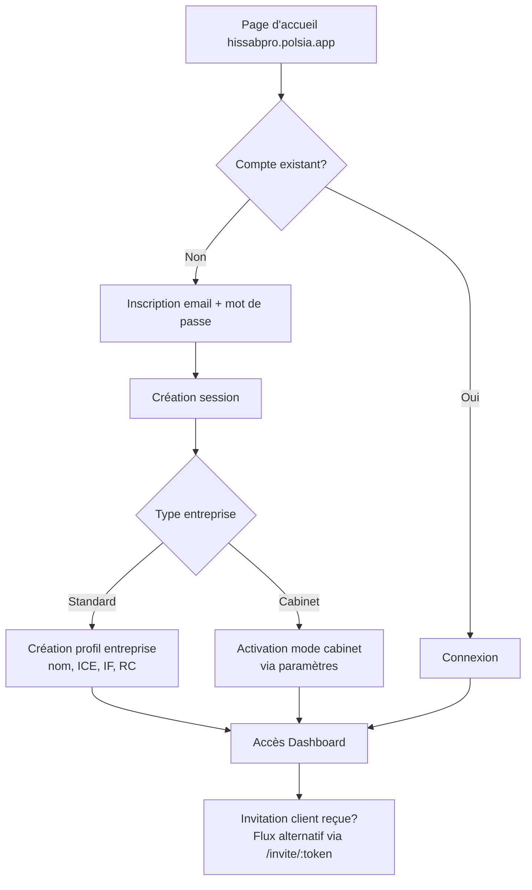

**Invitation client** : Le cabinet envoie un lien d'invitation (`/invite/:token`) au client. Le client s'inscrit directement via ce lien, son compte est automatiquement lié au dossier cabinet.

**Invitation membre** : L'admin cabinet envoie un lien (`/member-invite/:token`). Le nouveau membre cabinet s'inscrit et son rôle est pré-configuré.

---

## 2. Module Facturation Ventes

### Cycle de vie d'une facture vente

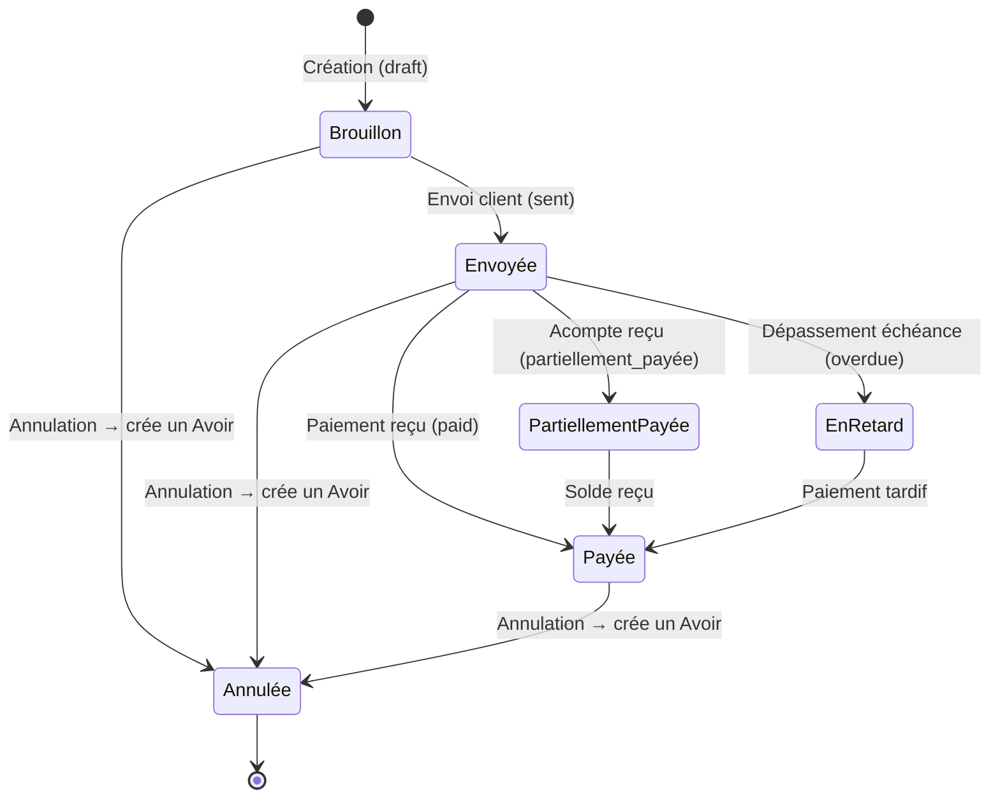

**Statuts possibles** :

| Statut DB | Label UI | Description |
|-----------|----------|-------------|
| `draft` | Brouillon | Facture créée, non finalisée |
| `sent` | Envoyée | Facture transmise au client |
| `paid` | Payée | Intégralement réglée |
| `overdue` | En retard | Non payée après échéance |
| `partiellement_payée` | Partiellement payée | Acompte partiel reçu |
| `validated` | Validée | Marquée validée (usage comptable) |
| `cancelled` | Annulée | Facture annulée — un avoir existe |

> **Règle** : L'annulation directe (`cancelled`) est **bloquée** via l'API status. Elle passe obligatoirement par l'endpoint `/cancel` qui génère automatiquement un avoir.

### Numérotation séquentielle

| Type | Format | Exemple |
|------|--------|---------|
| Facture vente | `F-YYYY-NNN` | `F-2024-001` |
| Facture achat | `FC-YYYY-NNN` | `FC-2024-001` |
| Avoir | `AV-YYYY-NNN` | `AV-2024-001` |
| Devis | `D-YYYY-NNN` | `D-2024-001` |

Compteur annuel par entreprise (repart à 001 chaque année). Les avoirs ne rentrent **pas** dans le compteur des factures.

### Champs obligatoires — mentions légales Maroc

| Champ | Description | Obligation |
|-------|-------------|------------|
| ICE client | Identifiant Commun de l'Entreprise | **Obligatoire** pour émettre une facture vente |
| IF (idf) | Identifiant Fiscal | Requis dans paramètres entreprise |
| RC | Registre du Commerce | Requis dans paramètres entreprise |
| Date | Date d'émission | Obligatoire |
| Lignes | Minimum 1 ligne de prestation | Obligatoire |
| Montants HT, TVA, TTC | Calculés automatiquement | Obligatoire |

> Si l'ICE client est absent au moment de la création de la facture, l'API retourne une erreur `422` avec le code `ICE_REQUIRED`.

### Calcul TVA

Calcul **par ligne** :

```
ligne_HT = quantité × prix_unitaire
TVA_ligne = ligne_HT × taux_TVA_ligne / 100
ligne_TTC = ligne_HT + TVA_ligne

subtotal = Σ ligne_HT
tva_total = Σ TVA_ligne
total_TTC = subtotal + tva_total
```

**Taux TVA supportés** : 0 %, 7 %, 10 %, 14 %, 20 %. Chaque ligne peut avoir son propre taux. La facture dispose également d'un taux par défaut (`tva_rate`) qui s'applique si aucun taux n'est spécifié sur la ligne.

### Génération automatique des écritures comptables

À la création de chaque facture vente, le système crée automatiquement une écriture dans le journal **VE (Ventes)** :

| N° de ligne | Compte | Libellé | Débit | Crédit |
|-------------|--------|---------|-------|--------|
| 1 | 3421 | Clients | Total TTC | — |
| 2 | 7111 | Ventes de marchandises au Maroc | — | Montant HT |
| 3 | 4455 | État — TVA facturée | — | Montant TVA |

Pour un avoir, les entrées sont **inversées** (journal type `AV`) : crédit 3421, débit 7111, débit 4455.

### Avoir (note de crédit)

Déclenché par `POST /api/invoices/:id/cancel`. Le système :
1. Vérifie que la facture n'est pas déjà annulée et n'a pas déjà d'avoir
2. Génère un avoir avec montants négatifs (copie miroir des lignes)
3. Crée une écriture comptable inversée
4. Marque la facture originale `cancelled` et lui affecte l'`avoir_id`

Contraintes :
- Un avoir ne peut pas être annulé lui-même
- Une facture ne peut avoir qu'un seul avoir

### Export PDF

Le PDF de facture est généré **côté navigateur** (impression navigateur) — pas de génération serveur. Le template inclut :
- En-tête : logo entreprise, raison sociale, ICE, IF, RC, adresse
- Bloc client : nom, ICE, adresse
- Tableau de lignes : description, quantité, prix unitaire, taux TVA, total ligne
- Récapitulatif : sous-total HT, TVA par taux, total TTC
- Informations bancaires : RIB, banque, conditions de paiement
- Mentions légales
- Numéro de facture, date, date d'échéance

### Pièce jointe

Une seule pièce jointe (PDF ou image) par facture, stockée en base64 dans `invoice_attachments`. L'upload remplace l'attachment existant. Limite : 10 Mo.

---

## 3. Module Factures Fournisseurs

### Cycle de vie

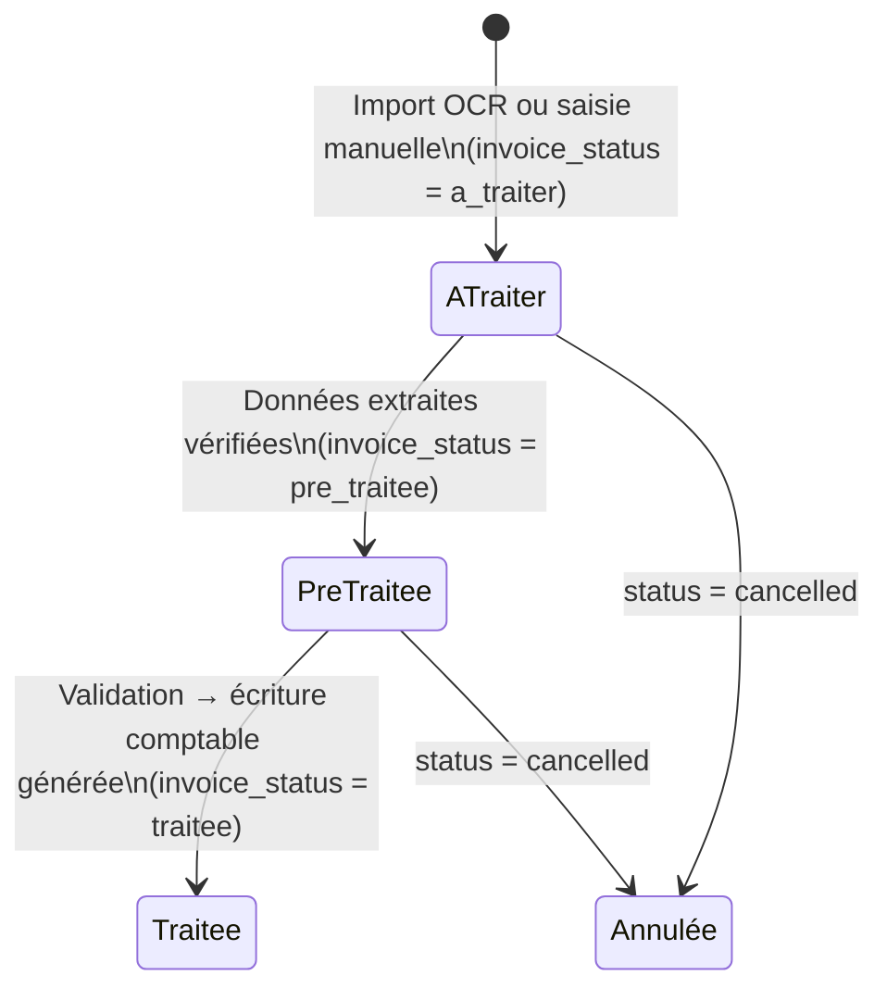

**Note** : `invoice_status` est distinct du champ `status` (approbation paiement : `pending` / `approved` / `paid` / `cancelled`).

### Import OCR (GPT-4o Vision)

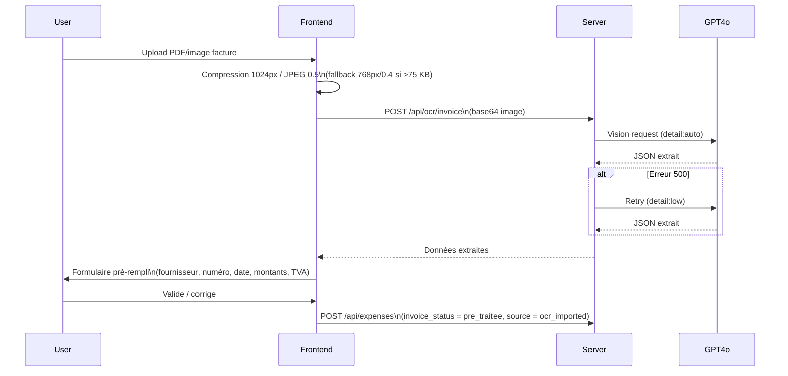

**Champs extraits par OCR** : `fournisseur_nom`, `numero_facture`, `date`, `montant_ht`, `taux_tva`, `montant_tva`, `total_ttc`, `ice_fournisseur`, lignes de détail.

**Contrainte payload** : Le proxy AI Polsia accepte ~100 Ko max. Le frontend compresse avant envoi.

### Saisie manuelle

Mode alternatif si l'OCR n'est pas utilisé ou échoue. Le formulaire de saisie manuelle expose les mêmes champs que le résultat OCR. `source = saisie_manuelle`.

### Vue split (PDF viewer + formulaire)

Interface en deux colonnes : à gauche le PDF original (rendu navigateur), à droite le formulaire de saisie/correction. Permet une vérification visuelle ligne par ligne.

### Ventilation multi-lignes TVA

La table `supplier_invoice_lines` permet de ventiler une facture fournisseur sur plusieurs comptes comptables avec des taux TVA différents :

| Champ | Description |
|-------|-------------|
| `account_code` | Compte PCM imputé (ex : `6111`, `6130`) |
| `account_label` | Libellé du compte |
| `amount_ht` | Montant HT sur ce compte |
| `tva_rate` | Taux TVA appliqué |
| `amount_tva` | Montant TVA calculé |

### Validation et écriture comptable

`POST /api/expenses/:id/valider` : passe le statut à `traitee` et crée l'écriture dans le journal **AC (Achats)** :

| Compte | Libellé | Débit | Crédit |
|--------|---------|-------|--------|
| 6111 | Achats de marchandises | HT | — |
| 3455 | État — TVA récupérable | TVA | — |
| 4411 | Fournisseurs | — | TTC |

### Split PDF

`POST /api/expenses/:id/split` : découpe un PDF multi-factures (ex : relevé avec plusieurs factures) en documents individuels. Utilise `pdf-lib`. Chaque page/segment devient une dépense enfant (`parent_document_id` renseigné).

### Pièces jointes / justificatifs

Le document original (PDF ou image) est stocké en base64 dans `expenses.document_data`. Téléchargement via `GET /api/expenses/:id/document`.

---

## 4. Module Comptabilité

### Plan Comptable Marocain (PCM)

7 classes de comptes, 100+ comptes pré-chargés :

| Classe | Catégorie | Sens normal |
|--------|-----------|-------------|
| **1** | Comptes de financement permanent | Crédit (passif) |
| **2** | Comptes d'actif immobilisé | Débit (actif) |
| **3** | Comptes d'actif circulant | Débit (actif) |
| **4** | Comptes de passif circulant | Crédit (passif) |
| **5** | Comptes de trésorerie | Débit (actif) |
| **6** | Comptes de charges | Débit |
| **7** | Comptes de produits | Crédit |

Comptes fréquemment utilisés :

| Code | Libellé | Module |
|------|---------|--------|
| 3421 | Clients | Factures ventes |
| 4411 | Fournisseurs | Factures achats |
| 4455 | État — TVA facturée | TVA collectée |
| 3455 | État — TVA récupérable | TVA déductible |
| 6111 | Achats de marchandises | Dépenses |
| 7111 | Ventes de marchandises au Maroc | Factures ventes |

### Journal des écritures

Codes journaux :

| Code | Libellé | Alimenté par |
|------|---------|--------------|
| `VE` | Ventes | Création facture vente |
| `AC` | Achats | Création facture achat / validation dépense |
| `BQ` | Banque | Transactions bancaires |
| `CA` | Caisse | — |
| `OD` | Opérations Diverses | Écritures manuelles |
| `AV` | Avoirs | Annulation de facture |
| `RAN` | Report à Nouveau | Écriture de clôture (bascule du résultat N→N+1) |

Chaque écriture est **équilibrée** (total débit = total crédit, `is_balanced = true`).

### Écritures automatiques

Générées automatiquement par les modules Facturation (création, annulation) et Dépenses (validation). La liaison entre l'écriture et sa source est conservée dans `journal_entries.source_type` et `source_id`.

### Création d'écritures manuelles

`POST /api/journal-entries` — permet de saisir une écriture OD libre :
- Journal type : `AC` | `VE` | `BQ` | `CA` | `OD`
- Lignes débit/crédit avec compte PCM
- L'équilibre débit = crédit n'est **pas** validé côté serveur — responsabilité de l'utilisateur

### Grand Livre (`/api/balance`)

Agrégation des `journal_entry_lines` par compte, avec filtres de date. Retourne pour chaque compte : code, libellé, classe, type, total débit, total crédit, solde.

### Balance Générale (`/api/balance-generale`)

Même structure que le Grand Livre mais avec possibilité de **comparaison N vs N-1** (paramètre `compare=true`). Retourne les soldes pour la période principale et, si demandé, pour la période de comparaison.

---

## 5. Module SIMPL-TVA

### Régimes disponibles

| Régime | Paramètre API | Description |
|--------|---------------|-------------|
| **Mensuel** | `year + month` | Déclaration par mois calendaire |
| **Trimestriel** | `year + quarter` | Q1 = Jan-Mar, Q2 = Avr-Jun, Q3 = Jul-Sep, Q4 = Oct-Déc |

### Calcul automatique

```
TVA collectée = Σ TVA sur factures ventes (statut ≠ cancelled) par taux
TVA déductible = Σ TVA sur factures achats (statut ≠ cancelled) par taux
              + Σ TVA sur dépenses (statut ≠ cancelled) par taux
TVA due = TVA collectée − TVA déductible
```

Si `TVA due < 0`, le résultat est un crédit de TVA (`is_credit = true`).

Le calcul est **par taux TVA** (0 %, 7 %, 10 %, 14 %, 20 %) pour ventilation dans le formulaire SIMPL.

### Format de sortie

```json
{
  "period": "Mars 2024",
  "collectee": {
    "20": { "base_ht": 100000, "tva": 20000 },
    "10": { "base_ht": 5000, "tva": 500 }
  },
  "deductible": {
    "20": { "base_ht": 50000, "tva": 10000 }
  },
  "total_collectee_tva": 20500,
  "total_deductible_tva": 10000,
  "tva_due": 10500,
  "is_credit": false
}
```

### Export CSV SIMPL

> **⚠️ Fonctionnalité partielle** : L'API retourne les données JSON pour affichage dans l'application. L'export CSV directement compatible avec le portail SIMPL-DGI **n'est pas encore implémenté**. La saisie sur le portail DGI se fait manuellement à partir des données affichées.

### Archivage PDF

> **⚠️ Fonctionnalité partielle** : L'archivage PDF de la déclaration est généré côté navigateur (impression) — pas de stockage serveur de l'archive.

### Calendrier fiscal marocain

Le dashboard expose les prochaines échéances fiscales calculées automatiquement :
- **TVA mensuelle** : 20 du mois suivant
- **TVA trimestrielle** : 20 avril, 20 juillet, 20 octobre, 20 janvier (N+1)
- **IS annuel** : 31 mars de l'année suivante

---

## 6. Module E-Facturation

### Architecture

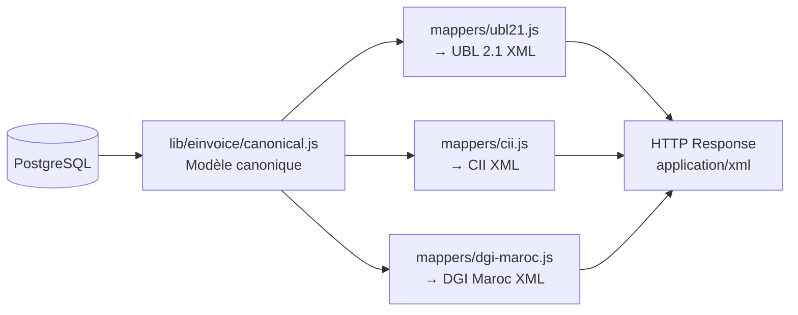

### Modèle canonique (format-agnostique)

```javascript
{
  invoiceNumber: "F-2024-001",
  invoiceDate: "2024-01-15",
  dueDate: "2024-02-15",
  currency: "MAD",
  supplier: { name, ice, idf, rc, address, city },
  buyer: { name, ice, address, city },
  lines: [{ description, quantity, unitPrice, tvaRate, tvaAmount, total }],
  taxBreakdown: [{ rate, baseAmount, taxAmount }],
  totals: { subtotal, tvaAmount, total }
}
```

### Formats supportés

| Format | Standard | Statut |
|--------|----------|--------|
| **UBL-2.1** | OASIS, EN 16931 | ✅ Implémenté |
| **CII** | UN/CEFACT, Factur-X | ✅ Implémenté (stub de base) |
| **DGI-MAROC** | Format officiel DGI Maroc | ⚠️ **Stub** — attend la spec officielle |

### Endpoints

| Route | Description |
|-------|-------------|
| `GET /api/invoices/:id/xml?format=UBL-2.1` | XML structuré (réponse JSON-encapsulée) |
| `GET /api/invoices/:id/export?format=UBL-2.1` | Téléchargement direct `.xml` |

Le nom du fichier généré : `{entreprise}_{numéro_facture}_{FORMAT}.xml`

### UBL 2.1 — structure

Inclut les namespaces OASIS UBL standard (`urn:oasis:names:specification:ubl:schema:xsd:Invoice-2`), les identifiants marocains (ICE, IF, RC) dans les blocs `Party`, et la ventilation TVA dans `TaxTotal`.

---

## 7. Module Cabinet (multi-entreprise)

### Contexte multi-dossiers

Un utilisateur de type `cabinet` opère sur plusieurs entreprises clientes. Le dossier actif est stocké dans `sessions.active_company_id`. L'ensemble des requêtes API filtre automatiquement par ce contexte.

**Switcher de contexte** : `POST /api/cabinet/switch/:company_id` met à jour `sessions.active_company_id`. Le header de l'application affiche un dropdown listant tous les dossiers accessibles.

### Gestion des dossiers

Toutes les entreprises clientes sont des enregistrements dans la table `companies`, liées au cabinet via `companies.user_id = cabinet_owner_id`.

| Opération | Route | Restriction |
|-----------|-------|-------------|
| Lister dossiers | `GET /api/cabinet/dossiers` | Selon rôle |
| Créer dossier | `POST /api/cabinet/dossiers` | admin |
| Modifier dossier | `PUT /api/cabinet/dossiers/:id` | admin |
| Inviter client | `POST /api/cabinet/dossiers/:id/invite-client` | admin |

**Filtres sur la liste des dossiers** : recherche par nom, email, ICE ; filtre par statut d'invitation (`client_invitation_status`).

**Statuts d'invitation client** :

| Valeur | Description |
|--------|-------------|
| `not_invited` | Aucune invitation envoyée |
| `pending` | Invitation envoyée, en attente d'inscription |
| `accepted` | Client inscrit et actif |

### Rôles et accès

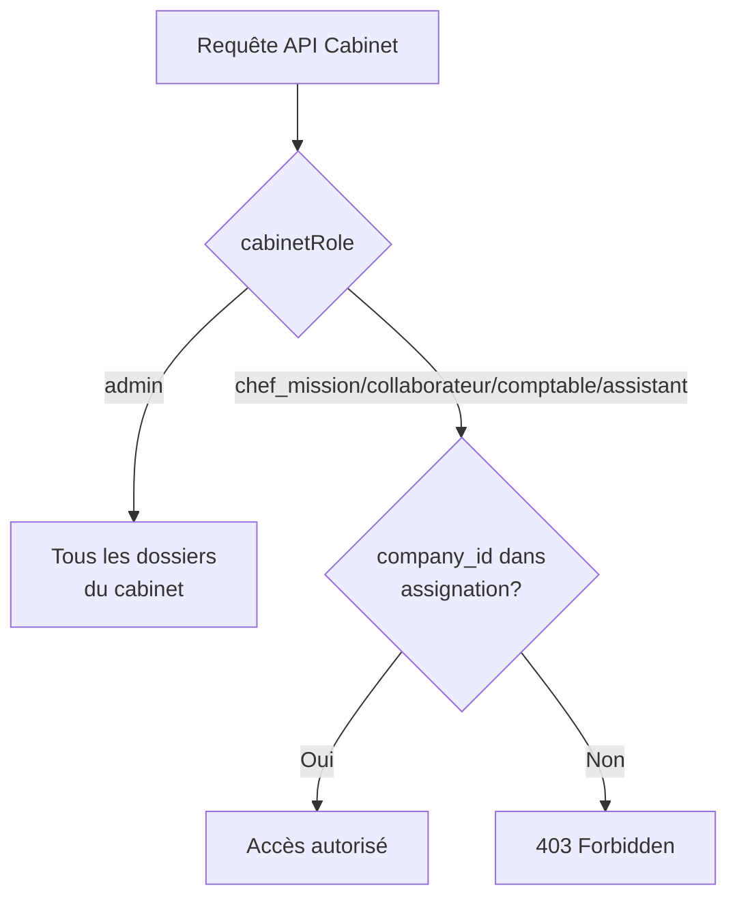

**Assignation** : Un dossier peut avoir :
- `chef_de_mission_id` → ID du membre chef de mission
- `collaborateur_id` → ID du membre collaborateur

Les membres non-admin ne voient que les dossiers où ils sont assignés (au moins un des deux champs).

### Membres du cabinet

| Rôle | Label | Permissions principales |
|------|-------|-------------------------|
| `admin` | Admin | Gestion complète : dossiers, membres, invitation |
| `chef_mission` | Chef de mission | Dossiers assignés, validation |
| `collaborateur` | Collaborateur | Dossiers assignés, saisie |
| `comptable` | Comptable | Dossiers assignés, saisie |
| `assistant` | Assistant | Dossiers assignés, lecture |

**Invitation membre** : L'admin génère un token d'invitation (7 jours de validité). Un email contenant le lien `/member-invite/:token` est envoyé. Le membre crée son compte via ce lien avec son rôle pré-configuré.

**Désactivation** : Passer un membre à `status = inactive` supprime immédiatement toutes ses sessions actives.

### Isolation des données

Toutes les tables métier (`invoices`, `expenses`, `journal_entries`, etc.) incluent `company_id`. En mode cabinet, toutes les requêtes filtrent par `sessions.active_company_id`. Un utilisateur ne peut jamais accéder à des données d'une société non liée à son cabinet.

---

## 8. Module Portail Client Collaboratif

### Vue d'ensemble

Le portail collaboratif permet une communication structurée entre le cabinet et ses clients. Chaque dossier client a son propre espace de collaboration isolé.

### Module Messagerie (Inbox)

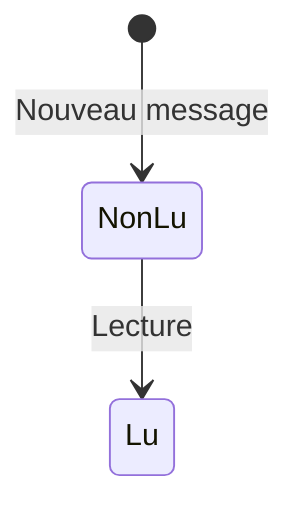

| Opération | Route | Accès |
|-----------|-------|-------|
| Lister messages | `GET /api/cabinet/messages` | Cabinet + Client |
| Envoyer message | `POST /api/cabinet/messages` | Cabinet + Client |
| Marquer lu | `PUT /api/cabinet/messages/:id/read` | Cabinet + Client |
| Tout marquer lu | `PUT /api/cabinet/messages/read-all` | Cabinet + Client |
| Supprimer | `DELETE /api/cabinet/messages/:id` | Auteur uniquement |

**Isolation** : Les messages sont filtrés par `company_id` (dossier actif). Un client ne voit que les messages de son dossier. Le cabinet voit les messages du dossier actuellement sélectionné.

**Pièces jointes de messages** : `cabinet_message_attachments` — fichiers en base64 liés à un message.

### Module Dépôt de Documents

| Opération | Route | Accès |
|-----------|-------|-------|
| Lister documents | `GET /api/cabinet/documents` | Cabinet + Client |
| Uploader document | `POST /api/cabinet/documents` | Cabinet + Client |
| Télécharger | `GET /api/cabinet/documents/:id/download` | Cabinet + Client |
| Supprimer | `DELETE /api/cabinet/documents/:id` | Uploadeur ou admin cabinet |

**Catégories de documents** : `autre`, et autres catégories libres selon les conventions du cabinet.

**Métadonnées** : `period_month`, `period_year`, `category`, `filename`, `file_size`.

### Module Demandes de Documents (Justificatifs)

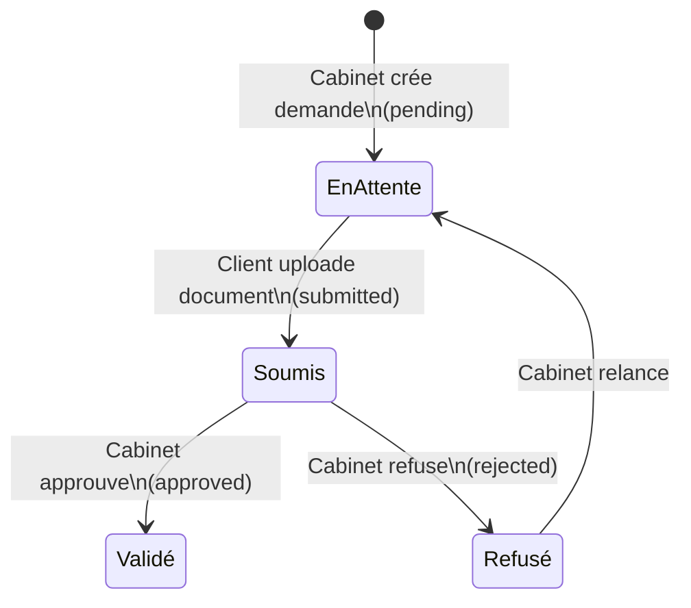

| Statut | `status` | Description |
|--------|----------|-------------|
| En attente | `pending` | Demande créée par le cabinet |
| Soumis | `submitted` | Document déposé par le client |
| Validé | `approved` | Cabinet a approuvé le document |
| Refusé | `rejected` | Cabinet a rejeté le document |

| Opération | Route | Accès |
|-----------|-------|-------|
| Lister demandes | `GET /api/cabinet/justificatifs` | Cabinet + Client |
| Créer demande | `POST /api/cabinet/justificatifs` | Cabinet uniquement |
| Mettre à jour statut | `PUT /api/cabinet/justificatifs/:id` | Cabinet |
| Répondre (déposer) | `POST /api/cabinet/justificatifs/:id/respond` | Client |
| Supprimer | `DELETE /api/cabinet/justificatifs/:id` | Cabinet |

**Champs d'une demande** : `title`, `description`, `deadline` (date limite), `document_id` (lien vers le document déposé).

### Statistiques de collaboration

`GET /api/cabinet/collaboration/stats` retourne par dossier : nombre de messages, documents, demandes en attente, demandes totales.

---

## 9. Dashboard

### KPIs affichés

| KPI | Période | Calcul |
|-----|---------|--------|
| Chiffre d'affaires (année) | Année en cours | Somme `invoices.total` (type=sale, ≠ cancelled) |
| Dépenses (année) | Année en cours | Somme `expenses.total` (≠ cancelled) |
| Résultat (année) | Année en cours | CA − Dépenses |
| CA (mois) | Mois en cours | Somme factures ventes du mois |
| Dépenses (mois) | Mois en cours | Somme dépenses du mois |
| TVA due (année) | Année en cours | TVA collectée − TVA déductible (factures + dépenses) |
| TVA estimée (mois) | Mois en cours | TVA collectée − TVA déductible du mois |
| Créances en attente | Courant | Nombre + montant de factures `sent` / `overdue` / `draft` |
| Délai moyen de paiement | Courant | Moyenne des jours de retard sur factures impayées |
| Créances > 30 jours | Courant | Nombre + montant des factures échues depuis +30 jours |

### Graphique revenus vs dépenses

6 mois glissants (mois courant − 5 mois). Format :
```json
[
  { "month": 1, "year": 2024, "revenue": 50000, "expenses": 30000 },
  ...
]
```
Les mois sans données apparaissent avec la valeur `0` (pas de trou dans le graphique).

### Tables récentes

- **Dernières factures** : 5 factures les plus récentes (non annulées), avec numéro, date, montant, statut, contact
- **Dernières écritures** : 10 dernières écritures du journal, avec lignes détaillées

### Deadlines fiscales

Le dashboard client expose les prochaines échéances fiscales marocaines calculées dynamiquement (voir section 5).

### Sélecteur de période

Le dashboard présente les KPIs annuels fixes (année civile en cours). Le module SIMPL-TVA (section 5) permet la sélection mensuelle ou trimestrielle.

---

## 10. Paramètres Entreprise

### Informations légales (obligatoires pour facturation)

| Champ | DB | Description |
|-------|----|-------------|
| Raison sociale | `companies.name` | Nom de l'entreprise (**requis**) |
| ICE | `companies.ice` | Identifiant Commun de l'Entreprise (15 chiffres) |
| IF | `companies.idf` | Identifiant Fiscal |
| RC | `companies.rc` | Registre du Commerce |
| CNSS | `companies.cnss` | Numéro d'affiliation CNSS |
| Forme juridique | `companies.forme_juridique` | SARL, SA, SAS, etc. |

### Coordonnées

| Champ | DB |
|-------|----|
| Adresse | `companies.address` |
| Ville | `companies.city` |
| Téléphone | `companies.phone` |
| Email | `companies.email` |
| Logo | `companies.logo_url` |

### Informations bancaires

| Champ | DB | Description |
|-------|----|-------------|
| RIB | `companies.rib` | Relevé d'Identité Bancaire |
| Banque | `companies.bank_name` | Nom de la banque |
| Conditions de paiement | `companies.payment_conditions` | Ex : "Paiement à 30 jours" |

Ces informations apparaissent automatiquement sur les PDFs de factures ventes.

### Paramètres comptables

| Champ | DB | Par défaut |
|-------|----|-----------|
| Taux TVA par défaut | `companies.default_tva_rate` | 20 % |
| Début exercice fiscal | `companies.fiscal_year_start` | Mois 1 (Janvier) |
| Devise | `companies.currency` | MAD |

### Comportement upsert

`POST /api/company` crée ou met à jour le profil de l'entreprise de l'utilisateur. Si un profil existe déjà (`companies.user_id = userId`), il est mis à jour. Sinon, un nouveau profil est créé.

---

## 11. Authentification

### Flux de connexion

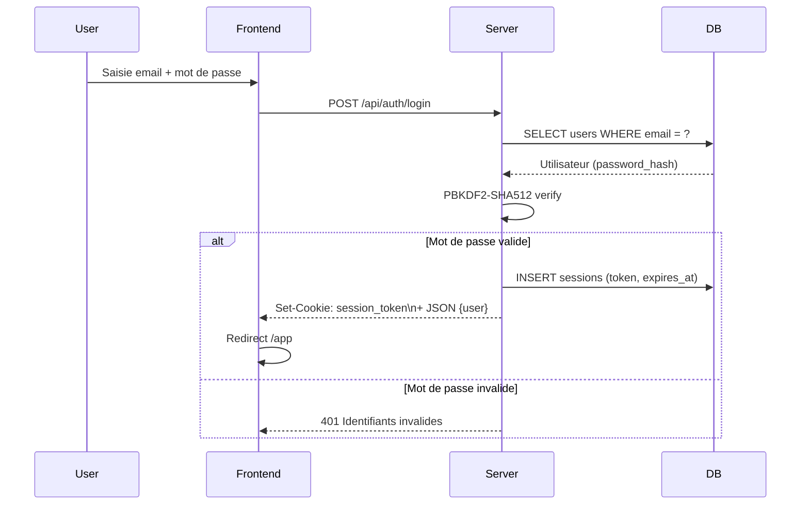

### Gestion de session

| Propriété | Valeur |
|-----------|--------|
| Type | Cookie HTTP-only (`session_token`) |
| Durée | 30 jours |
| Flags | `HttpOnly; SameSite=Lax; Secure` (prod) |
| Token | 96 hex chars (`crypto.randomBytes(48)`) |
| Stockage | Table `sessions` (PostgreSQL) |
| Nettoyage | Tâche automatique toutes les heures |

### Hachage des mots de passe

Algorithme : **PBKDF2-SHA512**, 100 000 itérations, 64 bytes de sortie, sel aléatoire (32 chars hex). Format stocké : `salt:hash`.

Comparaison avec `crypto.timingSafeEqual` pour résistance aux timing attacks.

> **Compatibilité legacy** : Les comptes créés via invitation ancienne (avant PBKDF2) utilisent SHA256. La vérification supporte les deux formats.

### Inscription

`POST /api/auth/signup` crée un compte email/mot de passe. Aucune vérification d'email n'est envoyée (pas de confirmation par email au signup). La session est créée immédiatement après inscription.

### Endpoints d'authentification

| Méthode | Route | Auth | Description |
|---------|-------|------|-------------|
| POST | `/api/auth/signup` | ❌ | Inscription standard |
| POST | `/api/auth/login` | ❌ | Connexion |
| POST | `/api/auth/logout` | ✅ | Déconnexion (supprime session) |
| GET | `/api/auth/me` | ✅ | Profil utilisateur courant |
| GET | `/api/auth/invitation/:token` | ❌ | Valider token invitation client |
| POST | `/api/auth/signup-invitation` | ❌ | Inscription via invitation client |
| GET | `/api/auth/member-invite/:token` | ❌ | Valider token invitation membre |
| POST | `/api/auth/member-invite/:token` | ❌ | Inscription via invitation membre |

### Types d'utilisateurs et droits

| Type | Accès | Ménu affiché |
|------|-------|--------------|
| `standard` | Sa propre société | 13 modules standards |
| `cabinet` (admin) | Tous dossiers cabinet | Modules cabinet complets |
| `cabinet` (autre rôle) | Dossiers assignés uniquement | Modules cabinet filtrés |
| Client invité | Son dossier via portail | Vue client uniquement |

---

## 12. Règles Métier Transversales

### Format des montants

| Propriété | Valeur |
|-----------|--------|
| Devise | MAD (Dirham marocain) |
| Séparateur décimal | Virgule (`,`) dans les affichages |
| Séparateur milliers | Espace dans les affichages |
| Précision | 2 décimales |
| Stockage DB | `NUMERIC(15,2)` |

Exemple d'affichage : `12 000,50 MAD`

### Format des dates

| Propriété | Valeur |
|-----------|--------|
| Format affiché | `JJ/MM/AAAA` |
| Stockage DB | `DATE` (ISO 8601) |
| Timezone | Serveur UTC, affichage local Maroc (UTC+1) |

### Terminologie marocaine

| Action | Libellé utilisé |
|--------|-----------------|
| Passer une facture au statut final | "Valider la facture" |
| Annuler une facture | "Annuler et créer un avoir" |
| Numéro de facture | "Numéro de facture" (pas "Invoice number") |
| Identification fiscale | ICE, IF, RC (abréviations françaises) |
| Déclaration TVA | "Déclaration SIMPL-TVA" |

### Multi-tenancy et isolation

Modèle de sécurité strict basé sur `company_id` :

1. **Utilisateur standard** : accès limité aux enregistrements où `company_id` appartient à `companies.user_id = req.userId`
2. **Utilisateur cabinet** : accès via `sessions.active_company_id` après vérification que la société appartient au cabinet (`companies.user_id = cabinetOwnerId`)
3. **Client invité** : accès via `companies.client_user_id = req.userId`

Toutes les requêtes API incluent une condition `user_id` ou `company_id` — il n'existe pas de requête cross-tenant.

### Droits d'accès par type d'utilisateur

| Module | Standard | Cabinet Admin | Cabinet Non-Admin | Client invité |
|--------|----------|---------------|-------------------|---------------|
| Facturation ventes | ✅ | ✅ | ✅ (dossier assigné) | ❌ |
| Factures fournisseurs | ✅ | ✅ | ✅ (dossier assigné) | ❌ |
| Comptabilité | ✅ | ✅ | ✅ (dossier assigné) | ❌ |
| SIMPL-TVA | ✅ | ✅ | ✅ | ❌ |
| E-Facturation | ✅ | ✅ | ✅ | ❌ |
| Cabinet / Dossiers | ❌ | ✅ | Lecture limitée | ❌ |
| Portail collaboratif | ❌ | ✅ | ✅ | ✅ (son dossier) |
| Dashboard | ✅ | ✅ | ✅ | ✅ (vue simplifiée) |
| Paramètres | ✅ | ✅ | ✅ | ❌ |
| Banque | ✅ | ✅ | ✅ | ❌ |
| Vente (CRM) | ✅ | ✅ | ✅ | ❌ |
| Lettrage comptable | ✅ | ✅ | ✅ | ❌ |
| Immobilisations | ✅ | ✅ | ✅ | ❌ |
| Exercices & Clôture | ✅ | ✅ | ✅ (admin) | ❌ |
| États financiers | ✅ | ✅ | ✅ | ❌ |
| SIMPL-IS | ✅ | ✅ | ✅ | ❌ |
| Trésorerie prévisionnelle | ✅ | ✅ | ✅ | ❌ |
| Effets de commerce | ✅ | ✅ | ✅ | ❌ |
| Balance âgée | ✅ | ✅ | ✅ | ❌ |

### Notifications

Système de notifications in-app stocké en base (`notifications` table). Déclenché par les événements métier (nouvelle demande de justificatif, nouveau message, etc.).

| Opération | Route |
|-----------|-------|
| Liste | `GET /api/notifications` |
| Compteur non lus | `GET /api/notifications/unread-count` |
| Marquer lu | `PUT /api/notifications/:id/read` |
| Tout marquer lu | `PUT /api/notifications/read-all` |
| Préférences | `GET/PUT /api/notifications/preferences` |

### Envoi d'emails

Transports disponibles (par ordre de priorité) :

1. **Postmark** (si `POSTMARK_SERVER_TOKEN` configuré)
2. **Polsia Email Proxy** (si `POLSIA_EMAIL_PROXY_URL` configuré)
3. **File d'attente DB** (fallback — traitement différé via `email_queue`)

Template email : HTML responsive avec en-tête dégradé vert émeraude (couleur de marque HissabPro), bouton CTA, footer mentions.

---

## 13. Module Banque

### Comptes bancaires

Chaque entreprise peut avoir plusieurs comptes bancaires (`bank_accounts`). Champs : `name`, `bank_name`, `account_number`, `rib`, `currency`, `last_balance`, `last_balance_date`.

### Transactions

| Champ | Description |
|-------|-------------|
| `transaction_date` | Date de l'opération |
| `label` | Libellé de l'opération |
| `debit` | Montant débité |
| `credit` | Montant crédité |
| `balance` | Solde après opération |
| `match_status` | `unmatched` / `auto_matched` / `manual_matched` / `ignored` |
| `match_confidence` | Score de confiance (0-100) pour le rapprochement auto |

### Import relevé bancaire

`POST /api/bank/import` — import d'un fichier CSV de relevé bancaire. Les transactions sont créées avec `match_status = unmatched`.

### Rapprochement bancaire

**Automatique** : `POST /api/bank/auto-match` — le système tente de faire correspondre chaque transaction bancaire avec une facture ou dépense par montant + date de proximité + label.

**Manuel** : `PUT /api/bank/transactions/:id/match` — l'utilisateur associe manuellement une transaction à une facture (`matched_invoice_id`) ou une dépense (`matched_expense_id`).

**Ignorer** : `PUT /api/bank/transactions/:id/ignore` — marque la transaction `ignored` (pas de rapprochement attendu).

**Annuler** : `DELETE /api/bank/transactions/:id/match` — remet la transaction à `unmatched`.

### Statistiques de rapprochement

`GET /api/bank/stats` : nombre de transactions rapprochées / non rapprochées / ignorées.

---

## 14. Module Vente (CRM)

### Entités principales

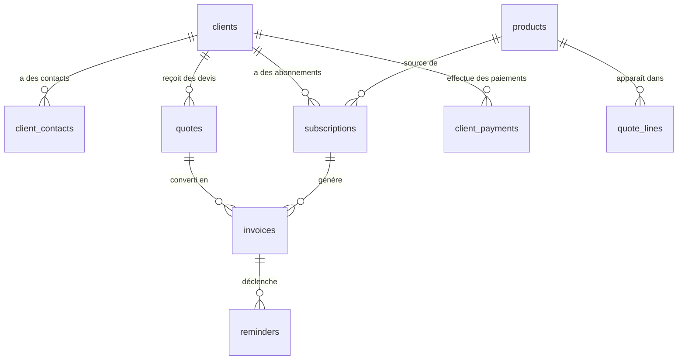

### CRM Clients

Annuaire des clients de l'entreprise (distinct des `contacts` legacy). Champs : nom, ICE, IF, RC, adresse, ville, pays, téléphone, email, site web, notes.

**Balance client** : `GET /api/vente/clients/:id/balance` — total facturé, total payé, solde dû.

### Catalogue Produits/Services

Types : `produit`, `service`, `abonnement`. Champs : nom, description, prix unitaire HT, taux TVA, unité, `is_recurring` (pour abonnements).

### Devis

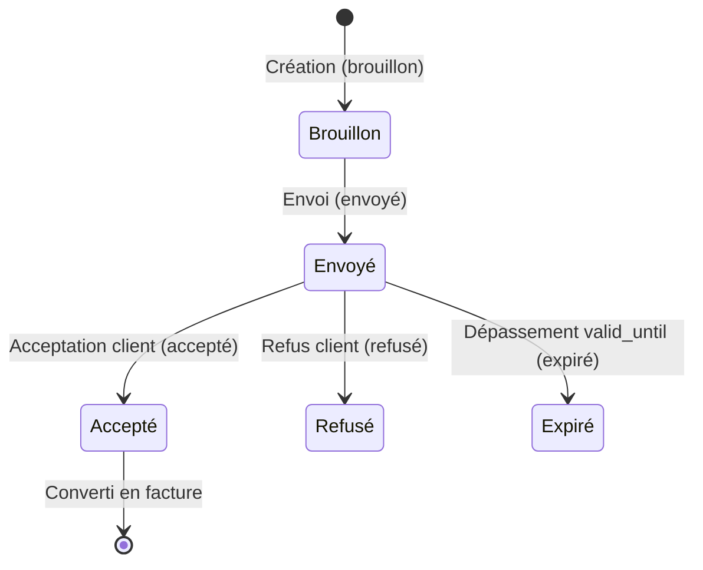

Numérotation : `D-YYYY-NNN` (annuelle par entreprise).

**Conversion en facture** : `POST /api/vente/quotes/:id/convert` — crée une facture vente à partir du devis, lie les deux via `converted_to_invoice_id`.

**Auto-expiration** : Lors du chargement de la liste des devis, les devis `envoyé` dont `valid_until < today` passent automatiquement à `expiré`.

### Abonnements récurrents

| Intervalle | Valeur DB |
|------------|-----------|
| Mensuel | `mensuel` |
| Trimestriel | `trimestriel` |
| Annuel | `annuel` |

Statuts : `actif` / `pausé` / `annulé` / `expiré`.

**Génération automatique** : `POST /api/vente/subscriptions/process-due` — traite tous les abonnements actifs dont `next_invoice_date <= today` et génère les factures correspondantes. Met à jour `next_invoice_date` et `last_invoice_id`.

### Paiements clients

Enregistrement des règlements reçus. Méthodes : `virement`, `chèque`, `espèces`, `carte`, `effet`, `autre`.

**Liaison paiement ↔ facture** : `PUT /api/vente/payments/:id/link` associe un paiement à une facture spécifique. Mise à jour du statut de la facture possible.

**Liaison paiement ↔ transaction bancaire** : `bank_transaction_id` sur `client_payments` pour rapprochement.

### Relances clients

Suivi des relances sur factures impayées :

| Niveau | Valeur | Description |
|--------|--------|-------------|
| Rappel | `rappel` | Première relance douce |
| Relance | `relance` | Deuxième relance |
| Mise en demeure | `mise_en_demeure` | Formel |
| Contentieux | `contentieux` | Procédure judiciaire |

Canaux : `email`, `telephone`, `whatsapp`, `physique`, `courrier_recommande_ar`, `autre`.

**Email de relance** : `POST /api/vente/reminders/send-email` — envoie un email de relance au client avec le contenu personnalisé.

**Historique** : `GET /api/vente/reminders/:invoice_id/history` — liste toutes les relances pour une facture donnée.

**Statistiques** : `GET /api/vente/reminders/stats` — taux de recouvrement, délai moyen de résolution.

---

## 15. Module Lettrage Comptable

### Concept

Le lettrage permet d'associer des lignes d'écritures comptables entre elles pour identifier que des flux se compensent (ex : une facture client lettrée avec son règlement). Un code lettre est attribué à chaque groupe de lignes lettrées (A, B, C..., puis AA, AB...).

### Lettrage automatique

`POST /api/lettrage/auto` — le système cherche automatiquement des correspondances (lignes de même compte dont débit = crédit). Pour chaque correspondance trouvée, un code lettrage est généré depuis la séquence et appliqué.

### Lettrage manuel

`POST /api/lettrage/manual` — l'utilisateur sélectionne explicitement les lignes à lettrer (minimum 2 lignes dont la somme débit = somme crédit). Le système génère le code et l'applique.

### Délettrage

`DELETE /api/lettrage/:code` — supprime un code de lettrage de toutes les lignes associées (reset `lettrage_code` à NULL).

### Données DB

| Champ | Table | Description |
|-------|-------|-------------|
| `lettrage_code` | `journal_entry_lines` | Code lettre affecté (A, B, AA...) |
| `line_id_for_lettrage` | `journal_entry_lines` | FK auto-référentielle (ligne jumelle) |
| `lettrage_sequences` | — | Séquences de codes par compte et par société |

### Endpoints

| Méthode | Route | Description |
|---------|-------|-------------|
| `GET` | `/api/lettrage/lines/:account_code` | Lignes lettrables pour un compte (avec filtre date) |
| `POST` | `/api/lettrage/auto` | Lettrage automatique |
| `POST` | `/api/lettrage/manual` | Lettrage manuel |
| `DELETE` | `/api/lettrage/:code` | Délettrage |

---

## 16. Module Immobilisations

### Concept

Gestion des actifs immobilisés selon les règles du PCM : acquisition, amortissement linéaire ou dégressif, dotations annuelles, cession et mise au rebut. Le module génère automatiquement les écritures comptables correspondantes.

### 8 catégories d'actifs

| Catégorie | Comptes PCM typiques |
|-----------|----------------------|
| Terrain | 2311 |
| Construction | 2321 |
| Matériel de transport | 2340 |
| Matériel de bureau & informatique | 2350 |
| Mobilier | 2355 |
| Logiciel | 2420 |
| Brevets & licences | 2410 |
| Autre | 2390 |

La table `asset_account_mappings` stocke le mapping compte d'immobilisation / dotation aux amortissements / amortissements cumulés pour chaque catégorie.

### Amortissement linéaire

```
Annuité = (Coût acquisition − Valeur résiduelle) / Durée de vie (années)
VNC = Coût acquisition − Amortissements cumulés
```

### Amortissement dégressif

Taux dégressif = Taux linéaire × Coefficient (1,5 ou 2 selon la durée). Basculement linéaire quand le taux linéaire résiduel dépasse le taux dégressif.

### Cycle de vie d'un actif

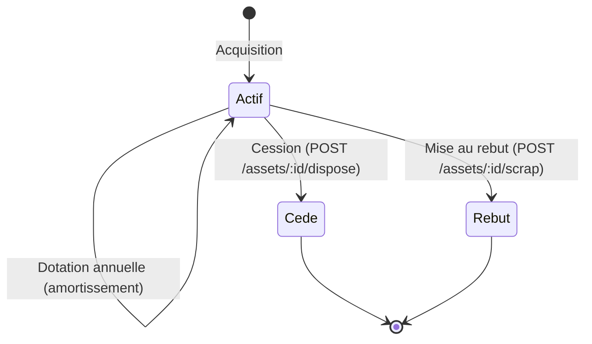

### Écritures comptables générées

**Acquisition** : Débit compte immobilisation (classe 2) / Crédit fournisseur (4411)

**Dotation amortissement** : Débit charge dotation (classe 6) / Crédit amortissements cumulés (classe 28)

**Cession** : Sortie de l'actif brut + amortissements cumulés + constatation de la plus/moins-value

### Endpoints

| Méthode | Route | Description |
|---------|-------|-------------|
| `GET` | `/api/assets` | Liste des immobilisations |
| `POST` | `/api/assets` | Créer une immobilisation |
| `PUT` | `/api/assets/:id` | Modifier |
| `DELETE` | `/api/assets/:id` | Supprimer |
| `GET` | `/api/assets/depreciation-summary` | Résumé des amortissements par exercice |
| `GET` | `/api/assets/:id/depreciation-schedule` | Tableau d'amortissement complet |
| `POST` | `/api/assets/generate-depreciations` | Générer les dotations de l'exercice |
| `POST` | `/api/assets/:id/dispose` | Comptabiliser la cession |
| `POST` | `/api/assets/:id/scrap` | Mettre au rebut |
| `GET` | `/api/assets/export/csv` | Export CSV |

---

## 17. Module Exercices Fiscaux & Clôture

### Exercices fiscaux

La table `fiscal_years` stocke les exercices comptables de l'entreprise. Chaque exercice a une date de début, une date de fin, et un statut (`open` / `closed`).

Les écritures sont liées à leur exercice via `journal_entries.fiscal_year_id`. Une fois un exercice clôturé, les écritures correspondantes sont verrouillées (`is_locked = true`) et ne peuvent plus être modifiées.

### Wizard de clôture (5 étapes)

1. **Vérifications pré-clôture** (`GET /api/cloture/pre-checks`) : détection des écritures non équilibrées, factures impayées, dépenses non traitées.
2. **Calcul du résultat** (`POST /api/cloture/resultat`) : résultat = produits (classe 7) − charges (classe 6). Génération d'une OD de résultat.
3. **Prévisualisation du Report à Nouveau** (`GET /api/cloture/preview-ran`) : calcul du RAN à basculer en N+1.
4. **Exécution de la clôture** (`POST /api/cloture/executer`) : verrouillage des écritures, génération des OD de résultat et de RAN, passage du statut fiscal_year à `closed`.
5. **Confirmation** : le nouvel exercice est ouvert automatiquement.

### Impacts comptables

- Écriture OD résultat : débit/crédit comptes 6/7 → compte 1190 (Résultat de l'exercice)
- Écriture RAN (journal type `RAN`) : virement du résultat en report à nouveau (comptes 110/119)
- Toutes les écritures de l'exercice clôturé passent à `is_locked = true`

### Endpoints

| Méthode | Route | Description |
|---------|-------|-------------|
| `GET` | `/api/exercices` | Liste des exercices fiscaux |
| `POST` | `/api/exercices` | Créer un exercice |
| `GET` | `/api/cloture/pre-checks` | Vérifications avant clôture |
| `POST` | `/api/cloture/resultat` | Calculer et enregistrer le résultat |
| `GET` | `/api/cloture/preview-ran` | Prévisualiser l'écriture RAN |
| `POST` | `/api/cloture/executer` | Clôturer l'exercice (irréversible) |

---

## 18. États Financiers (Bilan, CPC, ESG)

### Bilan PCM

Le bilan est calculé à partir des soldes des comptes PCM à une date donnée, selon la structure du Plan Comptable Marocain.

**Actif** :
- Actif immobilisé (classe 2) : brut − amortissements cumulés (classe 28) = net
- Actif circulant (classe 3) : créances, stocks
- Trésorerie (classe 5)

**Passif** :
- Financement permanent (classe 1) : capital, réserves, RAN, résultat
- Passif circulant (classe 4) : dettes fournisseurs, fiscales, sociales
- Trésorerie passif (classe 5)

L'API `GET /api/bilan` accepte `?date=YYYY-MM-DD` pour calculer le bilan à une date de clôture arbitraire.

### Compte de Produits et Charges (CPC)

13 rubriques selon le PCM marocain :
1. Produits d'exploitation (CA, variation stocks, prod immobilisée)
2. Charges d'exploitation (achats, charges externes, personnel, dotations)
3. Résultat d'exploitation (1 − 2)
4. Produits financiers
5. Charges financières
6. Résultat financier (4 − 5)
7. Résultat courant (3 + 6)
8. Produits non courants
9. Charges non courantes
10. Résultat non courant (8 − 9)
11. Résultat avant IS
12. Impôt sur les sociétés
13. Résultat net

Export CSV disponible (`GET /api/cpc/export/csv`).

### État des Soldes de Gestion (ESG) / CAF / TFR

L'ESG calcule les soldes intermédiaires de gestion (marge brute, valeur ajoutée, EBE, résultat d'exploitation) et la Capacité d'Autofinancement (CAF).

Export CSV disponible (`GET /api/esg/export/csv`).

### Endpoints

| Méthode | Route | Description |
|---------|-------|-------------|
| `GET` | `/api/bilan` | Bilan PCM (params: date, compare) |
| `GET` | `/api/cpc` | CPC 13 rubriques |
| `GET` | `/api/cpc/export/csv` | Export CSV CPC |
| `GET` | `/api/esg` | ESG / CAF / TFR |
| `GET` | `/api/esg/export/csv` | Export CSV ESG |

---

## 19. Module SIMPL-IS

### Concept

Calcul et déclaration de l'Impôt sur les Sociétés (IS) selon le barème marocain 2024.

### Barème IS 2024 (Maroc)

| Résultat fiscal | Taux |
|-----------------|------|
| Jusqu'à 300 000 MAD | 10 % |
| 300 001 à 1 000 000 MAD | 20 % |
| Au-delà de 1 000 000 MAD | 31 % |

L'IS est le maximum entre l'IS théorique et la cotisation minimale.

### Cotisation minimale

```
CM = CA (hors TVA) × 0,5 %
IS dû = MAX(IS théorique, CM)
```

### Calcul du résultat fiscal

```
Résultat fiscal = Résultat comptable + Réintégrations − Déductions
```

**Réintégrations courantes** : amendes et pénalités, charges non déductibles, TVA non récupérable sur cadeaux.

**Déductions courantes** : dividendes (exonérés 100 %), plus-values exonérées.

### Exports

- **PDF** : récapitulatif de la déclaration (généré côté navigateur)
- **CSV** : tableau de calcul
- **XML** : format DGI (stub en attente de la spec officielle)

### Endpoints

| Méthode | Route | Description |
|---------|-------|-------------|
| `GET` | `/api/is` | Calculer l'IS (params: year) |
| `POST` | `/api/is` | Enregistrer une déclaration IS |
| `GET` | `/api/is/declarations` | Historique des déclarations |

---

## 20. Module Trésorerie Prévisionnelle

### Concept

Projection du solde de trésorerie sur les N prochains mois, en combinant :
- Le solde bancaire actuel (depuis `bank_accounts`)
- Les encaissements prévus (factures ventes non payées)
- Les décaissements prévus (factures achats non réglées)
- Les charges récurrentes configurées

### Charges récurrentes

L'utilisateur configure des charges fixes mensuelles, trimestrielles ou annuelles (loyer, salaires, etc.) dans la table `recurring_charges`. Ces charges sont automatiquement intégrées dans la projection.

### Projection

`GET /api/tresorerie/previsionnel` retourne une projection mois par mois :
```json
[
  { "month": 5, "year": 2024, "solde_debut": 50000, "entrees": 30000, "sorties": 25000, "solde_fin": 55000, "alerte": false },
  ...
]
```

**Seuil d'alerte** : un paramètre configurable (`alert_threshold`) permet de signaler les mois où le solde prévu descend sous un seuil critique.

### Endpoints

| Méthode | Route | Description |
|---------|-------|-------------|
| `GET` | `/api/tresorerie/previsionnel` | Projection N mois (params: months, threshold) |
| `GET` | `/api/tresorerie/charges-recurrentes` | Liste des charges récurrentes |
| `POST` | `/api/tresorerie/charges-recurrentes` | Ajouter une charge |
| `PUT` | `/api/tresorerie/charges-recurrentes/:id` | Modifier |
| `DELETE` | `/api/tresorerie/charges-recurrentes/:id` | Supprimer |

---

## 21. Module Effets de Commerce

### Types d'effets

| Type | Description |
|------|-------------|
| **LC** | Lettre de Change — créance commerciale émise par le créancier (tireur) sur le débiteur (tiré) |
| **BAO** | Billet à Ordre — promesse de paiement émise par le débiteur lui-même |

### Cycle de vie

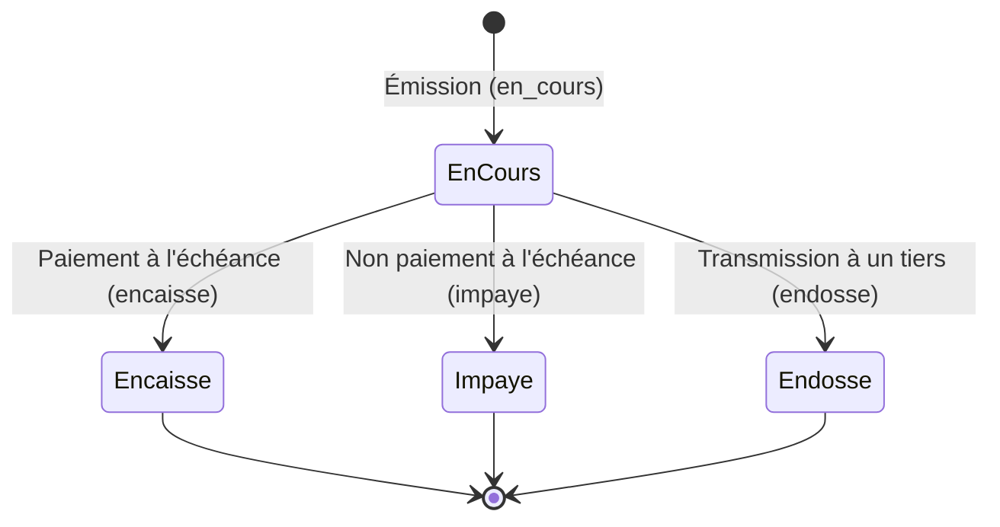

### Écritures comptables automatiques

| Événement | Débit | Crédit |
|-----------|-------|--------|
| Émission d'un effet | 3425 (Effets à recevoir) | 3421 (Clients) |
| Encaissement | 5141 (Banque) | 3425 (Effets à recevoir) |
| Impayé | 3424 (Clients — effets impayés) | 3425 |

### Endpoints

| Méthode | Route | Description |
|---------|-------|-------------|
| `GET` | `/api/effets` | Liste des effets (filtres: type, status, from, to) |
| `GET` | `/api/effets/:id` | Détail |
| `POST` | `/api/effets` | Créer un effet |
| `PUT` | `/api/effets/:id` | Modifier |
| `DELETE` | `/api/effets/:id` | Supprimer |
| `PUT` | `/api/effets/:id/status` | Changer statut (déclenche écriture) |
| `GET` | `/api/effets/export/csv` | Export CSV |

---

## 22. Module Onboarding Wizard

### Concept

Après l'inscription, les nouveaux utilisateurs sont automatiquement redirigés vers `/onboarding` si `users.onboarding_completed = false`. Le wizard collecte les informations essentielles de l'entreprise en 5 étapes guidées avant d'accéder au Dashboard.

### 5 étapes du wizard

| Étape | Contenu | Champs collectés |
|-------|---------|-----------------|
| 1. Welcome | Bienvenue, présentation du logiciel | — |
| 2. Entreprise | Identité légale | `name`, `ice`, `idf`, `rc`, `forme_juridique`, `city` |
| 3. Configuration | Paramètres comptables | `fiscal_year_start`, `tva_regime` (Mensuel/Trimestriel), `type_comptabilite` |
| 4. Banque | Coordonnées bancaires | `bank_name` (dropdown 11 banques marocaines), `rib` (optionnel) |
| 5. Première action | Choix de la première action | Navigation vers factures / dépenses / dashboard |

### API

`POST /api/onboarding` — transaction atomique qui :
1. Met à jour `companies` avec les champs de l'étape 2, 3 et 4
2. Passe `users.onboarding_completed = true`
3. Retourne `{ success: true }`

### Reset

`POST /api/onboarding/reset` — accessible depuis les Paramètres. Remet `onboarding_completed = false`, ce qui redirigera l'utilisateur vers le wizard à sa prochaine connexion.

### Redirection

La page `/app` vérifie au chargement si `onboarding_completed = false` → redirige vers `/onboarding`. Une fois le wizard complété, redirection vers le Dashboard avec `?welcome=true` pour afficher le guide contextuel.

---

## 23. Balance Âgée

### Concept

La balance âgée ventile les créances (clients) et dettes (fournisseurs) par tranches d'ancienneté, permettant d'identifier rapidement les impayés anciens.

### Tranches d'ancienneté

| Tranche | Couleur UI |
|---------|-----------|
| Non échu | Vert |
| 1–30 jours | Jaune |
| 31–60 jours | Orange |
| 61–90 jours | Rouge clair |
| > 90 jours | Rouge foncé |

### Calcul

Pour chaque contact/client, les factures non payées sont ventilées par tranche selon leur date d'échéance (`due_date`) par rapport à la date du jour.

### Export

`GET /api/balance-agee` retourne les données JSON pour affichage. Export Excel/CSV possible depuis le frontend.

### Endpoint

| Méthode | Route | Description |
|---------|-------|-------------|
| `GET` | `/api/balance-agee` | Balance âgée (params: type=client/fournisseur, date) |

---

## Annexe — Flux récapitulatifs clés

### Flux complet : facture vente → comptabilité

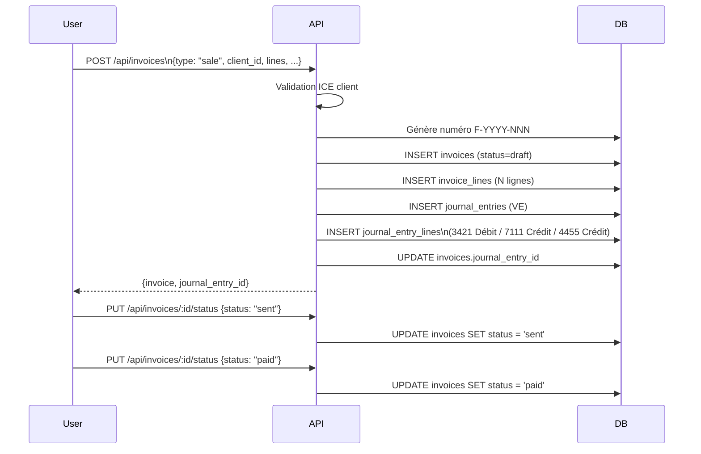

### Flux annulation → avoir

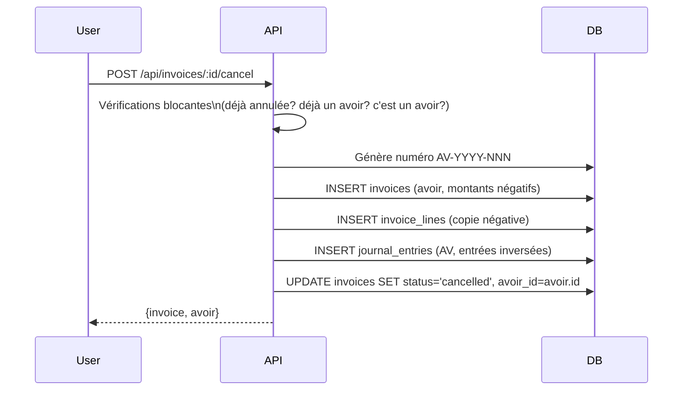

### Flux OCR → écriture comptable

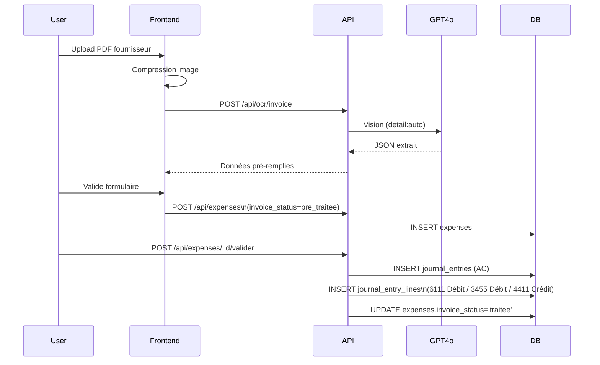

---

*Document mis à jour le 2026-04-21 par inspection du code source — ne documente que les fonctionnalités implémentées et fonctionnelles dans `server.js` (10 478 lignes) et les 31 migrations.*
