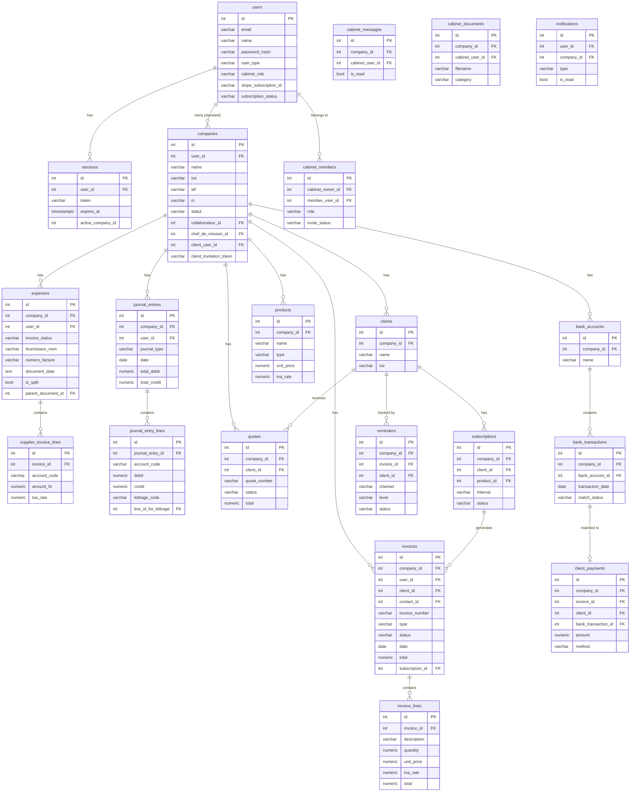
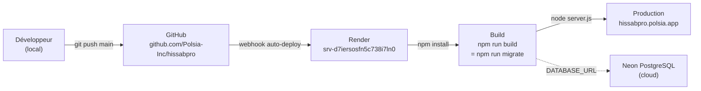

# HissabPro — Spécification Technique Exhaustive

**Version** : 2.1.0
**Date** : 2026-04-21
**URL de production** : https://hissabpro.polsia.app
**Repo GitHub** : github.com/Polsia-Inc/hissabpro

---

## Table des matières

1. [Stack technique](#1-stack-technique)
2. [Schéma de base de données](#2-schéma-de-base-de-données)
3. [API Endpoints](#3-api-endpoints)
4. [Structure du code](#4-structure-du-code)
5. [Design System & Frontend](#5-design-system--frontend)
6. [Intégrations tierces](#6-intégrations-tierces)
7. [Authentification & Sécurité](#7-authentification--sécurité)
8. [Déploiement & Infrastructure](#8-déploiement--infrastructure)
9. [Performance & Scalabilité](#9-performance--scalabilité)
10. [Tests](#10-tests)

---

## 1. Stack technique

### Frontend

| Composant | Technologie |
|-----------|-------------|
| Langage | Vanilla JavaScript (ES2020+) |
| Templating | HTML statique |
| Styles | CSS custom properties (design-tokens.css) + forms-modals.css |
| Bundler | Aucun — fichiers servis directement |
| Police | Inter (Google Fonts) |
| SPA | `app.html` + routing côté client via `history.pushState` |
| Assets | `/public/` (servi par Express `express.static`) |

**Structure des fichiers frontend** :
```
public/
├── index.html          # Landing page marketing
├── app.html            # SPA principale (toute l'application)
├── login.html          # Page login/signup
├── invite.html         # Invitation client (portail)
├── member-invite.html  # Invitation membre de cabinet
├── design-tokens.css   # Tokens CSS globaux
└── forms-modals.css    # Styles formulaires et modals
```

**Pas de framework JS frontend.** Tout le DOM est manipulé directement. Les modules de l'app (factures, dépenses, TVA, etc.) sont organisés en fonctions JS dans `app.html`.

---

### Backend

| Composant | Technologie |
|-----------|-------------|
| Runtime | Node.js 18 |
| Framework | Express 4.18.2 |
| Architecture | Monolith — fichier unique `server.js` (10 478 lignes) |
| Client DB | `pg` 8.11.3 (Pool) |
| PDF | `pdf-lib` 1.17.1 |
| AI / OCR | `openai` 4.77.0 |
| Sécurité mots de passe | PBKDF2 (crypto built-in, 100 000 itérations, sha512) |
| Sessions | Tokens DB (table `sessions`), cookies HttpOnly |
| Email | Postmark HTTP API ou proxy Polsia |
| Port | `process.env.PORT` (défaut : 3000, Render utilise 10000) |

**Pattern des routes** : toutes définies dans `server.js` avec le pattern :
```js
app.METHOD('/api/path', requireAuth?, handler)
```

---

### Base de données

| Composant | Valeur |
|-----------|--------|
| Moteur | PostgreSQL (Neon) |
| Version cible | PostgreSQL 15+ |
| Pooling | `pg.Pool` (connexion directe, SSL `rejectUnauthorized: false`) |
| Migrations | Système maison (`migrate.js` + dossier `migrations/`) |
| Stratégie | `CREATE TABLE IF NOT EXISTS` (idempotent) + fichiers horodatés |
| Tracking | Table `_migrations` (nom + timestamp) |

---

### Hébergement

| Composant | Valeur |
|-----------|--------|
| Plateforme | Render (Web Service) |
| Instance | `srv-d7iersosfn5c738i7ln0` |
| Build command | `npm install && npm run build` (`npm run build` = `npm run migrate`) |
| Start command | `npm start` (`node server.js`) |
| Health check | `GET /health` → `{"status":"healthy","version":"2.0.0"}` |
| RAM | 512 MB max |
| Auto-deploy | Oui, sur push vers main |

---

### Intégrations tierces

| Service | Usage | SDK |
|---------|-------|-----|
| OpenAI (GPT-4o) | OCR factures fournisseurs (extraction structurée) | `openai` npm |
| Postmark | Emails transactionnels (invitations, notifications) | HTTP API directe |
| Polsia Email Proxy | Fallback email si Postmark absent | HTTP API |
| Neon PostgreSQL | Base de données principale | `pg` npm |
| Render | Hébergement web service | — |

---

## 2. Schéma de base de données

### Vue d'ensemble des tables

| Table | Description |
|-------|-------------|
| `users` | Comptes utilisateurs (entreprises + membres cabinet) |
| `sessions` | Sessions d'authentification |
| `companies` | Profils entreprises / dossiers clients |
| `pcm_accounts` | Plan Comptable Marocain (accounts chart) |
| `contacts` | Contacts legacy (clients/fournisseurs) |
| `invoices` | Factures vente et achat |
| `invoice_lines` | Lignes de factures |
| `invoice_attachments` | Pièces jointes PDF/image sur factures achat |
| `expenses` | Factures fournisseurs (dépenses) avec OCR workflow |
| `supplier_invoice_lines` | Ventilation multi-taux des factures fournisseurs |
| `journal_entries` | Écritures comptables |
| `journal_entry_lines` | Lignes débit/crédit des écritures |
| `clients` | Clients (module vente) |
| `client_contacts` | Contacts physiques liés aux clients |
| `products` | Catalogue produits/services |
| `quotes` | Devis |
| `quote_lines` | Lignes de devis |
| `client_payments` | Paiements clients reçus |
| `subscriptions` | Abonnements récurrents |
| `reminders` | Relances créances |
| `bank_accounts` | Comptes bancaires |
| `bank_transactions` | Transactions bancaires importées (CSV) |
| `cabinet_messages` | Messages cabinet ↔ client par dossier |
| `cabinet_message_attachments` | Pièces jointes des messages |
| `cabinet_documents` | Documents déposés par dossier |
| `cabinet_justificatif_requests` | Demandes de justificatifs cabinet |
| `cabinet_members` | Membres du cabinet (RBAC) |
| `notifications` | Notifications in-app |
| `notification_preferences` | Préférences de notifications par utilisateur |
| `email_queue` | File d'attente emails (fallback) |
| `lettrage_sequences` | Séquences de codes de lettrage par compte |
| `assets` | Immobilisations (actifs) |
| `asset_depreciations` | Dotations aux amortissements |
| `asset_account_mappings` | Mapping comptes PCM pour 8 catégories d'actifs |
| `fiscal_years` | Exercices fiscaux |
| `is_declarations` | Déclarations IS (Impôt sur les Sociétés) |
| `effects` | Effets de commerce (LC, BAO) |
| `recurring_charges` | Charges récurrentes (trésorerie prévisionnelle) |
| `_migrations` | Suivi des migrations appliquées |

---

### Détail des tables

#### `users`
```sql
CREATE TABLE users (
  id                      SERIAL PRIMARY KEY,
  email                   VARCHAR(255) NOT NULL,
  name                    VARCHAR(255),
  password_hash           VARCHAR(255),
  created_at              TIMESTAMPTZ DEFAULT NOW(),
  updated_at              TIMESTAMPTZ DEFAULT NOW(),
  -- Subscription (synced by Polsia)
  stripe_subscription_id  VARCHAR(255),
  subscription_status     VARCHAR(50),
  subscription_plan       VARCHAR(255),
  subscription_expires_at TIMESTAMPTZ,
  subscription_updated_at TIMESTAMPTZ,
  -- Cabinet
  user_type               VARCHAR(20) NOT NULL DEFAULT 'standard',  -- 'standard' | 'cabinet'
  cabinet_role            VARCHAR(20) DEFAULT NULL,  -- 'admin' | 'comptable' | 'assistant' | 'chef_mission' | 'collaborateur'
  -- Onboarding
  onboarding_completed    BOOLEAN DEFAULT false
);

-- Contraintes
UNIQUE INDEX users_email_unique_idx ON users (LOWER(email))
INDEX users_stripe_subscription_id_idx ON users (stripe_subscription_id)
```

#### `sessions`
```sql
CREATE TABLE sessions (
  id               SERIAL PRIMARY KEY,
  user_id          INTEGER NOT NULL REFERENCES users(id) ON DELETE CASCADE,
  token            VARCHAR(128) NOT NULL UNIQUE,
  expires_at       TIMESTAMPTZ NOT NULL,
  created_at       TIMESTAMPTZ DEFAULT NOW(),
  active_company_id INTEGER  -- contexte cabinet (dossier actif)
);
```

#### `companies`
Multi-usage : profil entreprise standard OU dossier client géré par un cabinet.

```sql
CREATE TABLE companies (
  id                         SERIAL PRIMARY KEY,
  user_id                    INTEGER REFERENCES users(id),
  name                       VARCHAR(255) NOT NULL,
  -- Identifiants légaux marocains
  ice                        VARCHAR(15),
  idf                        VARCHAR(20),
  rc                         VARCHAR(50),
  cnss                       VARCHAR(20),
  -- Coordonnées
  address                    TEXT,
  city                       VARCHAR(100),
  phone                      VARCHAR(20),
  email                      VARCHAR(255),
  logo_url                   TEXT,
  -- Paramètres comptables
  fiscal_year_start          INTEGER DEFAULT 1,
  default_tva_rate           NUMERIC(5,2) DEFAULT 20.00,
  currency                   VARCHAR(3) DEFAULT 'MAD',
  -- Paiement (PDF)
  rib                        VARCHAR(30),
  bank_name                  VARCHAR(100),
  payment_conditions         TEXT,
  -- Cabinet-mode
  forme_juridique            VARCHAR(50),
  type_comptabilite          VARCHAR(20) DEFAULT 'Engagement',
  statut                     VARCHAR(20) NOT NULL DEFAULT 'actif',
  collaborateur              VARCHAR(255),
  chef_de_mission            VARCHAR(255),
  pilote_pa                  VARCHAR(255),
  abonnement                 VARCHAR(100) DEFAULT 'Collaboratif',
  expert_comptable           VARCHAR(255),
  collaborateur_id           INTEGER REFERENCES users(id) ON DELETE SET NULL,
  chef_de_mission_id         INTEGER REFERENCES users(id) ON DELETE SET NULL,
  -- Invitation client (portail)
  client_invitation_token    VARCHAR(64),
  client_invitation_expires_at TIMESTAMP,
  client_invitation_status   VARCHAR(20) DEFAULT 'none',
  client_user_id             INTEGER REFERENCES users(id) ON DELETE SET NULL,
  -- Onboarding & régime fiscal
  tva_regime                 VARCHAR(20) DEFAULT 'Mensuel',  -- 'Mensuel' | 'Trimestriel'
  -- Timestamps
  created_at                 TIMESTAMPTZ DEFAULT NOW(),
  updated_at                 TIMESTAMPTZ DEFAULT NOW()
);
```

#### `pcm_accounts`
Plan Comptable Marocain — 80+ comptes seedés à l'init.

```sql
CREATE TABLE pcm_accounts (
  id                  SERIAL PRIMARY KEY,
  code                VARCHAR(10) NOT NULL UNIQUE,
  name                VARCHAR(255) NOT NULL,
  class               INTEGER NOT NULL,       -- 1 à 7
  type                VARCHAR(20) NOT NULL,   -- 'asset' | 'liability' | 'equity' | 'revenue' | 'expense'
  parent_code         VARCHAR(10),
  is_active           BOOLEAN DEFAULT true,
  allow_direct_posting BOOLEAN DEFAULT true,
  description         TEXT,
  created_at          TIMESTAMPTZ DEFAULT NOW()
);
```

#### `invoices`
Factures vente ET achat + avoirs.

```sql
CREATE TABLE invoices (
  id                   SERIAL PRIMARY KEY,
  company_id           INTEGER REFERENCES companies(id),
  user_id              INTEGER REFERENCES users(id),
  contact_id           INTEGER REFERENCES contacts(id),
  client_id            INTEGER REFERENCES clients(id) ON DELETE SET NULL,
  invoice_number       VARCHAR(50) NOT NULL,
  type                 VARCHAR(20) NOT NULL,  -- 'sale' | 'purchase'
  invoice_subtype      VARCHAR(20),           -- 'avoir' (note de crédit)
  status               VARCHAR(20) DEFAULT 'draft',
  -- status: 'draft'|'sent'|'paid'|'cancelled'|'overdue'|'validated'|'partially_paid'
  date                 DATE NOT NULL DEFAULT CURRENT_DATE,
  due_date             DATE,
  subtotal             NUMERIC(15,2) NOT NULL DEFAULT 0,
  tva_amount           NUMERIC(15,2) NOT NULL DEFAULT 0,
  total                NUMERIC(15,2) NOT NULL DEFAULT 0,
  tva_rate             NUMERIC(5,2) DEFAULT 20.00,
  notes                TEXT,
  ice_client           VARCHAR(15),
  payment_method       VARCHAR(50),
  journal_entry_id     INTEGER,
  subscription_id      INTEGER REFERENCES subscriptions(id) ON DELETE SET NULL,
  avoir_for_invoice_id INTEGER REFERENCES invoices(id) ON DELETE SET NULL,
  avoir_id             INTEGER REFERENCES invoices(id) ON DELETE SET NULL,
  created_at           TIMESTAMPTZ DEFAULT NOW(),
  updated_at           TIMESTAMPTZ DEFAULT NOW()
);
```

#### `invoice_lines`
```sql
CREATE TABLE invoice_lines (
  id           SERIAL PRIMARY KEY,
  invoice_id   INTEGER REFERENCES invoices(id) ON DELETE CASCADE,
  description  VARCHAR(500) NOT NULL,
  quantity     NUMERIC(10,2) NOT NULL DEFAULT 1,
  unit_price   NUMERIC(15,2) NOT NULL,
  tva_rate     NUMERIC(5,2) DEFAULT 20.00,
  tva_amount   NUMERIC(15,2) DEFAULT 0,
  total        NUMERIC(15,2) NOT NULL,
  account_code VARCHAR(10),
  sort_order   INTEGER DEFAULT 0
);
```

#### `expenses`
Factures fournisseurs avec workflow OCR (à traiter → pré-traitée → traitée).

```sql
CREATE TABLE expenses (
  id                  SERIAL PRIMARY KEY,
  company_id          INTEGER REFERENCES companies(id),
  user_id             INTEGER REFERENCES users(id),
  contact_id          INTEGER REFERENCES contacts(id),
  date                DATE NOT NULL DEFAULT CURRENT_DATE,
  description         VARCHAR(500) NOT NULL,
  amount              NUMERIC(15,2) NOT NULL,
  tva_rate            NUMERIC(5,2) DEFAULT 20.00,
  tva_amount          NUMERIC(15,2) DEFAULT 0,
  total               NUMERIC(15,2) NOT NULL,
  account_code        VARCHAR(10) DEFAULT '6111',
  payment_method      VARCHAR(50) DEFAULT 'virement',
  status              VARCHAR(20) DEFAULT 'pending',
  -- status: 'pending' | 'approved' | 'paid' | 'cancelled'
  receipt_url         TEXT,
  journal_entry_id    INTEGER,
  category            VARCHAR(50),
  -- OCR workflow (Pennylane-style)
  invoice_status      VARCHAR(20) DEFAULT 'a_traiter',
  -- invoice_status: 'a_traiter' | 'pre_traitee' | 'traitee'
  fournisseur_nom     VARCHAR(255),
  numero_facture      VARCHAR(100),
  supplier_ice        VARCHAR(20),
  source              VARCHAR(50) DEFAULT 'saisie_manuelle',
  added_at            TIMESTAMPTZ DEFAULT NOW(),
  date_echeance       DATE,
  tva_rate_label      VARCHAR(20),
  -- Document (stockage inline)
  document_data       TEXT,    -- base64
  document_mime_type  VARCHAR(50),
  is_split            BOOLEAN DEFAULT false,
  parent_document_id  INTEGER REFERENCES expenses(id) ON DELETE SET NULL,
  created_at          TIMESTAMPTZ DEFAULT NOW(),
  updated_at          TIMESTAMPTZ DEFAULT NOW()
);
```

#### `supplier_invoice_lines`
Ventilation multi-comptes/multi-taux des factures fournisseurs.

```sql
CREATE TABLE supplier_invoice_lines (
  id            SERIAL PRIMARY KEY,
  invoice_id    INTEGER NOT NULL REFERENCES expenses(id) ON DELETE CASCADE,
  account_code  VARCHAR(20) NOT NULL DEFAULT '6111',
  account_label VARCHAR(255),
  amount_ht     NUMERIC(12,2) NOT NULL DEFAULT 0,
  tva_rate      NUMERIC(5,2) NOT NULL DEFAULT 0,
  amount_tva    NUMERIC(12,2) NOT NULL DEFAULT 0,
  sort_order    INTEGER NOT NULL DEFAULT 0,
  created_at    TIMESTAMPTZ DEFAULT NOW()
);
```

#### `journal_entries`
```sql
CREATE TABLE journal_entries (
  id             SERIAL PRIMARY KEY,
  company_id     INTEGER REFERENCES companies(id),
  user_id        INTEGER REFERENCES users(id),
  entry_number   VARCHAR(50),
  date           DATE NOT NULL DEFAULT CURRENT_DATE,
  journal_type   VARCHAR(20) NOT NULL DEFAULT 'OD',
  -- types: 'AC'|'VE'|'BQ'|'CA'|'OD'|'AV' (avoirs)|'RAN' (report à nouveau)
  reference      VARCHAR(100),
  description    TEXT,
  source_type    VARCHAR(20),
  source_id      INTEGER,
  is_balanced    BOOLEAN DEFAULT true,
  total_debit    NUMERIC(15,2) DEFAULT 0,
  total_credit   NUMERIC(15,2) DEFAULT 0,
  -- Exercice fiscal & verrouillage
  fiscal_year_id INTEGER REFERENCES fiscal_years(id) ON DELETE SET NULL,
  is_locked      BOOLEAN DEFAULT false,
  created_at     TIMESTAMPTZ DEFAULT NOW()
);
```

#### `clients` (module vente)
```sql
CREATE TABLE clients (
  id          SERIAL PRIMARY KEY,
  company_id  INTEGER NOT NULL REFERENCES companies(id) ON DELETE CASCADE,
  name        VARCHAR(255) NOT NULL,
  ice         VARCHAR(50),
  if_number   VARCHAR(50),
  rc_number   VARCHAR(50),
  address     TEXT,
  city        VARCHAR(100),
  postal_code VARCHAR(20),
  country     VARCHAR(100) DEFAULT 'Maroc',
  phone       VARCHAR(30),
  email       VARCHAR(255),
  website     VARCHAR(255),
  notes       TEXT,
  created_at  TIMESTAMPTZ DEFAULT NOW(),
  updated_at  TIMESTAMPTZ DEFAULT NOW()
);
```

#### `quotes` (devis)
```sql
CREATE TABLE quotes (
  id                     SERIAL PRIMARY KEY,
  company_id             INTEGER NOT NULL REFERENCES companies(id) ON DELETE CASCADE,
  client_id              INTEGER NOT NULL REFERENCES clients(id) ON DELETE RESTRICT,
  contact_id             INTEGER REFERENCES client_contacts(id) ON DELETE SET NULL,
  quote_number           VARCHAR(30) NOT NULL,
  date                   DATE NOT NULL,
  valid_until            DATE,
  status                 VARCHAR(20) NOT NULL DEFAULT 'brouillon',
  -- status: 'brouillon'|'envoyé'|'accepté'|'refusé'|'expiré'
  subtotal               NUMERIC(15,2) DEFAULT 0,
  tva_amount             NUMERIC(15,2) DEFAULT 0,
  total                  NUMERIC(15,2) DEFAULT 0,
  notes                  TEXT,
  converted_to_invoice_id INTEGER,
  created_at             TIMESTAMPTZ DEFAULT NOW(),
  updated_at             TIMESTAMPTZ DEFAULT NOW()
);
```

#### `products`
```sql
CREATE TABLE products (
  id                 SERIAL PRIMARY KEY,
  company_id         INTEGER NOT NULL REFERENCES companies(id) ON DELETE CASCADE,
  name               VARCHAR(255) NOT NULL,
  description        TEXT,
  type               VARCHAR(20) NOT NULL DEFAULT 'produit',
  -- type: 'produit' | 'service' | 'abonnement'
  unit_price         NUMERIC(15,2) NOT NULL DEFAULT 0,
  tva_rate           NUMERIC(5,2) NOT NULL DEFAULT 20,
  -- tva_rate: 0 | 7 | 10 | 14 | 20
  unit               VARCHAR(50) DEFAULT 'unité',
  is_recurring       BOOLEAN DEFAULT false,
  recurring_interval VARCHAR(20),
  -- interval: 'mensuel' | 'trimestriel' | 'annuel'
  is_active          BOOLEAN DEFAULT true,
  created_at         TIMESTAMPTZ DEFAULT NOW(),
  updated_at         TIMESTAMPTZ DEFAULT NOW()
);
```

#### `subscriptions` (abonnements récurrents)
```sql
CREATE TABLE subscriptions (
  id                SERIAL PRIMARY KEY,
  company_id        INTEGER NOT NULL REFERENCES companies(id) ON DELETE CASCADE,
  client_id         INTEGER NOT NULL REFERENCES clients(id) ON DELETE RESTRICT,
  product_id        INTEGER NOT NULL REFERENCES products(id) ON DELETE RESTRICT,
  start_date        DATE NOT NULL,
  next_invoice_date DATE,
  end_date          DATE,
  interval          VARCHAR(20) NOT NULL,
  -- interval: 'mensuel' | 'trimestriel' | 'annuel'
  amount            NUMERIC(15,2) NOT NULL,
  tva_rate          NUMERIC(5,2) NOT NULL DEFAULT 20,
  status            VARCHAR(20) NOT NULL DEFAULT 'actif',
  -- status: 'actif' | 'pausé' | 'annulé' | 'expiré'
  last_invoice_id   INTEGER,
  notes             TEXT,
  created_at        TIMESTAMPTZ DEFAULT NOW(),
  updated_at        TIMESTAMPTZ DEFAULT NOW()
);
```

#### `reminders` (relances)
```sql
CREATE TABLE reminders (
  id               SERIAL PRIMARY KEY,
  company_id       INTEGER NOT NULL REFERENCES companies(id) ON DELETE CASCADE,
  invoice_id       INTEGER,
  client_id        INTEGER REFERENCES clients(id) ON DELETE SET NULL,
  channel          VARCHAR(30) NOT NULL DEFAULT 'email',
  -- channel: 'email'|'telephone'|'whatsapp'|'physique'|'courrier_recommande_ar'|'autre'
  channel_other    VARCHAR(100),
  level            VARCHAR(30),
  -- level: 'rappel'|'relance'|'mise_en_demeure'|'contentieux'
  sent_at          TIMESTAMPTZ DEFAULT NOW(),
  status           VARCHAR(20) NOT NULL DEFAULT 'à_envoyer',
  -- status: 'à_envoyer'|'envoyé'|'répondu'|'résolu'
  notes            TEXT,
  sent_by          INTEGER REFERENCES users(id) ON DELETE SET NULL,
  call_datetime    TIMESTAMPTZ,
  tracking_number  VARCHAR(100),
  ar_received_date DATE,
  created_at       TIMESTAMPTZ DEFAULT NOW()
);
```

#### `bank_accounts` + `bank_transactions`
```sql
CREATE TABLE bank_accounts (
  id               SERIAL PRIMARY KEY,
  company_id       INTEGER NOT NULL REFERENCES companies(id) ON DELETE CASCADE,
  name             VARCHAR(255) NOT NULL,
  bank_name        VARCHAR(100),
  account_number   VARCHAR(50),
  rib              VARCHAR(30),
  currency         VARCHAR(3) DEFAULT 'MAD',
  last_import_at   TIMESTAMPTZ,
  last_balance     NUMERIC(15,2),
  last_balance_date DATE,
  created_at       TIMESTAMPTZ DEFAULT NOW()
);

CREATE TABLE bank_transactions (
  id                  SERIAL PRIMARY KEY,
  company_id          INTEGER NOT NULL REFERENCES companies(id) ON DELETE CASCADE,
  bank_account_id     INTEGER REFERENCES bank_accounts(id) ON DELETE SET NULL,
  transaction_date    DATE NOT NULL,
  label               TEXT NOT NULL,
  debit               NUMERIC(15,2),
  credit              NUMERIC(15,2),
  balance             NUMERIC(15,2),
  matched_invoice_id  INTEGER,
  matched_expense_id  INTEGER,
  match_status        VARCHAR(20) DEFAULT 'unmatched',
  -- match_status: 'unmatched'|'auto_matched'|'manual_matched'|'ignored'
  match_confidence    INTEGER,
  created_at          TIMESTAMPTZ DEFAULT NOW()
);
```

#### `cabinet_members`
```sql
CREATE TABLE cabinet_members (
  id               SERIAL PRIMARY KEY,
  cabinet_owner_id INTEGER NOT NULL REFERENCES users(id) ON DELETE CASCADE,
  member_user_id   INTEGER NOT NULL REFERENCES users(id) ON DELETE CASCADE,
  role             VARCHAR(20) NOT NULL DEFAULT 'comptable',
  -- role: 'admin'|'comptable'|'assistant'|'chef_mission'|'collaborateur'
  status           VARCHAR(20) NOT NULL DEFAULT 'active',
  invite_token     VARCHAR(128),
  invite_expires_at TIMESTAMP,
  invite_status    VARCHAR(20) NOT NULL DEFAULT 'active',
  -- invite_status: 'pending'|'active'|'inactive'
  invited_at       TIMESTAMP NOT NULL DEFAULT NOW(),
  created_at       TIMESTAMP NOT NULL DEFAULT NOW(),
  UNIQUE(cabinet_owner_id, member_user_id)
);
```

#### `journal_entry_lines` (mise à jour — colonnes lettrage)
```sql
CREATE TABLE journal_entry_lines (
  id                   SERIAL PRIMARY KEY,
  journal_entry_id     INTEGER NOT NULL REFERENCES journal_entries(id) ON DELETE CASCADE,
  account_code         VARCHAR(10) NOT NULL,
  account_name         VARCHAR(255),
  debit                NUMERIC(15,2) DEFAULT 0,
  credit               NUMERIC(15,2) DEFAULT 0,
  description          TEXT,
  sort_order           INTEGER DEFAULT 0,
  -- Lettrage
  lettrage_code        VARCHAR(10),           -- code lettre (ex: 'A', 'B', ...)
  line_id_for_lettrage INTEGER REFERENCES journal_entry_lines(id) ON DELETE SET NULL
);
```

#### `lettrage_sequences`
Séquences de codes de lettrage par compte comptable et par société.

```sql
CREATE TABLE lettrage_sequences (
  id           SERIAL PRIMARY KEY,
  company_id   INTEGER NOT NULL REFERENCES companies(id) ON DELETE CASCADE,
  account_code VARCHAR(10) NOT NULL,
  last_code    VARCHAR(10) NOT NULL DEFAULT 'A',
  created_at   TIMESTAMPTZ DEFAULT NOW(),
  UNIQUE(company_id, account_code)
);
```

#### `assets` (Immobilisations)
```sql
CREATE TABLE assets (
  id                SERIAL PRIMARY KEY,
  company_id        INTEGER NOT NULL REFERENCES companies(id) ON DELETE CASCADE,
  name              VARCHAR(255) NOT NULL,
  description       TEXT,
  category          VARCHAR(50) NOT NULL,
  -- category: 'terrain'|'construction'|'materiel_transport'|'materiel_bureau'|
  --           'mobilier'|'logiciel'|'brevets'|'autre'
  acquisition_date  DATE NOT NULL,
  acquisition_cost  NUMERIC(15,2) NOT NULL,
  depreciation_method VARCHAR(20) NOT NULL DEFAULT 'lineaire',
  -- depreciation_method: 'lineaire' | 'degressif'
  useful_life_years INTEGER NOT NULL,
  residual_value    NUMERIC(15,2) DEFAULT 0,
  account_code      VARCHAR(10),             -- compte PCM classe 2
  status            VARCHAR(20) DEFAULT 'actif',
  -- status: 'actif' | 'cede' | 'rebut'
  disposal_date     DATE,
  disposal_value    NUMERIC(15,2),
  journal_entry_id  INTEGER REFERENCES journal_entries(id) ON DELETE SET NULL,
  created_at        TIMESTAMPTZ DEFAULT NOW(),
  updated_at        TIMESTAMPTZ DEFAULT NOW()
);
```

#### `asset_depreciations`
Dotations aux amortissements annuelles par immobilisation.

```sql
CREATE TABLE asset_depreciations (
  id                SERIAL PRIMARY KEY,
  asset_id          INTEGER NOT NULL REFERENCES assets(id) ON DELETE CASCADE,
  company_id        INTEGER NOT NULL REFERENCES companies(id) ON DELETE CASCADE,
  year              INTEGER NOT NULL,
  depreciation_amount NUMERIC(15,2) NOT NULL,
  cumulative_depreciation NUMERIC(15,2) NOT NULL,
  net_book_value    NUMERIC(15,2) NOT NULL,
  journal_entry_id  INTEGER REFERENCES journal_entries(id) ON DELETE SET NULL,
  generated_at      TIMESTAMPTZ DEFAULT NOW()
);
```

#### `asset_account_mappings`
Mapping des comptes PCM (classe 2, 6, 28) pour les 8 catégories d'actifs.

```sql
CREATE TABLE asset_account_mappings (
  id                   SERIAL PRIMARY KEY,
  category             VARCHAR(50) NOT NULL UNIQUE,
  asset_account        VARCHAR(10) NOT NULL,  -- compte classe 2 (immobilisation)
  depreciation_expense_account VARCHAR(10) NOT NULL,  -- compte classe 6 (dotation)
  accumulated_depreciation_account VARCHAR(10) NOT NULL,  -- compte classe 28 (amort cumulé)
  created_at           TIMESTAMPTZ DEFAULT NOW()
);
```

#### `fiscal_years` (Exercices fiscaux)
```sql
CREATE TABLE fiscal_years (
  id           SERIAL PRIMARY KEY,
  company_id   INTEGER NOT NULL REFERENCES companies(id) ON DELETE CASCADE,
  label        VARCHAR(50) NOT NULL,           -- ex: 'Exercice 2024'
  start_date   DATE NOT NULL,
  end_date     DATE NOT NULL,
  status       VARCHAR(20) DEFAULT 'open',
  -- status: 'open' | 'closed'
  closed_at    TIMESTAMPTZ,
  closed_by    INTEGER REFERENCES users(id) ON DELETE SET NULL,
  created_at   TIMESTAMPTZ DEFAULT NOW()
);
```

#### `is_declarations` (Déclarations IS)
```sql
CREATE TABLE is_declarations (
  id                       SERIAL PRIMARY KEY,
  company_id               INTEGER NOT NULL REFERENCES companies(id) ON DELETE CASCADE,
  fiscal_year              INTEGER NOT NULL,
  result_comptable         NUMERIC(15,2) DEFAULT 0,
  reintegrations           NUMERIC(15,2) DEFAULT 0,
  deductions               NUMERIC(15,2) DEFAULT 0,
  result_fiscal            NUMERIC(15,2) DEFAULT 0,
  taux_is                  NUMERIC(5,2),
  cotisation_minimale      NUMERIC(15,2) DEFAULT 0,
  is_du                    NUMERIC(15,2) DEFAULT 0,
  status                   VARCHAR(20) DEFAULT 'brouillon',
  -- status: 'brouillon' | 'validee'
  created_at               TIMESTAMPTZ DEFAULT NOW(),
  updated_at               TIMESTAMPTZ DEFAULT NOW()
);
```

#### `effects` (Effets de commerce)
```sql
CREATE TABLE effects (
  id               SERIAL PRIMARY KEY,
  company_id       INTEGER NOT NULL REFERENCES companies(id) ON DELETE CASCADE,
  effect_type      VARCHAR(10) NOT NULL,  -- 'LC' (lettre de change) | 'BAO' (billet à ordre)
  reference        VARCHAR(100),
  amount           NUMERIC(15,2) NOT NULL,
  issue_date       DATE NOT NULL,
  due_date         DATE NOT NULL,
  drawee_name      VARCHAR(255),          -- tiré (LC) ou souscripteur (BAO)
  drawee_ice       VARCHAR(15),
  status           VARCHAR(20) DEFAULT 'en_cours',
  -- status: 'en_cours'|'encaisse'|'impaye'|'endosse'
  invoice_id       INTEGER REFERENCES invoices(id) ON DELETE SET NULL,
  journal_entry_id INTEGER REFERENCES journal_entries(id) ON DELETE SET NULL,
  notes            TEXT,
  created_at       TIMESTAMPTZ DEFAULT NOW(),
  updated_at       TIMESTAMPTZ DEFAULT NOW()
);
```

#### `recurring_charges` (Trésorerie prévisionnelle)
```sql
CREATE TABLE recurring_charges (
  id               SERIAL PRIMARY KEY,
  company_id       INTEGER NOT NULL REFERENCES companies(id) ON DELETE CASCADE,
  label            VARCHAR(255) NOT NULL,
  amount           NUMERIC(15,2) NOT NULL,
  frequency        VARCHAR(20) NOT NULL DEFAULT 'mensuel',
  -- frequency: 'mensuel' | 'trimestriel' | 'annuel'
  day_of_month     INTEGER,               -- jour du mois (1-28)
  account_code     VARCHAR(10),
  is_active        BOOLEAN DEFAULT true,
  created_at       TIMESTAMPTZ DEFAULT NOW(),
  updated_at       TIMESTAMPTZ DEFAULT NOW()
);
```

---

### Diagramme ERD (Mermaid)



---

### Stratégie d'isolation multi-tenant

L'isolation est assurée par **deux mécanismes complémentaires** :

1. **`user_id`** sur chaque table principale — toutes les requêtes filtrent sur `user_id = req.userId`
2. **`company_id`** — utilisé pour les jointures et le contexte cabinet

**Cabinet mode** : quand `active_company_id` est défini en session, les routes utilisent le contexte du dossier actif (appartenant au cabinet) au lieu du premier dossier de l'utilisateur. Fonction `getEffectiveCompanyId(req)`.

**Dette technique** : pas de Row-Level Security PostgreSQL. L'isolation repose entièrement sur le code applicatif.

---

## 3. API Endpoints

### Authentification (public)

| Méthode | Endpoint | Description |
|---------|----------|-------------|
| `POST` | `/api/auth/signup` | Création compte + session |
| `POST` | `/api/auth/login` | Connexion + session |
| `POST` | `/api/auth/logout` | Déconnexion (supprime session) |
| `GET` | `/api/auth/me` | Infos session courante |
| `GET` | `/api/auth/invitation/:token` | Valider token invitation client |
| `POST` | `/api/auth/signup-invitation` | Créer compte via invitation client |
| `GET` | `/api/auth/member-invite/:token` | Valider token invitation membre cabinet |
| `POST` | `/api/auth/member-invite/:token` | Accepter invitation + définir mot de passe |

### Entreprise & Paramètres

| Méthode | Endpoint | Auth | Description |
|---------|----------|------|-------------|
| `GET` | `/api/company` | ✅ | Profil entreprise actif |
| `POST` | `/api/company` | ✅ | Créer/mettre à jour le profil |
| `PUT` | `/api/user/type` | ✅ | Basculer en mode cabinet |

### Plan Comptable

| Méthode | Endpoint | Auth | Description |
|---------|----------|------|-------------|
| `GET` | `/api/accounts` | ✅ | Liste des comptes PCM (filtres: class, search) |

### Contacts (legacy)

| Méthode | Endpoint | Auth | Description |
|---------|----------|------|-------------|
| `GET` | `/api/contacts` | ✅ | Liste contacts (clients/fournisseurs) |
| `POST` | `/api/contacts` | ✅ | Créer contact |

### Factures

| Méthode | Endpoint | Auth | Description |
|---------|----------|------|-------------|
| `GET` | `/api/invoices` | ✅ | Liste factures (filtres: type, status, from, to) |
| `GET` | `/api/invoices/:id` | ✅ | Détail facture + lignes |
| `POST` | `/api/invoices` | ✅ | Créer facture + lignes + écriture comptable |
| `PUT` | `/api/invoices/:id/status` | ✅ | Changer statut (paid, sent, etc.) |
| `POST` | `/api/invoices/:id/cancel` | ✅ | Annuler + générer avoir |
| `GET` | `/api/invoices/:id/xml` | ✅ | Export XML (UBL/CII) |
| `GET` | `/api/invoices/:id/export` | ✅ | Export e-facture (`?format=UBL-2.1`) |
| `POST` | `/api/invoices/:id/attachment` | ✅ | Ajouter pièce jointe |
| `GET` | `/api/invoices/:id/attachment` | ✅ | Télécharger pièce jointe |
| `GET` | `/api/invoices/:id/has-attachment` | ✅ | Vérifier existence pièce jointe |

### Dépenses (Factures Fournisseurs)

| Méthode | Endpoint | Auth | Description |
|---------|----------|------|-------------|
| `GET` | `/api/expenses` | ✅ | Liste dépenses (filtres: invoice_status, from, to, search) |
| `GET` | `/api/expenses/:id` | ✅ | Détail dépense |
| `POST` | `/api/expenses` | ✅ | Créer dépense |
| `PUT` | `/api/expenses/:id` | ✅ | Modifier dépense |
| `DELETE` | `/api/expenses/:id` | ✅ | Supprimer dépense |
| `PATCH` | `/api/expenses/:id/status` | ✅ | Changer statut OCR workflow |
| `POST` | `/api/expenses/:id/valider` | ✅ | Valider + générer écriture comptable |
| `POST` | `/api/expenses/:id/split` | ✅ | Découper un document multi-factures |
| `POST` | `/api/expenses/import-multi` | ✅ | Import multiple (OCR batch) |
| `GET` | `/api/expenses/:id/document` | ✅ | Télécharger document (base64) |

### OCR

| Méthode | Endpoint | Auth | Description |
|---------|----------|------|-------------|
| `POST` | `/api/ocr/invoice` | ✅ | OCR via GPT-4o (image base64 → JSON structuré) |

### Journal Comptable

| Méthode | Endpoint | Auth | Description |
|---------|----------|------|-------------|
| `GET` | `/api/journal-entries` | ✅ | Liste écritures (filtres: journal_type, from, to) |
| `GET` | `/api/journal-entries/:id` | ✅ | Détail écriture + lignes |
| `POST` | `/api/journal-entries` | ✅ | Créer écriture manuelle |

### TVA & Comptabilité

| Méthode | Endpoint | Auth | Description |
|---------|----------|------|-------------|
| `GET` | `/api/tva/declaration` | ✅ | Déclaration TVA (mois ou trimestre) |
| `GET` | `/api/balance` | ✅ | Balance comptable (grand livre summary) |
| `GET` | `/api/balance-generale` | ✅ | Balance générale (tous comptes) |

### Dashboard

| Méthode | Endpoint | Auth | Description |
|---------|----------|------|-------------|
| `GET` | `/api/dashboard` | ✅ | KPIs entreprise (CA, charges, trésorerie, TVA) |
| `GET` | `/api/client/dashboard` | ✅ | Dashboard portail client (lecture seule) |

### Module Vente

**Clients**

| Méthode | Endpoint | Auth | Description |
|---------|----------|------|-------------|
| `GET` | `/api/vente/clients` | ✅ | Liste clients |
| `POST` | `/api/vente/clients` | ✅ | Créer client |
| `PUT` | `/api/vente/clients/:id` | ✅ | Modifier client |
| `DELETE` | `/api/vente/clients/:id` | ✅ | Supprimer client |
| `GET` | `/api/vente/clients/:id/contacts` | ✅ | Contacts du client |
| `POST` | `/api/vente/clients/:id/contacts` | ✅ | Ajouter contact |
| `PUT` | `/api/vente/clients/:id/contacts/:contactId` | ✅ | Modifier contact |
| `GET` | `/api/vente/clients/:id/balance` | ✅ | Solde / créances client |

**Produits**

| Méthode | Endpoint | Auth | Description |
|---------|----------|------|-------------|
| `GET` | `/api/vente/products` | ✅ | Liste produits/services |
| `POST` | `/api/vente/products` | ✅ | Créer produit |
| `PUT` | `/api/vente/products/:id` | ✅ | Modifier produit |
| `DELETE` | `/api/vente/products/:id` | ✅ | Supprimer produit |

**Devis**

| Méthode | Endpoint | Auth | Description |
|---------|----------|------|-------------|
| `GET` | `/api/vente/quotes` | ✅ | Liste devis |
| `GET` | `/api/vente/quotes/:id` | ✅ | Détail devis + lignes |
| `POST` | `/api/vente/quotes` | ✅ | Créer devis |
| `PUT` | `/api/vente/quotes/:id` | ✅ | Modifier devis |
| `DELETE` | `/api/vente/quotes/:id` | ✅ | Supprimer devis |
| `PUT` | `/api/vente/quotes/:id/status` | ✅ | Changer statut devis |
| `POST` | `/api/vente/quotes/:id/convert` | ✅ | Convertir devis → facture |

**Paiements**

| Méthode | Endpoint | Auth | Description |
|---------|----------|------|-------------|
| `GET` | `/api/vente/payments` | ✅ | Liste paiements |
| `POST` | `/api/vente/payments` | ✅ | Enregistrer paiement |
| `PUT` | `/api/vente/payments/:id/link` | ✅ | Lier paiement à facture |
| `DELETE` | `/api/vente/payments/:id/link` | ✅ | Délier paiement |
| `DELETE` | `/api/vente/payments/:id` | ✅ | Supprimer paiement |

**Abonnements**

| Méthode | Endpoint | Auth | Description |
|---------|----------|------|-------------|
| `GET` | `/api/vente/subscriptions` | ✅ | Liste abonnements |
| `POST` | `/api/vente/subscriptions` | ✅ | Créer abonnement |
| `PUT` | `/api/vente/subscriptions/:id` | ✅ | Modifier abonnement |
| `DELETE` | `/api/vente/subscriptions/:id` | ✅ | Annuler abonnement |
| `GET` | `/api/vente/subscriptions/:id/invoices` | ✅ | Factures de l'abonnement |
| `POST` | `/api/vente/subscriptions/process-due` | ✅ | Déclencher facturation échéances |

**Relances**

| Méthode | Endpoint | Auth | Description |
|---------|----------|------|-------------|
| `GET` | `/api/vente/reminders` | ✅ | Liste relances |
| `GET` | `/api/vente/reminders/stats` | ✅ | Stats relances par statut |
| `POST` | `/api/vente/reminders` | ✅ | Créer relance |
| `PUT` | `/api/vente/reminders/:id` | ✅ | Mettre à jour relance |
| `GET` | `/api/vente/reminders/:invoice_id/history` | ✅ | Historique relances facture |
| `POST` | `/api/vente/reminders/send-email` | ✅ | Envoyer email de relance |

### Banque (Rapprochement)

| Méthode | Endpoint | Auth | Description |
|---------|----------|------|-------------|
| `GET` | `/api/bank/accounts` | ✅ | Liste comptes bancaires |
| `POST` | `/api/bank/accounts` | ✅ | Créer compte bancaire |
| `PUT` | `/api/bank/accounts/:id` | ✅ | Modifier compte bancaire |
| `DELETE` | `/api/bank/accounts/:id` | ✅ | Supprimer compte bancaire |
| `GET` | `/api/bank/transactions` | ✅ | Liste transactions (filtres: status, from, to) |
| `POST` | `/api/bank/import` | ✅ | Importer CSV bancaire |
| `POST` | `/api/bank/auto-match` | ✅ | Rapprochement automatique |
| `PUT` | `/api/bank/transactions/:id/match` | ✅ | Rapprocher manuellement |
| `PUT` | `/api/bank/transactions/:id/ignore` | ✅ | Ignorer transaction |
| `DELETE` | `/api/bank/transactions/:id/match` | ✅ | Délier rapprochement |
| `GET` | `/api/bank/stats` | ✅ | Statistiques rapprochement |
| `GET` | `/api/bank/unmatched-invoices` | ✅ | Factures non rapprochées |
| `GET` | `/api/bank/unmatched-expenses` | ✅ | Dépenses non rapprochées |

### Cabinet (Mode Fiduciaire)

**Dossiers**

| Méthode | Endpoint | Auth | Rôle requis | Description |
|---------|----------|------|------------|-------------|
| `GET` | `/api/cabinet/dossiers` | ✅ | any | Liste dossiers (avec filtres) |
| `POST` | `/api/cabinet/dossiers` | ✅ | admin | Créer dossier client |
| `PUT` | `/api/cabinet/dossiers/:id` | ✅ | admin | Modifier dossier |
| `POST` | `/api/cabinet/dossiers/:id/invite-client` | ✅ | admin | Envoyer invitation client |
| `POST` | `/api/cabinet/switch/:id` | ✅ | any | Changer de dossier actif |
| `GET` | `/api/cabinet/collaborateurs` | ✅ | any | Liste membres du cabinet |

**Clients cabinet**

| Méthode | Endpoint | Auth | Description |
|---------|----------|------|-------------|
| `GET` | `/api/cabinet/clients` | ✅ | Liste dossiers clients avec stats |
| `GET` | `/api/cabinet/clients/:id` | ✅ | Détail dossier client |
| `PUT` | `/api/cabinet/clients/:id` | ✅ | Modifier informations dossier |
| `POST` | `/api/cabinet/clients` | ✅ (admin) | Créer dossier client |
| `POST` | `/api/cabinet/clients/:id/toggle-active` | ✅ (admin) | Activer/désactiver dossier |
| `POST` | `/api/cabinet/clients/:id/resend-invite` | ✅ (admin) | Renvoyer invitation client |

**Membres du cabinet**

| Méthode | Endpoint | Auth | Rôle | Description |
|---------|----------|------|------|-------------|
| `GET` | `/api/cabinet/members` | ✅ | admin | Liste membres |
| `POST` | `/api/cabinet/members` | ✅ | admin | Inviter membre |
| `PUT` | `/api/cabinet/members/:id` | ✅ | admin | Modifier rôle/statut |
| `POST` | `/api/cabinet/members/:id/resend-invite` | ✅ | admin | Renvoyer invitation |
| `DELETE` | `/api/cabinet/members/:id` | ✅ | admin | Supprimer membre |

**Messagerie & Documents**

| Méthode | Endpoint | Auth | Description |
|---------|----------|------|-------------|
| `GET` | `/api/cabinet/messages` | ✅ | Messages du dossier actif |
| `POST` | `/api/cabinet/messages` | ✅ | Envoyer message |
| `PUT` | `/api/cabinet/messages/:id/read` | ✅ | Marquer message lu |
| `PUT` | `/api/cabinet/messages/read-all` | ✅ | Tout marquer lu |
| `DELETE` | `/api/cabinet/messages/:id` | ✅ | Supprimer message |
| `GET` | `/api/cabinet/documents` | ✅ | Documents du dossier |
| `POST` | `/api/cabinet/documents` | ✅ | Uploader document |
| `GET` | `/api/cabinet/documents/:id/download` | ✅ | Télécharger document |
| `DELETE` | `/api/cabinet/documents/:id` | ✅ | Supprimer document |
| `GET` | `/api/cabinet/collaboration/stats` | ✅ | Stats collaboration dossier |

**Justificatifs**

| Méthode | Endpoint | Auth | Description |
|---------|----------|------|-------------|
| `GET` | `/api/cabinet/justificatifs` | ✅ | Demandes de justificatifs |
| `POST` | `/api/cabinet/justificatifs` | ✅ | Créer demande |
| `PUT` | `/api/cabinet/justificatifs/:id` | ✅ | Modifier demande |
| `POST` | `/api/cabinet/justificatifs/:id/respond` | ✅ | Répondre (client) |
| `DELETE` | `/api/cabinet/justificatifs/:id` | ✅ | Supprimer demande |

### Notifications

| Méthode | Endpoint | Auth | Description |
|---------|----------|------|-------------|
| `GET` | `/api/notifications` | ✅ | Liste notifications |
| `GET` | `/api/notifications/unread-count` | ✅ | Compteur non-lus |
| `PUT` | `/api/notifications/:id/read` | ✅ | Marquer lu |
| `PUT` | `/api/notifications/read-all` | ✅ | Tout marquer lu |
| `GET` | `/api/notifications/preferences` | ✅ | Préférences |
| `PUT` | `/api/notifications/preferences` | ✅ | Mettre à jour préférences |

### Lettrage comptable

| Méthode | Endpoint | Auth | Description |
|---------|----------|------|-------------|
| `GET` | `/api/lettrage/lines/:account_code` | ✅ | Lignes lettrables pour un compte |
| `POST` | `/api/lettrage/auto` | ✅ | Lettrage automatique (par montant) |
| `POST` | `/api/lettrage/manual` | ✅ | Lettrage manuel (sélection explicite) |
| `DELETE` | `/api/lettrage/:code` | ✅ | Délettrage (supprimer un lettrage) |

### Immobilisations

| Méthode | Endpoint | Auth | Description |
|---------|----------|------|-------------|
| `GET` | `/api/assets` | ✅ | Liste des immobilisations |
| `GET` | `/api/assets/:id` | ✅ | Détail immobilisation |
| `POST` | `/api/assets` | ✅ | Créer une immobilisation |
| `PUT` | `/api/assets/:id` | ✅ | Modifier une immobilisation |
| `DELETE` | `/api/assets/:id` | ✅ | Supprimer une immobilisation |
| `GET` | `/api/assets/depreciation-summary` | ✅ | Résumé des amortissements |
| `GET` | `/api/assets/:id/depreciation-schedule` | ✅ | Tableau d'amortissement |
| `POST` | `/api/assets/generate-depreciations` | ✅ | Générer dotations aux amortissements |
| `POST` | `/api/assets/:id/dispose` | ✅ | Comptabiliser la cession |
| `POST` | `/api/assets/:id/scrap` | ✅ | Mettre au rebut |
| `GET` | `/api/assets/export/csv` | ✅ | Export CSV immobilisations |

### Exercices fiscaux & Clôture

| Méthode | Endpoint | Auth | Description |
|---------|----------|------|-------------|
| `GET` | `/api/exercices` | ✅ | Liste des exercices fiscaux |
| `POST` | `/api/exercices` | ✅ | Créer un exercice fiscal |
| `GET` | `/api/cloture/pre-checks` | ✅ | Vérifications pré-clôture |
| `POST` | `/api/cloture/resultat` | ✅ | Calculer le résultat de l'exercice |
| `GET` | `/api/cloture/preview-ran` | ✅ | Prévisualiser le report à nouveau |
| `POST` | `/api/cloture/executer` | ✅ | Exécuter la clôture (verrouille écritures) |

### États financiers

| Méthode | Endpoint | Auth | Description |
|---------|----------|------|-------------|
| `GET` | `/api/bilan` | ✅ | Bilan PCM (Actif brut/amort/net + Passif) |
| `GET` | `/api/cpc` | ✅ | Compte de Produits et Charges (13 rubriques) |
| `GET` | `/api/cpc/export/csv` | ✅ | Export CSV du CPC |
| `GET` | `/api/esg` | ✅ | État des Soldes de Gestion / CAF / TFR |
| `GET` | `/api/esg/export/csv` | ✅ | Export CSV de l'ESG |

### SIMPL-IS (Impôt sur les Sociétés)

| Méthode | Endpoint | Auth | Description |
|---------|----------|------|-------------|
| `GET` | `/api/is` | ✅ | Calcul IS (résultat fiscal, barème 2024) |
| `POST` | `/api/is` | ✅ | Enregistrer une déclaration IS |
| `GET` | `/api/is/declarations` | ✅ | Historique des déclarations IS |

### Trésorerie prévisionnelle

| Méthode | Endpoint | Auth | Description |
|---------|----------|------|-------------|
| `GET` | `/api/tresorerie/previsionnel` | ✅ | Projection du solde sur N mois |
| `GET` | `/api/tresorerie/charges-recurrentes` | ✅ | Liste des charges récurrentes |
| `POST` | `/api/tresorerie/charges-recurrentes` | ✅ | Ajouter une charge récurrente |
| `PUT` | `/api/tresorerie/charges-recurrentes/:id` | ✅ | Modifier une charge récurrente |
| `DELETE` | `/api/tresorerie/charges-recurrentes/:id` | ✅ | Supprimer une charge récurrente |

### Effets de commerce

| Méthode | Endpoint | Auth | Description |
|---------|----------|------|-------------|
| `GET` | `/api/effets` | ✅ | Liste des effets (LC et BAO) |
| `GET` | `/api/effets/:id` | ✅ | Détail d'un effet |
| `POST` | `/api/effets` | ✅ | Créer un effet de commerce |
| `PUT` | `/api/effets/:id` | ✅ | Modifier un effet |
| `DELETE` | `/api/effets/:id` | ✅ | Supprimer un effet |
| `PUT` | `/api/effets/:id/status` | ✅ | Changer le statut (encaissé, impayé, endossé) |
| `GET` | `/api/effets/export/csv` | ✅ | Export CSV effets |

### Onboarding

| Méthode | Endpoint | Auth | Description |
|---------|----------|------|-------------|
| `POST` | `/api/onboarding` | ✅ | Compléter le wizard (transaction atomique) |
| `POST` | `/api/onboarding/reset` | ✅ | Réinitialiser l'onboarding (depuis paramètres) |

### Divers

| Méthode | Endpoint | Auth | Description |
|---------|----------|------|-------------|
| `GET` | `/api/balance-agee` | ✅ | Balance âgée (ventilation par ancienneté) |
| `GET` | `/api/search` | ✅ | Recherche globale (factures, contacts, etc.) |
| `PUT` | `/api/user/type` | ✅ | Basculer en mode cabinet |

### Internal (admin interne)

| Méthode | Endpoint | Auth | Description |
|---------|----------|------|-------------|
| `GET` | `/api/internal/email-queue` | — | File d'attente emails |
| `PUT` | `/api/internal/email-queue/:id/sent` | — | Marquer email envoyé |

### Pages web (HTML)

| Méthode | Endpoint | Description |
|---------|----------|-------------|
| `GET` | `/` | Landing page (`index.html`) |
| `GET` | `/login` | Page login/signup |
| `GET` | `/app` | SPA principale |
| `GET` | `/app/*` | SPA (toutes les routes frontend) |
| `GET` | `/invite/:token` | Page invitation client |
| `GET` | `/member-invite/:token` | Page invitation membre cabinet |
| `GET` | `/health` | Health check Render |

---

### Format requête/réponse — endpoints critiques

#### `POST /api/auth/signup`
```json
// Request
{ "email": "user@example.com", "password": "motdepasse", "name": "Mohammed" }

// Response 200
{ "user": { "id": 1, "email": "user@example.com", "name": "Mohammed" } }
// Set-Cookie: session_token=<96-char hex>; HttpOnly; Secure; SameSite=Lax

// Response 409
{ "error": "Un compte existe deja avec cet email" }
```

#### `POST /api/ocr/invoice`
```json
// Request
{ "file_data": "data:image/jpeg;base64,...", "filename": "facture.jpg" }

// Response 200
{
  "extracted": {
    "fournisseur_nom": "SARL Exemple",
    "fournisseur_ice": "123456789012345",
    "numero_facture": "F2024-001",
    "date_facture": "2024-01-15",
    "date_echeance": "2024-02-15",
    "description": "Fournitures de bureau",
    "lignes": [{"description": "Papier A4", "quantite": 10, "prix_unitaire_ht": 50, "tva_rate": 20, "compte_pcm": "6151"}],
    "total_ht": 500, "total_tva": 100, "total_ttc": 600,
    "tva_rates": [20], "suggested_account": "6151"
  }
}
```

#### `GET /api/tva/declaration?year=2024&month=3`
```json
// Response 200
{
  "period": "Mars 2024",
  "date_from": "2024-03-01",
  "date_to": "2024-03-31",
  "company": { "name": "...", "ice": "..." },
  "collectee": { "20": { "base_ht": 50000, "tva": 10000 } },
  "deductible": { "20": { "base_ht": 20000, "tva": 4000 } },
  "total_collectee_ht": 50000,
  "total_collectee_tva": 10000,
  "total_deductible_ht": 20000,
  "total_deductible_tva": 4000,
  "tva_due": 6000,
  "is_credit": false
}
```

---

## 4. Structure du code

### Arborescence
```
hissabpro/
├── server.js               # Monolith Express (10 478 lignes) — toutes les routes
├── migrate.js              # Runner de migrations
├── package.json            # Dépendances (express, pg, openai, pdf-lib)
├── render.yaml             # Config déploiement Render
├── SPEC.md                 # Spec fonctionnelle
├── SPEC_TECHNIQUE.md       # Ce document
│
├── migrations/             # Migrations horodatées
│   ├── 1713520000000_initial_schema.js
│   ├── 1713530000000_add_auth.js
│   ├── 1713540000000_add_payment_details.js
│   ├── 1713550000000_add_invoice_attachments.js
│   ├── 1713570000000_add_cabinet_mode.js
│   ├── 1713580000000_add_cabinet_collaboration.js
│   ├── 1745087014000_add_saisie_fields.js
│   ├── 1745087500000_add_notifications.js
│   ├── 1745092000000_add_cabinet_rbac.js
│   ├── 1745200000000_add_client_invitation.js
│   ├── 1745275000000_add_email_queue.js
│   ├── 1745300000000_add_cabinet_member_invite.js
│   ├── 1745360000000_add_bank_transactions.js
│   ├── 1745410000000_add_vente_tables.js
│   ├── 1745450000000_add_payments_extensions.js
│   ├── 1745500000000_add_subscription_reminder_extensions.js
│   ├── 1745500000000_enhance_invoices_facture_refonte.js
│   ├── 1745600000000_add_invoice_status.js
│   ├── 1745620000000_add_pdf_split.js
│   ├── 1745700000000_add_supplier_ice_echeance.js
│   ├── 1745700000000_add_supplier_invoice_lines.js
│   ├── 1745800000000_add_lettrage.js           # Lettrage comptable (tables + colonnes)
│   ├── 1745800000000_add_lettrage_code.js      # Colonnes lettrage_code sur journal_entry_lines
│   ├── 1745900000000_add_assets.js             # Immobilisations (assets + asset_depreciations)
│   ├── 1745900000000_add_fiscal_years.js       # Exercices fiscaux + is_locked/fiscal_year_id
│   ├── 1745950000000_add_asset_account_mappings.js  # Mapping comptes PCM pour immobilisations
│   ├── 1745960000000_add_is_declarations.js    # Déclarations IS (impôt sur les sociétés)
│   ├── 1745970000000_add_effects.js            # Effets de commerce (LC, BAO)
│   ├── 1745970000000_add_onboarding.js         # Onboarding wizard (flag + tva_regime)
│   ├── 1745970000000_add_recurring_charges.js  # Charges récurrentes trésorerie prévisionnelle
│   └── 1745980000000_add_entreprise_rbac.js    # Extensions RBAC entreprise
│
├── lib/
│   └── einvoice/           # Module e-facturation (seul module extrait)
│       ├── index.js        # Registre des formats + export public
│       ├── canonical.js    # Normalisation données → objet canonique
│       ├── README.md
│       └── mappers/
│           ├── ubl21.js    # OASIS UBL 2.1 XML ✅ production
│           ├── cii.js      # UN/CEFACT CII D16B XML ✅ production
│           ├── ubl.js      # UBL (version legacy)
│           └── dgi-maroc.js # DGI Maroc XML (stub)
│
└── public/                 # Fichiers statiques (frontend)
    ├── index.html          # Landing page
    ├── app.html            # Application principale (SPA)
    ├── login.html          # Authentification
    ├── invite.html         # Portail invitation client
    ├── member-invite.html  # Invitation membre cabinet
    ├── onboarding.html     # Wizard d'onboarding 5 étapes
    ├── logiciel-comptabilite-maroc.html  # Page SEO / marketing
    ├── design-tokens.css   # Design system (tokens)
    └── forms-modals.css    # Styles composants
```

### Conventions de nommage

| Entité | Convention |
|--------|------------|
| Tables SQL | `snake_case` |
| Colonnes SQL | `snake_case` |
| Variables JS | `camelCase` |
| Routes API | `/api/module/resource/:id` |
| Fonctions helper | `camelCase` |
| Middleware | `requireAuth`, `requireCabinetRole([...])` |

### Pattern architectural

L'application suit un pattern simple **Route → Handler → DB** sans couche service intermédiaire :

```js
// Pattern typique
app.get('/api/invoices', requireAuth, async (req, res) => {
  // 1. Extraire params (query, body)
  const { type, status, from, to } = req.query;

  // 2. Construire query SQL avec filtres
  let query = 'SELECT * FROM invoices WHERE user_id = $1';
  const params = [req.userId];
  if (type) { params.push(type); query += ` AND type = $${params.length}`; }

  // 3. Exécuter
  const result = await pool.query(query, params);

  // 4. Répondre
  res.json({ invoices: result.rows });
});
```

**Pas de couche service, pas d'ORM, pas de validation schema.** Tout est inline dans le handler.

---

## 5. Design System & Frontend

### design-tokens.css

Fichier de tokens CSS importé sur toutes les pages. Approche Pennylane-style : propre, moderne, accent émeraude.

#### Couleurs

| Token | Valeur | Usage |
|-------|--------|-------|
| `--color-primary` | `#059669` (emerald-600) | Boutons principaux, liens actifs |
| `--color-primary-hover` | `#047857` (emerald-700) | Hover boutons |
| `--color-primary-light` | `#d1fae5` (emerald-100) | Badges success |
| `--color-primary-subtle` | `#ecfdf5` (emerald-50) | Background items actifs |
| `--color-text-heading` | `#111827` (gray-900) | Titres |
| `--color-text-body` | `#374151` (gray-700) | Corps de texte |
| `--color-text-secondary` | `#6b7280` (gray-500) | Texte secondaire |
| `--color-bg-page` | `#f9fafb` (gray-50) | Background page |
| `--color-bg-hover` | `#f3f4f6` (gray-100) | Hover states |
| `--color-border` | `#e5e7eb` (gray-200) | Bordures |
| `--color-error` | `#dc2626` (red-600) | Erreurs |
| `--color-warning` | `#d97706` (amber-600) | Avertissements |
| `--color-info` | `#2563eb` (blue-600) | Info |

#### Typographie

| Token | Valeur |
|-------|--------|
| `--font-family` | `Inter`, -apple-system, sans-serif |
| `--text-xs` | 12px |
| `--text-sm` | 14px |
| `--text-base` | 16px |
| `--text-lg` | 18px |
| `--text-xl` | 20px |
| `--text-2xl` | 24px |

#### Dimensions

| Token | Valeur |
|-------|--------|
| `--sidebar-width` | 240px |
| `--radius-sm` | 4px |
| `--radius-md` | 6px (boutons, inputs) |
| `--radius-lg` | 8px (cartes) |
| `--radius-xl` | 12px (modals) |

#### Ombres

| Token | Usage |
|-------|-------|
| `--shadow-sm` | Léger (0 1px 2px) |
| `--shadow-md` | Cartes standard |
| `--shadow-lg` | Dropdowns |
| `--shadow-xl` | Modals |

### Gestion des états

États UI gérés manuellement dans le JS :
- **Loading** : spinner inline, bouton désactivé
- **Error** : banner rouge en haut de formulaire
- **Empty** : illustration + message "Aucun élément"
- **Success** : toast notification temporaire

### Responsive breakpoints

Aucun breakpoint systématique documenté. L'interface est principalement desktop-first. La sidebar se replie sur mobile via media query CSS.

### SPA (app.html)

Navigation côté client via `history.pushState`. Chaque module est une section HTML/JS dans `app.html`. Pas de router externe.

---

## 6. Intégrations tierces

### OCR Factures Fournisseurs (GPT-4o)

**Endpoint** : `POST /api/ocr/invoice`

**Flux** :
```
Frontend (image base64, max ~4MB)
  → POST /api/ocr/invoice
  → Compression frontend recommandée: 1024px / JPEG quality 0.5
  → Backend: OpenAI chat.completions (gpt-4o, vision)
  → Prompt: extraction structurée JSON (fournisseur, ICE, montants, TVA, lignes)
  → Retry: detail='auto' → detail='low' si erreur 500
  → Response: { extracted: { ... } }
```

**Modèle utilisé** : `gpt-4o`
**Champs extraits** : fournisseur_nom, fournisseur_ice, numero_facture, date_facture, date_echeance, lignes (description, quantité, prix HT, tva_rate, compte PCM), total_ht, total_tva, total_ttc, suggested_account

**Contrainte** : payload max ~100KB au niveau du proxy AI Polsia (frontend doit compresser). Guard serveur : 4MB.

**Fallback** : si OCR échoue, l'utilisateur peut saisir manuellement (formulaire classique).

---

### E-Facturation (module `lib/einvoice/`)

**Architecture** : modular, format-agnostic via registre de mappers.

```
POST /api/invoices/:id/export?format=UBL-2.1
  → requireAuth + ownership check
  → generateEInvoice(invoiceId, format, pool)
     → buildCanonicalInvoice() — normalise invoice + lignes + parties
     → MAPPERS[format].generate(canonical) — produit XML
  → Response: application/xml
```

**Formats supportés** :

| Format | Fichier | Statut |
|--------|---------|--------|
| `UBL-2.1` | `mappers/ubl21.js` | ✅ Production |
| `CII-D16B` | `mappers/cii.js` | ✅ Production (Factur-X) |
| `DGI-MA` | `mappers/dgi-maroc.js` | 🚧 Stub (non exposé) |

**Objet canonique** :
```js
{
  id, invoiceNumber, type, subtype, status,
  date, dueDate, currency,
  paymentMethod, paymentTerms, notes,
  supplier: { name, ice, idf, rc, address, city, rib, bankName },
  customer: { name, ice, idf, rc, address, city },
  lines: [{ description, quantity, unitPriceHT, tvaRate, tvaAmount, totalHT, totalTTC }],
  totals: { totalHT, taxBreakdown: [{ rate, taxableAmount, taxAmount }], totalTVA, totalTTC }
}
```

**Ajout d'un format** : créer `mappers/<nom>.js` + enregistrer dans `index.js`. Pas de modification du canonical.

---

### Génération PDF (pdf-lib)

**Librairie** : `pdf-lib` 1.17.1
**Déclencheur** : côté client (JavaScript) ou côté serveur selon le module

Le PDF de facture est généré côté **frontend** (JS dans app.html) avec les données reçues de l'API. pdf-lib est utilisé côté **serveur** pour le splitting de documents PDF fournisseurs (`POST /api/expenses/:id/split`).

**Données injectées (facture)** : logo, infos entreprise (nom, ICE, IF, RC, adresse), infos client/fournisseur, lignes (description, qté, PU HT, TVA, total), totaux HT/TVA/TTC, mentions légales, RIB, conditions de paiement.

---

### SIMPL-TVA Export

Export CSV de la déclaration TVA compatible DGI Maroc.

**Source** : `GET /api/tva/declaration` + transformation côté client en CSV.

**Champs DGI mappés** :
- Opérations soumises à TVA collectée (par taux : 20%, 14%, 10%, 7%)
- TVA déductible sur achats (par taux)
- TVA déductible sur charges
- TVA nette due ou crédit

---

### Email (Postmark + fallback)

**Priorité** :
1. `POSTMARK_SERVER_TOKEN` → Postmark HTTP API
2. `POLSIA_EMAIL_PROXY_URL` + `POLSIA_API_KEY` → Proxy Polsia
3. Aucun → file d'attente en DB (`email_queue`)

**Templates disponibles** :
- Email de notification générique (HTML branded)
- Invitation client (portail)
- Invitation membre de cabinet
- Relance créance

**Expéditeur** : `hissabpro@polsia.app` (configurable via `EMAIL_FROM`)

---

## 7. Authentification & Sécurité

### Mécanisme de session

```
1. Login → vérification password (PBKDF2)
2. Création session en DB (token 96 chars hex)
3. Set-Cookie: session_token=<token>; HttpOnly; SameSite=Lax; Max-Age=2592000 (30j)
4. En production: flag Secure ajouté
5. Chaque requête API → parseCookies(req) → getSession(token) → req.userId
6. Expiration sessions : 30 jours
7. Nettoyage : setInterval toutes les heures (DELETE WHERE expires_at < NOW())
```

### Hachage des mots de passe

- **Algorithme** : PBKDF2 (crypto Node.js built-in)
- **Paramètres** : 100 000 itérations, sha512, salt aléatoire 16 octets
- **Format stocké** : `<salt_hex>:<hash_hex>`
- **Legacy** : sha256 + `SESSION_SECRET` (anciens comptes cabinet créés par temp password)
- **Comparaison** : `crypto.timingSafeEqual` (protection timing attack)

### Protection CSRF/XSS

- **CSRF** : pas de protection CSRF explicite. SameSite=Lax atténue les attaques cross-site
- **XSS** : pas de sanitization explicite côté serveur. Risque dans les champs texte

**Dette de sécurité** : pas de CSRF token, pas de Content-Security-Policy, pas de rate limiting sur login.

### Middleware Auth

```js
// requireAuth — injecte dans req:
req.userId          // ID utilisateur
req.userEmail       // email
req.userType        // 'standard' | 'cabinet'
req.cabinetRole     // 'admin' | 'comptable' | ... | null
req.cabinetOwnerId  // cabinet owner (soi-même ou cabinet propriétaire)
req.activeCompanyId // dossier actif (cabinet) | null

// requireCabinetRole(['admin', 'comptable'])
// → 403 si user_type != 'cabinet' ou role non autorisé
```

### Types utilisateurs

| Type | Description |
|------|-------------|
| `standard` | Entreprise normale, gère ses propres données |
| `cabinet` | Fiduciaire — accède à tous les dossiers clients |

### Rôles cabinet

| Rôle | Accès |
|------|-------|
| `admin` | Tout (dossiers, membres, configuration) |
| `chef_mission` | Gestion dossiers, opérations comptables |
| `collaborateur` | Opérations courantes |
| `comptable` | Legacy — équivalent collaborateur |
| `assistant` | Accès limité |

---

## 8. Déploiement & Infrastructure

### Pipeline de déploiement



**Durée de build** : ~38 secondes en moyenne.

### Variables d'environnement

| Variable | Requis | Description |
|----------|--------|-------------|
| `DATABASE_URL` | ✅ **Obligatoire** | Connexion PostgreSQL Neon |
| `SESSION_SECRET` | Recommandé | Clé session (généré aléatoirement si absent) |
| `OPENAI_API_KEY` | Pour OCR | Clé API OpenAI |
| `OPENAI_BASE_URL` | Optionnel | Proxy AI (défaut : `https://api.openai.com/v1`) |
| `POLSIA_API_KEY` | Optionnel | Clé proxy Polsia (email, AI) |
| `POSTMARK_SERVER_TOKEN` | Pour email | Token Postmark |
| `POLSIA_EMAIL_PROXY_URL` | Optionnel | Proxy email Polsia (fallback Postmark) |
| `EMAIL_FROM` | Optionnel | Expéditeur email (défaut : `hissabpro@polsia.app`) |
| `EMAIL_FROM_NAME` | Optionnel | Nom expéditeur (défaut : `HissabPro`) |
| `NODE_ENV` | Recommandé | `production` en prod (active cookie Secure) |
| `PORT` | Auto Render | Port serveur (défaut : 3000) |

### Configuration Render

```yaml
services:
  - type: web
    runtime: node
    name: app
    buildCommand: npm install && npm run build
    startCommand: npm start
    healthCheckPath: /health
    envVars:
      - key: NODE_ENV
        value: production
```

- **Plan** : Free ou Starter (512MB RAM)
- **Auto-deploy** : activé sur push vers main
- **Instance ID** : `srv-d7iersosfn5c738i7ln0`

### Base de données Neon

- **Région** : US East (ou EU selon config)
- **Pooling** : `pg.Pool` Node.js (connexion directe, SSL activé)
- **SSL** : `rejectUnauthorized: false` (connexion Neon serverless)
- **Migrations** : run à chaque déploiement (idempotent via `IF NOT EXISTS`)

### Monitoring

- **Health check** : `GET /health` → `{"status":"healthy","version":"2.0.0"}`
- **Sentry** : non configuré
- **Logs** : `console.log/error` → logs Render (`get_logs` via CLI)
- **Alertes** : aucune alerte configurée (point d'attention)

---

## 9. Performance & Scalabilité

### Indexes existants

Les indexes couvrent les requêtes les plus fréquentes :
- `invoices(company_id)`, `invoices(date)`, `invoices(user_id)`
- `expenses(company_id)`, `expenses(date)`, `expenses(invoice_status)`
- `journal_entries(company_id)`, `journal_entries(date)`
- `bank_transactions(company_id, match_status)`
- `notifications(user_id, is_read) WHERE is_read = false`
- `email_queue(status) WHERE status = 'pending'`
- `users(email)` (unique, case-insensitive)

### Requêtes N+1 identifiées

- **Dashboard** (`/api/dashboard`) : multiples requêtes séquentielles pour KPIs. Candidat à l'optimisation avec des CTE ou requêtes parallèles.
- **Liste dossiers cabinet** : jointures sur `companies` + `users` + stats → peut être lent avec beaucoup de dossiers.
- **OCR batch** : `POST /api/expenses/import-multi` traite les fichiers séquentiellement.

### Pagination

Pagination implémentée sur :
- `GET /api/expenses` : `?limit=` et `?offset=`
- `GET /api/bank/transactions` : `?limit=` et `?offset=`
- `GET /api/vente/reminders` : `?limit=` et `?offset=`

**Non paginé** (tous les résultats) :
- `GET /api/invoices` — risque de lenteur avec des volumes importants
- `GET /api/journal-entries`
- `GET /api/contacts`

### Stockage fichiers

Les fichiers (PDF, images factures fournisseurs, documents cabinet) sont stockés **en base de données** en base64 dans des colonnes `TEXT`. C'est une **dette technique majeure** :
- Gonfle la taille de la base
- Pas de streaming
- Pas de CDN

Les pièces jointes factures (`invoice_attachments.file_data`) et documents cabinet (`cabinet_documents.file_data`) sont aussi en base64 DB.

### Caching

**Aucun caching** configuré (Redis, mémoire, HTTP cache-control). Toutes les requêtes API font des aller-retours DB.

### Limites body

```js
app.use(express.json({ limit: '10mb' }));  // JSON request body
// OCR guard: 4MB sur file_data
// Recommandation front: compression 1024px / JPEG 0.5 quality → ~75-100KB
```

### Points d'attention pour la montée en charge

1. **Stockage fichiers en DB** — à migrer vers S3/R2 avant de dépasser ~5GB
2. **Monolith 10 478 lignes** — pas de workers, pas de queue pour les tâches longues (OCR batch)
3. **Pas de connection pool optimisé** — le pool `pg.Pool` utilise les défauts (max 10)
4. **Sessions en DB** — avec des milliers d'utilisateurs concurrents, indexer correctement `sessions(token)` ✅ (déjà fait)
5. **Pas de rate limiting** sur les endpoints publics (login, signup, OCR)

---

## 10. Tests

### Framework de tests

**Aucun framework de tests configuré.** Pas de fichiers `*.test.js`, `*.spec.js` ni de dossier `__tests__/`.

### Couverture actuelle

**0%** — aucun test automatisé.

### Tests manuels

Le fichier `test-fixtures/` contient des fixtures pour tests manuels (documents de test).

### Modules non testés (liste complète)

- Auth (signup, login, sessions)
- Gestion factures (CRUD, statuts, avoirs)
- OCR et parsing JSON GPT-4o
- Génération d'écriture comptable automatique
- Module TVA (calculs collectée/déductible)
- Rapprochement bancaire (auto-match)
- E-facturation (UBL 2.1, CII — seul module avec structure extractable)
- Cabinet mode (RBAC, switching, invitations)
- Abonnements récurrents (génération automatique)
- Notifications et email queue

### Recommandations

Le module `lib/einvoice/` (canonical + mappers) est le seul code suffisamment isolé pour être testé unitairement sans infrastructure. Priorité 1 pour ajouter des tests.

Tests d'intégration à ajouter : auth flow, création facture + écriture comptable, déclaration TVA.

---

## Annexe — Dettes techniques identifiées

| Priorité | Problème | Impact |
|----------|---------|--------|
| 🔴 Critique | Stockage fichiers en base64 en DB | Performance, scalabilité DB |
| 🔴 Critique | 0% de couverture tests | Bugs silencieux en prod |
| 🟠 Élevée | Monolith 10 478 lignes (server.js) | Maintenabilité |
| 🟠 Élevée | Pas de rate limiting (login, OCR) | Sécurité, abus |
| 🟠 Élevée | Pas de CSRF protection | Sécurité |
| 🟡 Moyenne | Pas de caching | Performance sous charge |
| 🟡 Moyenne | N+1 queries (dashboard, cabinet) | Performance |
| 🟡 Moyenne | `GET /api/invoices` non paginé | Lenteur avec volume |
| 🟡 Moyenne | Pas de validation schema (zod, joi) | Bugs données |
| 🟢 Faible | Mapper DGI Maroc stub non exposé | Feature incomplète |
| 🟢 Faible | Session cleanup via setInterval (pas de job dédié) | Légère consommation mémoire |

---

*Document mis à jour le 2026-04-21 par inspection du code source. Documente l'existant (31 migrations, 10 478 lignes), pas l'idéal.*
